# Semantic Computational Runtime

> **Build the semantics. Compile the meaning. Execute the computation.**

**Semantic Computational Runtime (SCR)** is an MLIR-based runtime for computational semantics.

SCR allows applications to describe **what a computation means** independently of the implementation, representation, provider, or execution substrate used to realize it.

This guide gets a developer from a clean **Arch Linux** workstation to a validated SCR development environment and then points directly toward the current **v0.0.1 Golden Path**.

---

## 0. Start Here

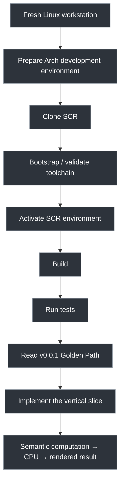

### If you are joining the project for the first time

```bash
git clone https://github.com/zharia/Semantic-Computational-Runtime.git
cd Semantic-Computational-Runtime
```

Then inspect the project before changing anything:

```bash
git status
git log --oneline -5
find . -maxdepth 2 -type f | sort
```

Run the environment check:

```bash
./scripts/bootstrap_arch.sh --check
```

If the environment is ready, activate the SCR-specific environment:

```bash
source ./scripts/env-arch.sh
```

Then:

```bash
./scripts/check-environment.sh
```

> **Important:** environment activation and environment bootstrap are separate operations.
>
> Bootstrap scripts must not drop the developer into an interactive subshell.
> `env-arch.sh` is explicitly sourced by the developer's existing shell.

---

# 1. What SCR Is

SCR is **not** simply:

* an MLIR dialect collection;
* a simulation engine;
* a wrapper around scientific libraries;
* a rendering engine;
* a hardware abstraction layer.

SCR is a semantic computational environment.

The fundamental architecture is:

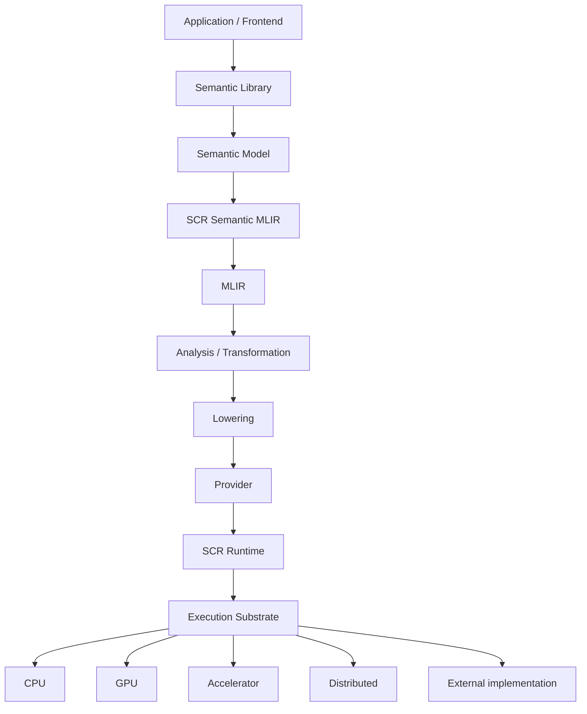

The critical distinction is:

| Concern        | Question                                                    |
| -------------- | ----------------------------------------------------------- |
| Semantics      | **What does this computation mean?**                        |
| IR             | How is that meaning represented computationally?            |
| Transformation | How can the representation change while preserving meaning? |
| Lowering       | How does it move toward an executable representation?       |
| Provider       | Which implementation realizes the contract?                 |
| Runtime        | Where and when should it execute?                           |
| Substrate      | What actually performs the computation?                     |

Therefore:

```text
Semantic Meaning ≠ Representation
Representation ≠ Implementation
Implementation ≠ Provider
Provider ≠ Hardware
```

---

# 2. The Governing Principle

The project follows one central rule:

> **The code is not the architecture.**

SCR separates:

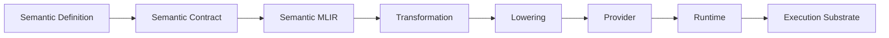

The implementation may change.

The representation may change.

The provider may change.

The hardware may change.

The semantic contract remains authoritative.

---

# 3. Read These Documents in This Order

A new contributor should not attempt to understand the entire repository before doing useful work.

Read:

| Order | Document                                       | Purpose                              |
| ----: | ---------------------------------------------- | ------------------------------------ |
|     1 | `README.md`                                    | Project orientation                  |
|     2 | `AGENTS.md`                                    | Development and architectural policy |
|     3 | `lib/README.md`                                | Semantic library organization        |
|     4 | `program_increments/v0.0.1/000_spec.md`        | Current increment                    |
|     5 | `program_increments/v0.0.1/101_definition.md`  | v0.0.1 semantic definition           |
|     6 | `program_increments/v0.0.1/102_status.yaml`    | Current implementation state         |
|     7 | `program_increments/v0.0.1/104_golden-path.md` | Executable vertical slice            |

The last document answers the most important practical question:

> **What should I implement first?**

---

# 4. Source-of-Truth Hierarchy

SCR deliberately distinguishes normative architecture from implementation state.

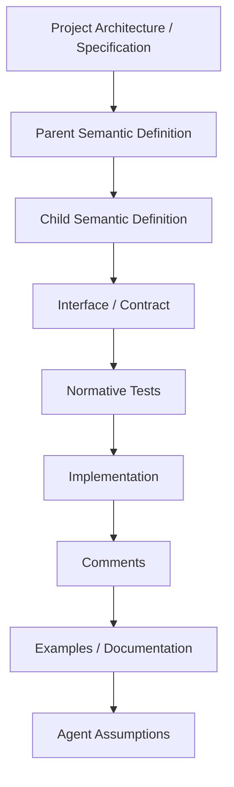

The authority order is:

1. Project architecture/specification
2. Parent semantic definition
3. Child semantic definition
4. Explicit interface/contract specification
5. Tests expressing normative behavior
6. Current implementation
7. Comments
8. Documentation/examples
9. Agent assumptions

This means:

```text
101_definition.md
        >
implementation
```

and:

```text
102_status.yaml
```

describes engineering state.

It does not redefine semantics.

Likewise:

```text
103_library.graph.json
```

is derived graph information.

It is not an independent source of truth.

---

# 5. Development Lifecycle

All substantive development follows:

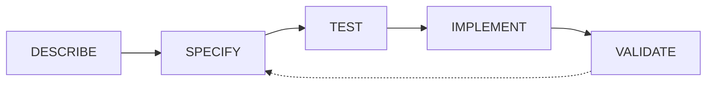

## DESCRIBE

Establish what the concept is.

## SPECIFY

Define:

* semantics;
* scope;
* invariants;
* contracts;
* relationships;
* representations;
* errors;
* determinism;
* equivalence;
* testing requirements.

## TEST

Create tests that express the required behavior.

## IMPLEMENT

Implement the smallest system capable of satisfying the specification.

## VALIDATE

Demonstrate that the implementation satisfies the semantic contract.

Do not routinely begin with code.

---

# 6. Preferred Development Environment

## Primary Platform: Arch Linux

**Arch Linux is the preferred SCR development platform.**

The canonical developer environment is:

```text
Arch Linux
    │
    ├── Git
    ├── Clang / Clang++
    ├── LLD
    ├── LLVM / MLIR
    ├── CMake
    ├── Ninja
    ├── Rust / Cargo
    └── Python
```

Arch is preferred because SCR development tracks modern compiler infrastructure and benefits from current versions of the LLVM/Clang, CMake, Ninja, Rust, and Python ecosystems.

### Other Linux distributions

Ubuntu, Debian, Fedora, and other Linux distributions remain valid development environments where the required toolchain can be provided.

They are **compatibility environments**, not the canonical developer environment.

Do not write project documentation as though Ubuntu is the reference platform.

---

# 7. Developer Workstation

A practical SCR workstation is:

| Resource     | Recommended          |
| ------------ | -------------------- |
| Architecture | x86_64               |
| CPU          | 8+ cores             |
| RAM          | 32 GB+               |
| Storage      | 100 GB+ free SSD     |
| GPU          | Optional for v0.0.1  |
| OS           | Arch Linux preferred |

LLVM/MLIR builds can consume substantial CPU, memory, and storage.

A GPU is **not required** for the first executable SCR milestone.

---

# 8. Install the Arch Toolchain

Update the system:

```bash
sudo pacman -Syu
```

Install the core development environment:

```bash
sudo pacman -S --needed \
    base-devel \
    git \
    curl \
    wget \
    cmake \
    ninja \
    clang \
    lld \
    llvm \
    python \
    python-pip \
    python-virtualenv \
    pkgconf \
    ccache
```

Verify:

```bash
git --version
clang --version
clang++ --version
ld.lld --version
cmake --version
ninja --version
python --version
```

The exact installed versions are intentionally not hard-coded into this document.

SCR should validate the versions actually required by the current repository/toolchain configuration.

---

# 9. Rust

Rust is the primary systems implementation language for the SCR runtime and runtime infrastructure.

Use `rustup` when a project-specific toolchain needs to be pinned or reproduced.

```bash
rustup toolchain install stable
rustup default stable
```

Install development components:

```bash
rustup component add rustfmt
rustup component add clippy
```

Verify:

```bash
rustc --version
cargo --version
cargo fmt --version
cargo clippy --version
```

When SCR specifies a particular Rust toolchain, that specification takes precedence over the local default.

---

# 10. Python

Python is used for:

* MLIR Python bindings;
* tooling;
* test infrastructure;
* analysis;
* optional language-facing APIs.

Create a local environment when Python dependencies are required:

```bash
python -m venv .venv
source .venv/bin/activate
```

Then:

```bash
python -m pip install --upgrade pip setuptools wheel
```

Do not install large collections of speculative dependencies.

A dependency belongs in the development environment when the current implementation actually requires it.

---

# 11. LLVM / MLIR

SCR is built **on top of MLIR**.

The LLVM/MLIR version used by SCR must be treated as a compatibility set.

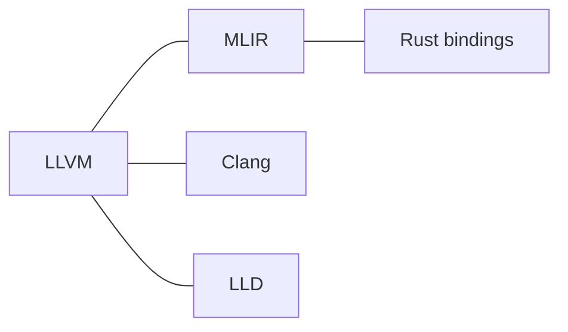

Do not silently mix installations from unrelated LLVM versions.

For example, avoid:

```text
mlir-opt     → LLVM version A
MLIR library → LLVM version B
clang        → LLVM version C
Rust binding → MLIR version D
```

The project should instead establish one coherent toolchain.

---

# 12. LLVM Installation Layout

For locally built SCR toolchains, prefer a versioned installation tree such as:

```text
~/.local/opt/scr/
└── llvm-<SCR_LLVM_VERSION>/
    ├── bin/
    ├── include/
    ├── lib/
    └── ...
```

A versioned prefix makes multiple toolchains possible without destroying an existing system installation.

It also makes toolchain provenance explicit.

---

# 13. Bootstrap vs Environment Activation

These are deliberately different operations.

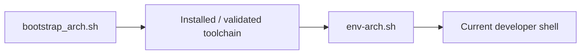

### Bootstrap

```bash
./scripts/bootstrap_arch.sh
```

or inspect only:

```bash
./scripts/bootstrap_arch.sh --check
```

Bootstrap may:

* detect the environment;
* validate dependencies;
* prepare build infrastructure;
* establish required local toolchains;
* report failures.

### Activation

```bash
source ./scripts/env-arch.sh
```

Activation establishes the current shell environment.

### Mandatory policy

Bootstrap scripts must **not**:

* spawn an interactive Bash shell;
* replace the developer's shell;
* silently alter shell startup files;
* hide environment changes inside a subprocess.

This is intentional:

```text
bootstrap
    =
prepare / install / validate

environment script
    =
activate
```

---

# 14. Environment Validation

SCR provides environment validation scripts under:

```text
scripts/
```

The current repository includes:

```text
bootstrap.sh
bootstrap_arch.sh
build.sh
check-environment.sh
env-arch.sh
format.sh
test.sh
```

The preferred Arch workflow is:

```bash
./scripts/bootstrap_arch.sh --check
source ./scripts/env-arch.sh
./scripts/check-environment.sh
```

The validation should establish the availability of the toolchain required by the current increment.

Typical tools include:

```text
git
clang
clang++
lld
cmake
ninja
python
rustc
cargo
llvm
mlir-opt
mlir-translate
llc
FileCheck
llvm-lit
```

The exact required set is determined by the current implementation.

> Documentation must not claim a command is available merely because it is planned.

---

# 15. Build the Repository

Use the repository's build scripts rather than inventing a parallel build workflow.

```bash
./scripts/build.sh
```

If the repository provides a more specific target or invocation, use that target.

Inspect the script before assuming its behavior:

```bash
sed -n '1,240p' scripts/build.sh
```

This is especially important while SCR's build system is still evolving.

---

# 16. Test the Repository

Run:

```bash
./scripts/test.sh
```

For formatting:

```bash
./scripts/format.sh
```

For Rust projects, also use the standard checks where applicable:

```bash
cargo fmt --check
cargo clippy
cargo test
```

Do not claim a test passes unless it has actually been executed.

---

# 17. MLIR Smoke Test

Once MLIR is available:

```bash
mlir-opt --version
```

Then:

```bash
cat > /tmp/scr-hello.mlir <<'EOF'
module {
  func.func @main() {
    return
  }
}
EOF
```

Run:

```bash
mlir-opt /tmp/scr-hello.mlir
```

A successful parse establishes that the basic MLIR executable is available.

This is an **environment smoke test**, not an SCR semantic test.

---

# 18. MLIR Is Infrastructure, Not Semantic Authority

MLIR supplies mechanisms such as:

* IR;
* SSA;
* types;
* attributes;
* operations;
* regions;
* blocks;
* dialects;
* interfaces;
* verification;
* rewriting;
* transformations;
* dialect conversion;
* lowering infrastructure.

SCR supplies the semantic layer.

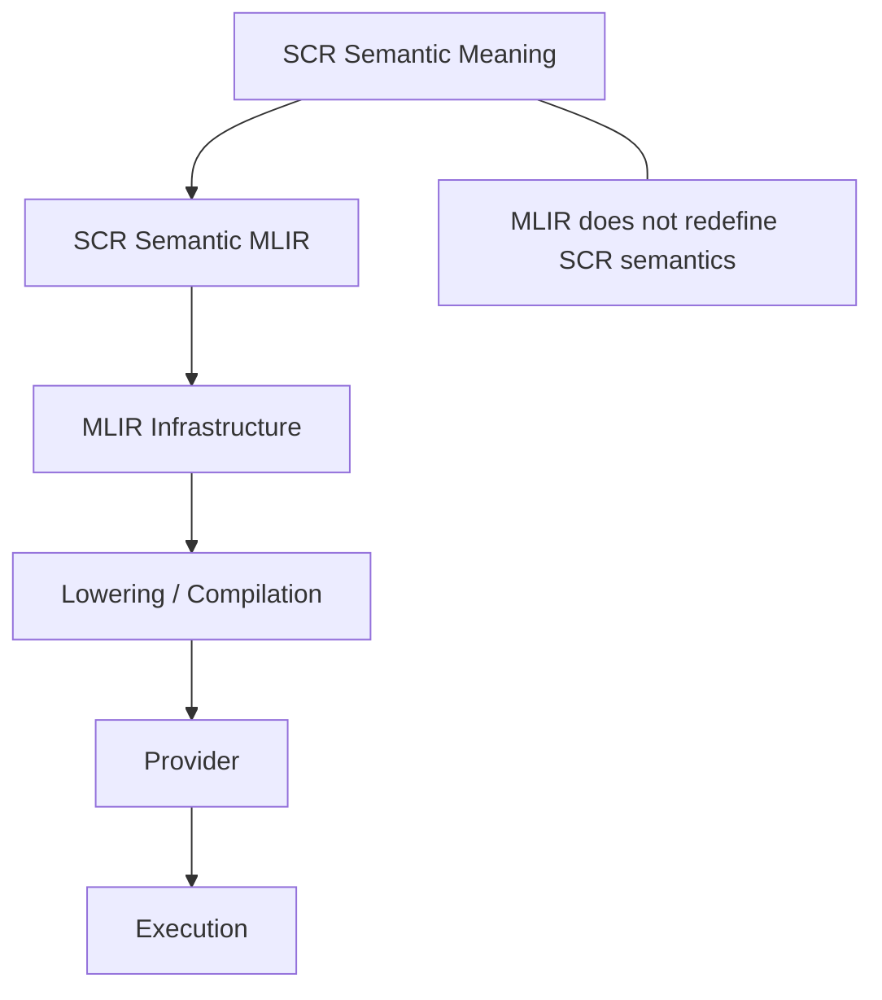

Do not recreate compiler infrastructure that MLIR already provides.

Do not make MLIR's representation the definition of the semantic concept.

---

# 19. SCR Semantic MLIR

An `IR/` directory within a semantic domain represents the domain's **computational representation**.

It does not automatically mean:

> "Create a new MLIR dialect."

The conceptual pipeline is:


A domain may:

* define its own MLIR dialect;
* reuse existing MLIR dialects;
* compose multiple MLIR dialects;
* use domain-specific IR structures before MLIR representation.

Create only what the semantic and computational requirements justify.

---

# 20. Transformation ≠ Lowering

SCR explicitly distinguishes transformation from lowering.

### Transformation

Changes representation while preserving the relevant semantic contract.

Examples:

```text
Canonicalization
Composition
Decomposition
Fusion
Parallelization
Scheduling
Specialization
Tiling
Vectorization
Memory transformation
Representation transformation
```

### Lowering

Moves computation toward a lower abstraction or execution representation.

Example:

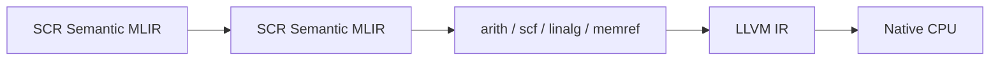

Do not use "lowering" as a generic word for every compiler transformation.

---

# 21. Providers

A provider implements a semantic contract.

It does not own the meaning of the semantic operation.

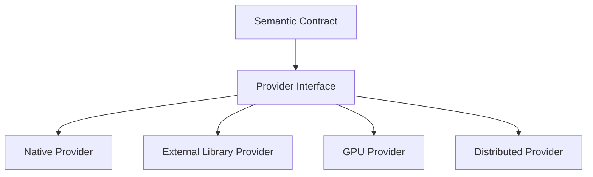

External libraries are therefore providers or implementation resources.

Examples may eventually include:

```text
Eigen
CGAL
H3
OpenVDB
Chrono
VulkanSceneGraph
CUDA
ROCm
```

They are not semantic authorities.

Do not introduce an external dependency merely because it could implement something.

---

# 22. The v0.0.1 Golden Path

The first implementation milestone is deliberately a **vertical slice**.

It is not an attempt to implement the entire semantic library.

The target is:

```mermaid
flowchart LR
    A["Core"]
    B["Dynamics"]
    C["Simulation"]
    D["SCR Semantic MLIR"]
    E["MLIR"]
    F["CPU Provider"]
    G["Simulation State"]
    H["Render Projection"]
    I["Render State"]
    J["Rendering Provider"]
    K["VSG / Vulkan"]
    L["Visible Result"]

    A --> B --> C --> D --> E --> F --> G --> H --> I --> J --> K --> L
```

The complete implementation target is defined by:

```text
program_increments/v0.0.1/
```

and its Golden Path document.

---

# 23. The First Real SCR Program

The reference workload is intentionally simple:

```text
World
└── ParticleSystem
    ├── Particle
    │   ├── position
    │   └── velocity
    ├── Particle
    │   ├── position
    │   └── velocity
    └── ...
```

The first dynamic law is:

```text
position(t + dt)
    =
position(t)
    +
velocity(t) × dt
```

The objective is not to demonstrate sophisticated physics.

The objective is to prove:

```text
semantic state
    ↓
semantic operation
    ↓
IR
    ↓
MLIR
    ↓
CPU execution
    ↓
state evolution
    ↓
render projection
    ↓
visible result
```

---

# 24. Simulation and Rendering Must Remain Separate

The simulation must not know that Vulkan exists.

The renderer must not define simulation semantics.

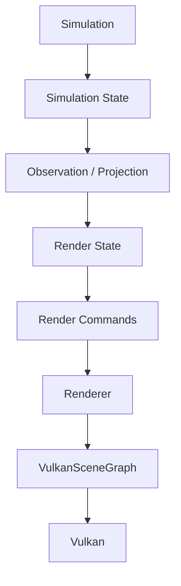

The intended implementation boundary is:

```text
Simulation State
        ↓
Render Projection
        ↓
Render State
        ↓
Render Commands
        ↓
Renderer
```

Not:

```text
Simulation
    ↓
Vulkan calls
```

---

# 25. Rendering Path

The initial rendering implementation may use:

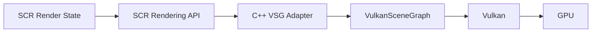

This is an **implementation path**.

It is not a semantic dependency.

The semantic rendering model must remain independent of VSG and Vulkan.

---

# 26. What Does Not Belong in v0.0.1

Do not block the Golden Path on:

* GPU simulation;
* CUDA;
* ROCm;
* distributed execution;
* AMQP runtime;
* neural computation;
* learning;
* adaptation;
* evolution;
* ecology;
* advanced physics;
* collision systems;
* H3;
* BVH;
* KD-trees;
* spatial databases;
* GQL;
* CRDTs;
* persistent semantic storage;
* automatic provider discovery;
* heterogeneous scheduling;
* multi-device execution.

These are future capabilities.

The first objective is an **end-to-end proof**.

---

# 27. Testing Model

SCR testing is progressive.

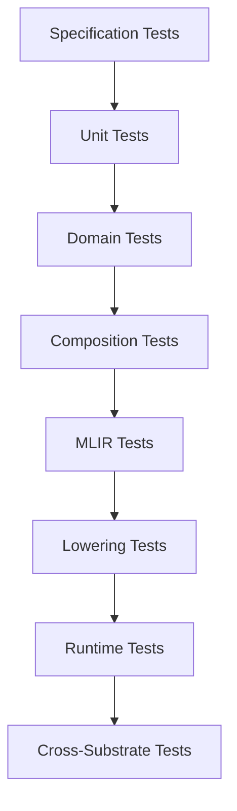

Tests should establish:

* semantic correctness;
* invariant preservation;
* valid and invalid representations;
* diagnostic behavior;
* deterministic behavior where required;
* transformation correctness;
* lowering correctness;
* runtime correctness;
* provider correctness;
* cross-provider equivalence where specified.

---

# 28. Determinism Is Explicit

A computation must not be assumed deterministic merely because it looks mathematical.

Classify relevant behavior as:

```text
deterministic
conditionally deterministic
stochastic
nondeterministic
```

Where applicable, document:

* seeds;
* ordering;
* concurrency effects;
* hardware effects;
* numerical tolerances;
* reproducibility expectations;
* equivalence criteria.

---

# 29. Build Modes

## Normal development

```text
RelWithDebInfo
Assertions ON
ccache ON
```

## Debugging

```text
Debug
Assertions ON
```

## Sanitized development

Use periodically:

```text
AddressSanitizer
UndefinedBehaviorSanitizer
```

Correctness comes before optimization.

---

# 30. C++ and Rust

SCR is a multi-language system, but language boundaries have architectural meaning.

### Rust

Rust is the primary systems language for:

* runtime;
* orchestration;
* scheduling;
* resource management;
* telemetry;
* runtime APIs;
* execution infrastructure.

### C++

C++ remains important for:

* MLIR integration;
* MLIR dialect implementation where appropriate;
* compiler passes;
* MLIR interfaces;
* native provider adapters;
* C++ scientific libraries;
* Vulkan/VSG integration.

The boundary must remain explicit.

Do not allow an implementation dependency to leak across the semantic architecture merely because the external library is written in a particular language.

---

# 31. Optional Provider Toolchains

External provider dependencies should be installed only when the corresponding provider is being developed or tested.

Potential providers include:

```text
Chrono
Eigen
CGAL
H3
OpenVDB
VulkanSceneGraph
```

The semantic core should remain buildable without them unless a specific program increment explicitly makes one mandatory.

---

# 32. Repository Exploration

Before editing a domain, inspect its context.

```bash
find lib/<domain> -maxdepth 3 -type f | sort
```

Inspect definitions:

```bash
find lib/<domain> -name '101_definition.md' -print
```

Inspect status:

```bash
find lib/<domain> -name '102_status.yaml' -print
```

Search relationships:

```bash
rg "REFINES|SPECIALIZES|COMPOSES|DEPENDS_ON|LOWERS_TO|IMPLEMENTED_BY" lib
```

Search implementations:

```bash
rg "operation_name|type_name|interface_name" .
```

Do not infer semantic architecture from filesystem hierarchy alone.

---

# 33. Semantic Library Organization

The semantic library currently contains broad domains such as:

```text
lib/
├── 000_meta
├── 101_Core
├── 201_Data
├── 202_Math
├── 203_Graph
├── 301_Field
├── 302_Geometry
├── 303_Topology
├── 401_Morphology
├── 501_Physics
├── 502_Dynamics
├── 503_Simulation
├── 601_Agent
├── 602_Neural
├── 603_Perception
├── 604_Control
├── 701_Optimization
├── 702_Learning
├── 703_Adaptation
├── 704_Evolution
├── 705_Ecology
├── 801_Spatial
├── 802_Stream
├── 901_Analysis
├── 902_Interfaces
├── 903_Lowering
├── 904_Providers
├── 905_Transforms
└── A01_Render
```

This is a **repository organization**, not a claim that every directory is implemented.

In particular:

```text
Filesystem hierarchy ≠ semantic hierarchy
```

and:

```text
Directory existence ≠ implementation completeness
```

---

# 34. Cross-Cutting Architecture

The cross-cutting directories have distinct roles.

| Directory        | Role                              |
| ---------------- | --------------------------------- |
| `901_Analysis`   | Analysis and capability reasoning |
| `902_Interfaces` | Reusable cross-domain interfaces  |
| `903_Lowering`   | Lowering infrastructure           |
| `904_Providers`  | Implementation providers          |
| `905_Transforms` | Semantic/compiler transformations |
| `A01_Render`     | Rendering computational domain    |

This distinction is important.

For example:

```text
Transform ≠ Lowering
Provider ≠ Semantic Domain
Interface ≠ Implementation
Rendering ≠ Vulkan
```

---

# 35. Git Workflow

Before work:

```bash
git status
git branch --show-current
git log --oneline -5
```

After changes:

```bash
git status
git diff
```

Before committing:

```bash
./scripts/format.sh
./scripts/test.sh
git diff --check
```

Do not commit:

* build trees;
* local LLVM installations;
* virtual environments;
* compiler caches;
* machine-specific configuration;
* generated artifacts unless explicitly required.

---

# 36. AI Coding Agents

AI coding agents are expected to operate under the same architectural rules as human contributors.

Read:

```text
AGENTS.md
```

before making substantive changes.

Agents must:

* inspect before editing;
* identify the semantic domain;
* identify parent and child relationships;
* find existing interfaces;
* find existing implementations;
* preserve source-of-truth boundaries;
* create tests before or alongside implementation;
* validate changes;
* report incomplete work honestly.

Agents must not:

* invent architecture;
* treat implementation as semantic authority;
* create unnecessary dialects;
* add speculative dependencies;
* fabricate test results;
* fabricate tool availability;
* silently alter semantic definitions;
* implement unrelated domains to satisfy local convenience.

---

# 37. The Three Initial Proofs

The v0.0.1 implementation should establish three proofs.

### 1. Semantic proof

SCR can represent:

```text
entity
state
relationship
operation
state transition
```

without binding them to a physical implementation.

### 2. Computational proof

SCR can transform:

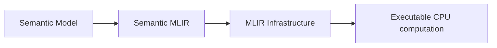

### 3. Manifestation proof

The computation can become:

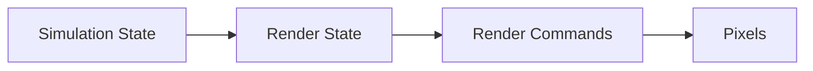

The third proof is particularly important.

SCR should not merely compile semantics.

It must eventually demonstrate that semantic computation can produce observable manifestations.

---

# 38. The Definition of "Done" for v0.0.1

The Golden Path is complete when a developer can demonstrate:

* a semantic simulation definition;
* semantic state;
* a semantic state transition;
* a valid SCR Semantic MLIR representation;
* MLIR verification;
* lowering;
* CPU execution;
* observable state evolution;
* render projection;
* render state;
* renderer integration;
* a visible result.

The result should be a small moving particle simulation.

The point is not the particle simulation.

The point is the architectural proof.

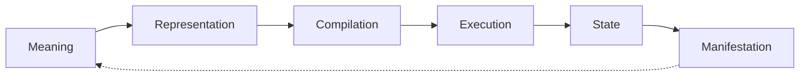

---

# 39. When Something Goes Wrong

Start with the narrowest layer that can explain the failure.

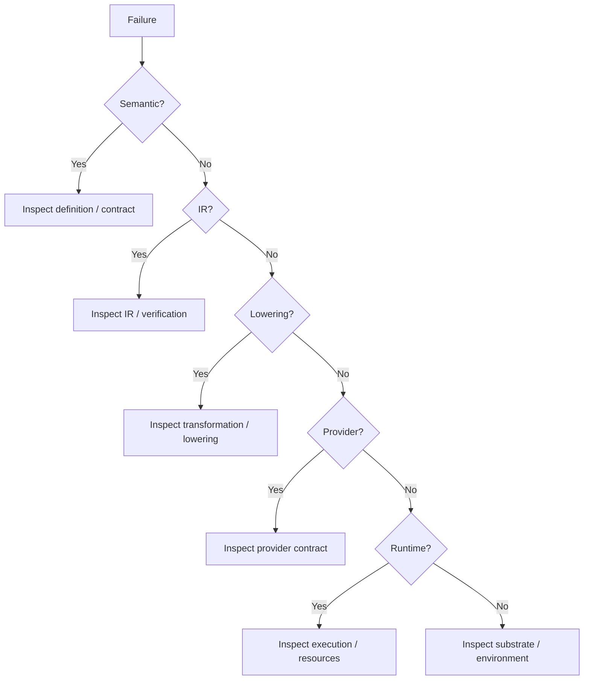

Do not immediately patch the lowest layer.

A failure in an implementation may actually indicate:

* an incomplete semantic definition;
* an invalid contract;
* a missing interface;
* an incorrect lowering;
* an inappropriate provider;
* an environment mismatch.

---

# 40. Environment Troubleshooting

## `mlir-opt` not found

Check:

```bash
which mlir-opt
echo "$PATH"
```

Then inspect:

```bash
source ./scripts/env-arch.sh
```

and rerun:

```bash
which mlir-opt
mlir-opt --version
```

## Wrong LLVM version

Check:

```bash
which clang
which mlir-opt
which llvm-config
clang --version
mlir-opt --version
```

If the paths resolve to different installations, fix the environment before building SCR.

## Bootstrap opens a shell

That is a tooling defect.

Bootstrap should establish or validate the environment, not replace the developer's shell.

Use:

```bash
./scripts/bootstrap_arch.sh --check
source ./scripts/env-arch.sh
```

and report the bootstrap behavior as an issue if it violates this policy.

## Build fails after changing LLVM versions

Clean the affected build tree rather than attempting to repair a build directory containing artifacts from an incompatible toolchain.

---

# 41. Development Roadmap

The repository contains a large semantic surface.

That does **not** mean it should all be implemented simultaneously.

The preferred development direction is:

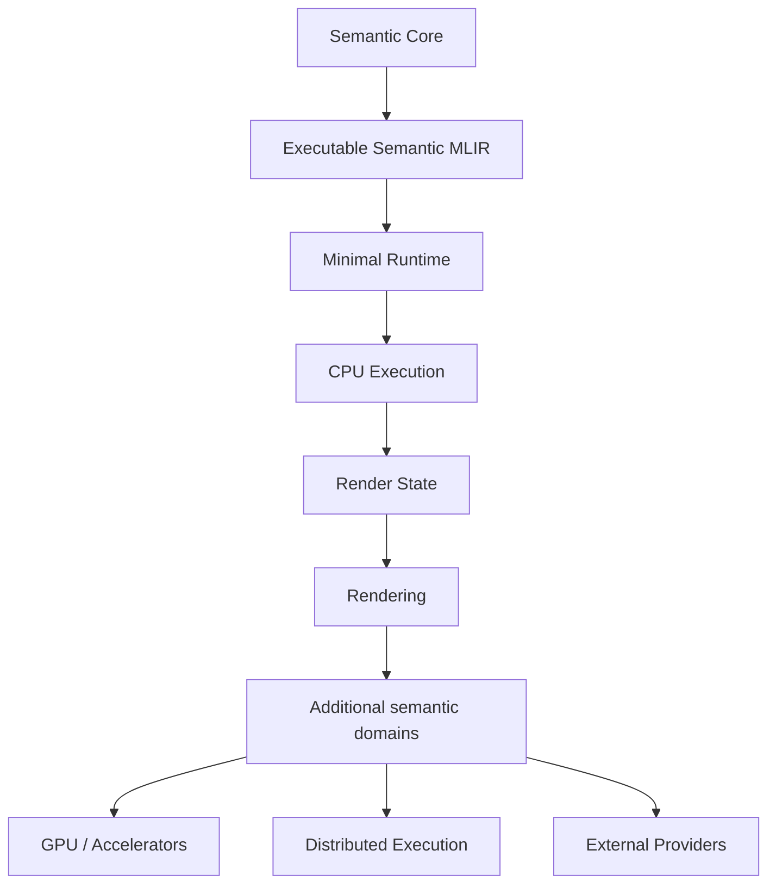

The first milestone is the vertical slice.

Only then should the system expand horizontally.

---

# 42. A Useful Mental Model

Think of SCR as a compiler/runtime stack for **meaning**.

```text
┌─────────────────────────────────────────────┐
│              Application Meaning            │
├─────────────────────────────────────────────┤
│             Semantic Library                │
├─────────────────────────────────────────────┤
│             Semantic Model                  │
├─────────────────────────────────────────────┤
│                SCR Semantic MLIR                   │
├─────────────────────────────────────────────┤
│                   MLIR                     │
├─────────────────────────────────────────────┤
│       Analysis / Transform / Lowering       │
├─────────────────────────────────────────────┤
│                Providers                   │
├─────────────────────────────────────────────┤
│             SCR Runtime                    │
├─────────────────────────────────────────────┤
│ CPU │ GPU │ Accelerator │ Distributed │ ...│
└─────────────────────────────────────────────┘
```

The purpose of every lower layer is to realize the meaning established above it.

---

# 43. Final Rule

When in doubt, ask:

> **What does this mean, independently of how we currently implement it?**

Then ask:

> **What is the smallest implementation that proves that meaning?**

That is the SCR development method.

```mermaid
flowchart LR
    A["What does it mean?"]
    B["What contract follows?"]
    C["How can we represent it?"]
    D["How can we transform it?"]
    E["How can we lower it?"]
    F["Which provider can realize it?"]
    G["Where should it execute?"]
    H["How do we validate it?"]

    A --> B --> C --> D --> E --> F --> G --> H
```

> **Define the meaning first.
> Prove the contract.
> Represent the computation.
> Compile it.
> Execute it.
> Observe the result.**

That is the path from SCR's semantic architecture to a working computational system.
