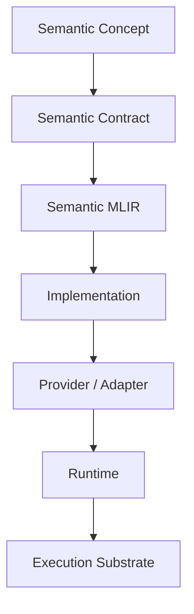
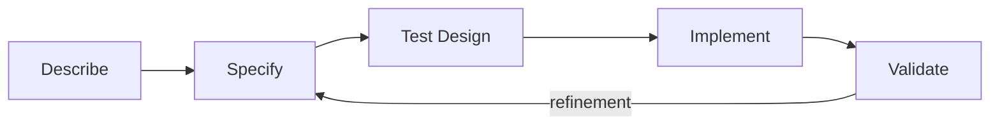

# AGENTS.md

# Semantic Computational Runtime — Agent Instructions

**Project:** Semantic Computational Runtime (SCR)
**Document:** `AGENTS.md`
**Version:** `1.0.0`
**Date:** 2026-09-05
**Authority:** Project-level agent instructions

---

# 1. Purpose

This document defines how AI coding agents must operate within the Semantic Computational Runtime (SCR) repository.

SCR is not merely a software library.

It is an **MLIR-based semantic computational environment** in which computational domains are represented through explicit semantic contracts and progressively transformed into executable implementations.

Agents must therefore treat:

```text
semantics
specification
architecture
implementation
testing
validation
```

as distinct but connected layers.

The central rule is:

> **Do not allow implementation convenience to silently redefine computational semantics.**

---

# 2. Project Identity

SCR is an:

> **MLIR-based Language Runtime for Computational Semantics.**

Its purpose is to provide a common semantic environment in which heterogeneous computational domains can be represented as formally specified, composable capabilities and compiled into optimized implementations across heterogeneous execution substrates.

The conceptual architecture is:

```text
Application
    ↓
Semantic API / Frontend
    ↓
Semantic Library
    ↓
Semantic MLIR
    ↓
Analysis / Transformation
    ↓
Provider Selection
    ↓
Lowering
    ↓
Runtime
    ↓
Execution Substrate
```

Execution substrates may include:

```text
CPU
GPU
Accelerator
External Library
Distributed System
```

---

# 3. Core Principle

The project follows this separation:

```text
WHAT
  ↓
Semantic Definition
  ↓
Semantic Contract
  ↓
MLIR Representation
  ↓
Implementation
  ↓
Provider / Adapter
  ↓
Execution
```

The layers have different authorities.

| Layer               | Meaning                                              |
| ------------------- | ---------------------------------------------------- |
| Semantic definition | What the concept means                               |
| Semantic contract   | What implementations must preserve                   |
| MLIR                | Formal computational representation                  |
| Implementation      | How the computation is performed                     |
| Provider            | How an external implementation realizes the contract |
| Runtime             | Where, when, and under what resources it executes    |
| Hardware            | Physical execution substrate                         |

An agent must not collapse these layers.

---

# 4. Source of Truth Hierarchy

When information conflicts, use the following authority order:

```text
1. Normative project architecture/specification
2. Parent semantic domain definition
3. Child semantic domain definition
4. Explicit interface/contract specification
5. Tests expressing normative behavior
6. Current implementation
7. Comments
8. Documentation/examples
9. Agent assumptions
```

More specifically:

```text
101_definition.md
      >
implementation
```

and:

```text
102_status.yaml
```

describes implementation state but does **not** redefine semantics.

The semantic graph:

```text
103_library.graph.json
```

is derived information.

It is not an independent source of truth.

---

# 5. Control-Plane Documents

Every semantic library directory should, where applicable, contain:

```text
101_definition.md
102_status.yaml
103_library.graph.json
```

Their roles are strictly separated.

## `101_definition.md`

Normative semantic definition.

Answers:

> What is this domain and what should it mean?

It defines:

* purpose
* scope
* semantic primitives
* entities
* values
* abstractions
* operations
* invariants
* relationships
* state
* transitions
* errors
* composition
* MLIR representation
* runtime semantics
* dependencies
* provider semantics
* testing requirements
* validation requirements

Changes to this file are **semantic changes**.

---

## `102_status.yaml`

Mutable engineering state.

Answers:

> What currently exists?

It records:

* implementation status
* tests
* validation
* MLIR status
* runtime status
* providers
* dependencies
* known limitations
* blockers
* risks
* open questions
* implementation history

Do not use status to hide incomplete implementation.

---

## `103_library.graph.json`

Derived semantic graph.

Answers:

> How does the library relate?

It may contain:

* domains
* modules
* functions
* operations
* types
* relationships
* dependencies
* implementations
* providers
* tests
* validation
* MLIR artifacts
* backend mappings
* provenance

Agents should prefer generating this graph from authoritative definitions and status records rather than manually maintaining it.

---

# 6. Semantic Development Lifecycle

All substantive development should follow:

```text
DESCRIBE
   ↓
SPECIFY
   ↓
TEST
   ↓
IMPLEMENT
   ↓
VALIDATE
```

Do not routinely begin with implementation.

For a new semantic capability:

```text
1. Describe the domain.
2. Define its semantic meaning.
3. Specify its invariants and contract.
4. Define its representation.
5. Define expected behavior.
6. Design tests.
7. Implement it.
8. Validate implementation against the specification.
```

---

# 7. Inspect Before Editing

Before modifying code, agents MUST inspect the relevant architecture.

At minimum determine:

```text
Where am I?
What domain does this represent?
Who is my parent domain?
What are my child domains?
What interfaces do I implement?
Who depends on me?
What depends on me?
What semantic definitions exist?
What status records exist?
What tests exist?
What MLIR dialects/types/operations are involved?
What providers or adapters are involved?
```

Do not assume the filesystem hierarchy is the semantic hierarchy.

The project is fundamentally a graph.

---

# 8. Repository Exploration

When beginning substantial work, inspect recursively.

Useful commands include:

```bash
find . -maxdepth 2 -type f | sort
find lib -type d | sort
find lib -type f | sort
```

Inspect:

```text
101_definition.md
102_status.yaml
```

before modifying a semantic domain.

Search for related concepts:

```bash
rg "ConceptName" .
```

Search for implementations:

```bash
rg "operation_name|type_name|interface_name" .
```

Search for tests:

```bash
find . -type f \( -name '*test*' -o -name '*lit*' \) | sort
```

The exact build/test commands should be determined from the repository's current build configuration rather than invented.

---

# 9. Never Treat the Filesystem as the Architecture

A directory tree is an implementation organization.

The semantic architecture is a graph.

For example:

```text
Morphology
    REFINES
Geometry

Morphology
    INTERACTS_WITH
Fields

Physics
    CONSUMES
Geometry

Dynamics
    TRANSFORMS
State
```

These relationships may cross directory boundaries.

Agents must therefore distinguish:

```text
filesystem relationship
```

from:

```text
semantic relationship
```

and:

```text
implementation dependency
```

---

# 10. Relationship Vocabulary

Use explicit relationship types.

Preferred vocabulary includes:

```text
CONTAINS
REFINES
SPECIALIZES
COMPOSES
DEPENDS_ON
REPRESENTS
LOWERS_TO
IMPLEMENTED_BY
EXECUTES_ON
ADAPTS
PRODUCES
CONSUMES
INTERACTS_WITH
CONSTRAINS
OBSERVES
TRANSFORMS
```

Do not invent relationships casually when an existing controlled relationship expresses the intended meaning.

---

# 11. Semantic Relationships vs Implementation Dependencies

These are different.

Example:

```text
Morphology REFINES Geometry
```

is a semantic relationship.

Whereas:

```text
morphology.rs DEPENDS_ON geometry.rs
```

is an implementation dependency.

Do not encode implementation dependencies as semantic relationships.

Similarly:

```text
Physics IMPLEMENTED_BY Chrono
```

does not mean:

```text
Physics IS Chrono
```

The external implementation is subordinate to the semantic contract.

---

# 12. Implementation Independence

SCR semantics must not depend on:

```text
Rust
C++
Python
LLVM
CUDA
ROCm
Vulkan
VulkanSceneGraph
Chrono
Eigen
CGAL
H3
OpenVDB
BLAS
```

or any other specific implementation technology.

These may be:

```text
providers
adapters
lowering targets
execution substrates
```

but they are not semantic authorities.

A useful mental model is:

```text
SCR Semantic Domain
        ↓
SCR Contract
        ↓
SCR Adapter
        ↓
External Implementation
```

---

# 13. Provider Architecture

External libraries are implementation resources.

A provider should implement one or more SCR semantic contracts.

For example:

```text
semantic.physics.integrate
        │
        ├── Chrono
        ├── Generated Solver
        ├── GPU Solver
        └── Custom Solver
```

The provider boundary must document, where applicable:

* semantic coverage
* precision
* determinism
* supported types
* supported operations
* performance characteristics
* memory behavior
* ownership
* lifecycle
* threading
* platform restrictions
* failure behavior

Never allow an external library API to silently become the SCR semantic API.

---

# 14. Semantic vs Physical Representation

Always distinguish semantic objects from their physical representations.

For example:

```text
Semantic Position
    ≠
Rust Position Struct
    ≠
MLIR Position Type
    ≠
GPU Buffer
    ≠
Vulkan Resource
```

Likewise:

```text
Semantic Field
    ≠
Tensor
    ≠
Dense Memory Buffer
    ≠
GPU Allocation
```

Representation transformations must preserve the semantic contract.

---

# 15. MLIR Rules

SCR is built on MLIR.

Agents should use MLIR's existing mechanisms whenever appropriate:

```text
Dialect
Operation
Type
Attribute
Region
Interface
Trait
Verification
Rewrite
Canonicalization
Dialect Conversion
Analysis
Transform
Lowering
```

Do not create parallel infrastructure when MLIR already provides the required mechanism.

Before introducing a new abstraction, ask:

```text
Can this be represented directly by MLIR?
Can an existing MLIR mechanism express it?
Does SCR actually require additional semantics?
```

---

# 16. Semantic Dialects

SCR may contain coordinated semantic dialects such as:

```text
semantic.core
semantic.math
semantic.data
semantic.tensor
semantic.field
semantic.graph
semantic.geometry
semantic.topology
semantic.spatial
semantic.morphology
semantic.physics
semantic.dynamics
semantic.simulation
semantic.agent
semantic.neural
semantic.learning
semantic.optimization
semantic.control
semantic.perception
semantic.render
semantic.stream
semantic.system
```

These boundaries are architectural hypotheses until formally established.

Do not create dialects merely because a directory exists.

A dialect should correspond to a coherent semantic domain.

---

# 17. Semantic Interfaces

Capabilities should be expressed through reusable interfaces where appropriate.

Examples:

```text
Dynamical
Spatial
Temporal
Differentiable
Parallelizable
Vectorizable
Tileable
Reducible
Integrable
Stateful
Stateless
Streamable
Renderable
Distributable
Deterministic
Stochastic
Invertible
Composable
Interpolatable
Queryable
Mutable
Immutable
```

The goal is to enable generic reasoning.

For example:

```text
Dynamical
+
Parallelizable
+
Vectorizable
```

may expose opportunities for:

```text
SIMD
GPU execution
parallel execution
kernel fusion
```

without requiring a generic compiler pass to understand every domain dialect individually.

---

# 18. Function-Level Requirements

Every meaningful function or operation should be understood in terms of:

```text
Purpose
Inputs
Outputs
Preconditions
Postconditions
Invariants
Errors
Determinism
Side effects
State changes
Ownership
Lifecycle
Composition
Performance characteristics
```

For an MLIR operation, additionally consider:

```text
Operands
Results
Attributes
Regions
Types
Traits
Interfaces
Verification
Canonicalization
Lowering
```

Do not implement behavior that cannot be explained semantically.

---

# 19. Determinism

Every meaningful computational operation should explicitly consider determinism.

Document whether it is:

```text
deterministic
conditionally deterministic
stochastic
nondeterministic
```

If nondeterministic or stochastic, identify:

```text
source of nondeterminism
seed/control mechanism
reproducibility expectations
equivalence criteria
parallelism effects
hardware-dependent behavior
```

Do not assume that mathematically equivalent computations are necessarily bitwise equivalent.

Distinguish:

```text
semantic equivalence
numerical equivalence
bitwise equivalence
```

---

# 20. Invariants

Semantic domains must identify their invariants.

Possible categories include:

```text
Domain invariants
Identity invariants
State invariants
Type invariants
Topological invariants
Geometric invariants
Physical invariants
Conservation laws
Ordering invariants
Determinism invariants
Lifecycle invariants
Resource invariants
```

An implementation is not correct merely because it produces plausible output.

It must preserve the required invariants.

---

# 21. Semantic Equivalence

Do not equate:

```text
same output on one test
```

with:

```text
semantic equivalence
```

When considering alternative implementations, determine the applicable contract.

Possible equivalence levels include:

```text
Exact equivalence
Numerical equivalence
Approximate equivalence
Distributional equivalence
Behavioral equivalence
Contractual equivalence
```

Document which level applies.

An optimization may only replace an operation if the relevant semantic guarantees remain satisfied.

---

# 22. Testing Strategy

Testing follows a progressive hierarchy:

```text
Specification Tests
        ↓
Unit Tests
        ↓
Domain Tests
        ↓
Composition Tests
        ↓
MLIR Tests
        ↓
Lowering Tests
        ↓
Runtime Tests
        ↓
Cross-Substrate Tests
```

Tests should cover, where applicable:

```text
normal behavior
boundary cases
invalid inputs
degenerate cases
error behavior
composition
determinism
invariant preservation
serialization
MLIR verification
canonicalization
lowering
runtime behavior
provider behavior
backend equivalence
```

---

# 23. Specification Tests

Tests should verify the semantic contract, not merely the implementation.

For example, if an operation promises:

```text
output preserves topology
```

there should be a test capable of detecting topology violations.

If an operation promises:

```text
deterministic for a fixed seed
```

there should be a reproducibility test.

If an operation promises:

```text
provider independence
```

at least one alternate implementation path should eventually exercise the contract.

---

# 24. Testing Implementations Against Semantics

The preferred model is:

```text
Semantic Contract
       ↓
Reference Behavior
       ↓
Implementation
       ↓
Conformance Tests
```

Where practical, tests should make it possible to compare multiple providers against the same semantic expectations.

This is particularly important for:

```text
numerical computation
physics
geometry
spatial operations
neural computation
rendering
distributed execution
```

---

# 25. Runtime Architecture

SCR is not merely an MLIR interpreter.

MLIR provides representation and compiler infrastructure.

The runtime is responsible for execution concerns such as:

```text
provider discovery
resource discovery
hardware discovery
scheduling
memory management
data movement
stream execution
asynchronous execution
telemetry
runtime specialization
provider selection
lifecycle management
```

A useful conceptual model is:

```text
Semantic Program
        +
MLIR
        +
Capability Requirements
        +
Provider Metadata
        +
Compiled Variants
        +
Runtime Configuration
        ↓
SCR Runtime
        ↓
Execution
```

---

# 26. Hardware Awareness

SCR aims to be:

```text
hardware-independent at the semantic level
```

while being:

```text
hardware-aware at compilation/runtime
```

Agents should not hard-code semantic behavior around:

```text
CPU
GPU
CUDA
Vulkan
ROCm
specific vector widths
specific accelerators
```

unless those details belong explicitly to a lower layer.

Hardware-specific optimization belongs in:

```text
lowering
provider
backend
runtime
specialization
```

not in the semantic contract.

---

# 27. Adaptive Execution

The runtime may eventually support:

```text
capability analysis
hardware analysis
provider selection
scheduling
compilation
execution
telemetry
re-specialization
```

Agents should preserve the architectural possibility of this model.

Do not introduce abstractions that make execution permanently tied to one provider or substrate unless that restriction is explicitly part of the semantic domain.

---

# 28. Cross-Domain Composition

SCR is specifically intended to allow domains to interact.

Examples include:

```text
Field → Morphology
Morphology → Geometry
Geometry → Physics
Physics → Dynamics
Dynamics → Agents
Agents → Neural Computation
Neural Computation → Control
Control → Dynamics
Geometry → Rendering
Rendering → Streams
Streams → Perception
Perception → Agents
```

When adding a domain, consider:

```text
What does it consume?
What does it produce?
What concepts does it refine?
What concepts does it constrain?
What concepts does it observe?
What concepts can it transform?
```

Do not treat domain boundaries as isolated packages unless the semantics genuinely require isolation.

---

# 29. Information Is a Computational Resource

SCR treats information-bearing structures as potentially active computational substrates.

Relevant representations include:

```text
fields
graphs
streams
tensors
spatial structures
semantic state
topological structures
```

Do not assume that information is merely passive input data.

A field may influence morphology.

A graph may determine communication.

A stream may drive perception.

A spatial structure may constrain dynamics.

A morphology may alter geometry and therefore physics.

These relationships should be represented explicitly when semantically meaningful.

---

# 30. Morphology

Morphology is not merely:

```text
mesh generation
```

or:

```text
rendering geometry
```

It concerns computational structure and form.

Morphology may derive from:

```text
patterns
fields
topology
geometry
constraints
dynamics
semantic relationships
```

and may produce:

```text
geometry
spatial structures
patterns
renderable representations
computational structures
```

Where appropriate, preserve the bidirectional possibility:

```text
patterns ↔ morphology
fields ↔ morphology
morphology ↔ geometry
morphology ↔ topology
```

Do not reduce morphology to a final presentation layer.

---

# 31. Rendering

Rendering is a computational domain.

Do not assume rendering is necessarily:

```text
final output
```

Rendering may participate in:

```text
observation
streaming
visual feedback
perception
interaction
simulation
```

A backend such as:

```text
Rust
 ↓
C++ adapter
 ↓
VulkanSceneGraph
 ↓
Vulkan
 ↓
GPU
```

is an implementation path.

It does not define rendering semantics.

---

# 32. Messaging and Streams

Communication may carry computational semantics.

Where messaging is modeled, preserve distinctions between:

```text
message
event
stream
queue
exchange
routing
delivery
acknowledgement
ordering
backpressure
state
```

An AMQP-compatible implementation may be used as a provider or execution mechanism.

Do not make a particular broker the semantic definition of messaging.

---

# 33. Reference Workloads

The project uses demanding cross-domain workloads to validate architecture.

A simulation workload may combine:

```text
spatial topology
+
fields
+
geometry
+
morphology
+
physics
+
dynamics
+
agents
+
neural computation
+
perception
+
rendering
+
stream processing
```

The workload is a validation environment.

It is not the definition of SCR.

Avoid allowing the current reference workload to unnecessarily constrain the general semantic architecture.

---

# 34. Language Frontends

SCR should support multiple language frontends where practical.

Potential frontends include:

```text
Rust
Python
C++
Julia
```

A frontend should express semantic intent rather than expose provider-specific implementation details unnecessarily.

Conceptually:

```text
Language
    ↓
Semantic API
    ↓
Semantic MLIR
```

A language binding must not become the semantic authority merely because it is convenient to implement.

---

# 35. API Design

Prefer APIs that expose:

```text
semantic concepts
capabilities
contracts
relationships
```

rather than:

```text
implementation objects
backend handles
library-specific data structures
vendor-specific assumptions
```

Where an implementation-specific API is necessary, isolate it behind an explicit adapter/provider boundary.

---

# 36. Error Semantics

Errors are part of semantics.

For every meaningful operation, consider:

```text
invalid input
unsupported capability
invalid state
resource exhaustion
provider failure
numerical failure
convergence failure
hardware failure
communication failure
timeout
cancellation
```

Do not silently convert semantic failure into arbitrary implementation behavior.

Document whether an error is:

```text
recoverable
non-recoverable
retryable
provider-specific
semantic
```

---

# 37. Performance Semantics

Performance must not silently redefine correctness.

Where performance characteristics matter, distinguish:

```text
semantic requirement
```

from:

```text
performance preference
```

For example:

```text
must preserve deterministic ordering
```

is semantic.

Whereas:

```text
prefer GPU execution
```

is generally a scheduling or optimization preference.

Do not encode optimization preferences as semantic requirements unless they genuinely are part of the contract.

---

# 38. Memory and Ownership

For every substantial data representation, understand:

```text
ownership
lifetime
mutability
aliasing
copy semantics
movement
device residency
synchronization
serialization
```

Do not confuse:

```text
semantic ownership
```

with:

```text
Rust ownership
```

or:

```text
GPU memory ownership
```

These are different concepts.

---

# 39. Concurrency

When implementing concurrent behavior, document:

```text
thread safety
ordering
synchronization
atomicity
race behavior
determinism
reentrancy
parallel semantics
```

Do not assume that an operation is safely parallelizable because it happens to run correctly in one concurrent test.

If an operation is declared:

```text
Parallelizable
```

the semantic contract must justify what parallel execution preserves.

---

# 40. Serialization and Persistence

If a semantic object can be serialized, determine:

```text
identity
version
schema
compatibility
canonical representation
losslessness
migration requirements
```

Serialization must not accidentally become a new semantic definition.

---

# 41. Versioning

Use Semantic Versioning where applicable:

```text
MAJOR.MINOR.PATCH
```

Normative semantic changes must be traceable.

At minimum preserve:

```text
version
created
updated
history
```

Do not silently overwrite historical semantic decisions.

If a change modifies meaning, classify it explicitly as a semantic change.

---

# 42. Dates

Use ISO-8601 dates:

```text
YYYY-MM-DD
```

For example:

```yaml
created: 2026-09-05
updated: 2026-09-05
```

Avoid ambiguous date formats.

---

# 43. Status Discipline

Suggested status vocabulary:

```text
not_started
discovered
specified
partially_implemented
implemented
tested
validated
deprecated
blocked
```

Do not mark something:

```text
implemented
```

without evidence.

Do not mark something:

```text
tested
```

because tests merely exist.

Do not mark something:

```text
validated
```

because unit tests pass.

Validation should correspond to the applicable semantic and architectural requirements.

---

# 44. Completeness

A semantic domain is not complete merely because source files exist.

A meaningful definition should establish:

```text
identity
purpose
scope
primitives
abstractions
operations
relationships
invariants
inputs
outputs
state
errors
composition
MLIR representation
runtime semantics
dependencies
providers
testing requirements
validation requirements
```

---

# 45. Empty or Incomplete Directories

Do not automatically delete empty or apparently unused directories.

Classify them as potentially:

```text
intentional domain
placeholder
future domain
obsolete
misplaced
duplicate
implementation artifact
restructuring candidate
```

Record the finding before destructive action.

---

# 46. Dependency Discipline

Classify dependencies as:

```text
semantic
implementation
optional
backend
external
```

Investigate cycles.

A dependency cycle may indicate:

```text
incorrect abstraction
incorrect ownership
incorrect domain boundary
missing shared semantic domain
implementation leakage
```

Do not resolve architectural cycles merely by rearranging imports.

---

# 47. Conflict Resolution

When definitions, implementation, or tests disagree:

1. Identify the conflict.
2. Identify affected domains.
3. Identify the highest semantic authority.
4. Determine whether the conflict is semantic or implementation-level.
5. Record the discrepancy.
6. Resolve explicitly.
7. Update affected specifications.
8. Update implementation.
9. Add or update tests.
10. Update status and graph.

Never silently choose whichever interpretation is easiest to implement.

---

# 48. Existing Code May Be Wrong

When inspecting existing code, ask two separate questions:

```text
What does the code currently do?
```

and:

```text
What should the semantic domain mean?
```

These are not necessarily the same.

If they differ:

```text
record discrepancy
```

rather than redefining the semantics to match the implementation.

---

# 49. Do Not Over-Engineer Speculatively

SCR is ambitious.

Agents must not turn every architectural possibility into immediate implementation.

Distinguish:

```text
current requirement
planned capability
research direction
architectural possibility
```

Implement what the current increment requires.

Document future possibilities without prematurely hard-coding them.

---

# 50. Do Not Under-Specify Foundational Concepts

The opposite failure is also prohibited.

Foundational concepts such as:

```text
identity
type
field
state
relationship
capability
operation
domain
provider
execution
```

should be specified rigorously before large amounts of dependent implementation are created.

Weak foundations create semantic drift.

---

# 51. Avoid Premature Optimization

The preferred order is:

```text
correct semantics
        ↓
correct representation
        ↓
correct implementation
        ↓
correct validation
        ↓
optimization
```

Do not sacrifice semantic clarity to obtain early performance.

When optimizing, demonstrate that the optimization preserves the relevant contract.

---

# 52. Agent Scope

Agents working on a specific domain should operate within an explicit scope.

Before making changes, establish:

```text
Assigned domain
Parent domain
Child domains
Relevant interfaces
Relevant dependencies
Relevant tests
```

Agents should avoid unrelated modifications.

If an architectural issue outside the assigned scope blocks progress:

```text
record it
```

and escalate it rather than silently changing unrelated architecture.

---

# 53. Parallel Agent Work

Parallel work is encouraged when semantic boundaries are already established.

Suitable parallel tasks include:

```text
domain A implementation
domain B tests
domain C provider
domain D documentation
```

provided they do not independently redefine shared foundational concepts.

Do not allow multiple agents to create competing definitions of:

```text
same type
same invariant
same capability
same identity model
same foundational operation
```

without coordination.

---

# 54. Required Agent Reporting

For substantive work, agents should report:

```text
Scope
Files changed
Semantic changes
Implementation changes
Tests added/changed
Validation performed
Known discrepancies
Open questions
Remaining blockers
```

Do not claim work was performed if it was not.

Do not claim tests passed unless they actually ran and passed.

Do not claim validation occurred unless the relevant validation was performed.

---

# 55. Graph Integrity

When a semantic domain changes, determine whether the derived graph is affected.

Potentially affected entities include:

```text
domain
operation
type
relationship
dependency
provider
implementation
test
validation
lowering
backend
```

The graph should preserve provenance.

Prefer:

```text
definition/status
       ↓
graph generation
```

over:

```text
manual graph editing
```

---

# 56. Traceability

Important artifacts should be traceable across:

```text
requirement
   ↓
definition
   ↓
operation
   ↓
implementation
   ↓
test
   ↓
validation
   ↓
lowering
   ↓
runtime
```

A useful question for any feature is:

> Can we determine why this code exists, what semantic contract it implements, and what evidence demonstrates that it is correct?

If not, improve traceability.

---

# 57. Architectural Invariants

The following invariants apply across SCR:

## Semantic Primacy

Meaning comes before implementation.

## Implementation Independence

Semantics do not depend on a particular implementation.

## Backend Independence

Semantic contracts do not depend on execution hardware.

## Explicit Relationships

Important semantic relationships must be represented explicitly.

## Invariant Preservation

Transformations must preserve applicable invariants.

## No Silent Semantics

Meaning must never be changed implicitly.

## Testability

Semantic claims must be testable where practical.

## Traceability

Implementation must be traceable to semantic requirements.

## Version Integrity

Normative changes must be versioned.

## Historical Integrity

Previous semantic decisions must remain recoverable.

## Graph Semantics

The computational architecture is a graph, not merely a directory tree.

## Progressive Abstraction

Concepts should be progressively refined:

```text
Concept
  ↓
Semantic Contract
  ↓
MLIR Representation
  ↓
Generic Implementation
  ↓
Provider / Adapter
  ↓
Hardware
```

## Status Separation

Engineering state must not redefine semantics.

## Derived Graph

The aggregate graph is derived from authoritative sources.

---

# 58. Common Failure Modes

Agents must actively avoid:

### Code-as-Authority

> "The code already does this, therefore this is what the domain means."

Incorrect.

### Provider-as-Semantics

> "Chrono represents physics, therefore physics means Chrono."

Incorrect.

### Directory-as-Domain

> "There is a directory called `foo`, therefore `foo` is a semantic domain."

Not necessarily.

### Test-as-Complete

> "There are tests, therefore the domain is complete."

Incorrect.

### Status-as-Truth

> "`status: implemented`, therefore it works."

Not sufficient.

### Graph-as-Authority

> "The graph says these domains relate, therefore they must."

Incorrect.

The graph is derived.

### Backend-Driven Semantics

> "The GPU requires this representation, therefore the semantic type should be defined that way."

Incorrect.

### Premature Abstraction

> "We might eventually need this, therefore implement it now."

Incorrect.

### Silent Compatibility Break

Changing an operation's meaning without changing its specification/version/history.

Prohibited.

---

# 59. Definition of Done — Function

A meaningful function or operation is complete when:

```text
[ ] Purpose described
[ ] Inputs defined
[ ] Outputs defined
[ ] Preconditions defined
[ ] Postconditions defined
[ ] Invariants defined
[ ] Errors defined
[ ] Determinism defined
[ ] Side effects defined
[ ] State behavior defined
[ ] Composition defined
[ ] Implementation exists
[ ] Unit tests exist
[ ] Boundary tests exist
[ ] Error tests exist
[ ] Composition tests exist where applicable
[ ] Semantic validation performed
[ ] MLIR verification performed where applicable
[ ] Lowering tested where applicable
[ ] Runtime tested where applicable
[ ] Status updated
[ ] Traceability established
```

---

# 60. Definition of Done — Domain

A semantic domain is complete when:

```text
[ ] 101_definition.md exists
[ ] 102_status.yaml exists
[ ] Domain identity established
[ ] Scope established
[ ] Parent/child relationships established
[ ] Semantic primitives defined
[ ] Abstractions defined
[ ] Operations defined
[ ] Types defined
[ ] Invariants defined
[ ] Inputs/outputs defined
[ ] State model defined
[ ] Error semantics defined
[ ] Composition defined
[ ] MLIR representation defined
[ ] Runtime semantics defined
[ ] Provider boundary defined
[ ] Dependencies classified
[ ] Tests defined
[ ] Validation defined
[ ] Implementation status accurate
[ ] Graph relationships derivable
```

---

# 61. Definition of Done — Module

A module is complete when:

```text
semantic contract
        +
implementation
        +
tests
        +
validation
        +
MLIR integration
        +
lowering
        +
runtime behavior
        +
provider integration
        +
traceability
```

have been addressed to the degree applicable to that module.

Not every module requires every category.

The definition must explain why a category is:

```text
applicable
not applicable
planned
blocked
```

---

# 62. Definition of Done — Program Increment

A program increment is complete when the relevant architecture can be answered mechanically.

For each domain:

```text
What is it?
Why does it exist?
What does it mean?
What are its invariants?
What does it consume?
What does it produce?
How does it compose?
What does it depend on?
What depends on it?
How is it represented in MLIR?
How is it implemented?
What providers implement it?
Where can it execute?
How is it tested?
How is it validated?
What remains incomplete?
What changed?
```

The answers must be traceable to project artifacts.

---

# 63. Preferred Work Order

For substantial features, use:

```text
DISCOVER
   ↓
CLASSIFY
   ↓
DEFINE
   ↓
RELATE
   ↓
SPECIFY
   ↓
DESIGN TESTS
   ↓
IMPLEMENT
   ↓
TEST
   ↓
VALIDATE
   ↓
INTEGRATE
   ↓
OPTIMIZE
```

Optimization belongs near the end.

---

# 64. Minimal Change Principle

Make the smallest change that correctly satisfies the semantic and engineering requirements.

Avoid:

```text
unrelated refactors
style-only rewrites
unnecessary dependency changes
architectural churn
premature abstraction
```

However, do not preserve obviously incorrect architecture merely because changing it is inconvenient.

Semantic correctness takes precedence over minimal textual change.

---

# 65. Documentation Requirements

When adding a meaningful capability, update documentation where appropriate.

At minimum consider:

```text
101_definition.md
102_status.yaml
tests
API documentation
examples
graph
```

If behavior changes, documentation must not remain silently stale.

---

# 66. Examples Are Architectural Tests

Examples should demonstrate semantic composition rather than provider-specific usage whenever possible.

Prefer:

```text
ecosystem.simulate()
```

over an example whose primary purpose is:

```text
call Chrono API
```

unless the example specifically demonstrates a provider.

Examples should help answer:

> What can a developer express using SCR?

---

# 67. Public Documentation

The public documentation should maintain a clear distinction between:

```text
current implementation
```

and:

```text
architectural vision
```

Do not present planned capabilities as implemented functionality.

Use language such as:

```text
provides
```

for implemented functionality and:

```text
is intended to
may
could
is designed to
```

for architectural goals that are not yet implemented.

---

# 68. Security and Isolation

Where relevant, consider:

```text
provider isolation
resource limits
untrusted inputs
external execution
memory safety
process boundaries
network access
code generation
dynamic loading
serialization
```

Do not assume that a semantic operation is safe merely because its mathematical definition is safe.

The implementation and runtime boundaries can introduce security concerns.

---

# 69. External Resources

Do not introduce an external dependency simply because it provides a convenient implementation.

Before adding one, consider:

```text
semantic necessity
license
maintenance
portability
performance
build complexity
runtime requirements
platform restrictions
security
provider isolation
```

Prefer provider boundaries for optional implementations.

---

# 70. Build and Tooling

Respect the repository's established toolchain.

Do not casually replace:

```text
CMake
Ninja
Clang/LLVM
Rust
Python
Nix
```

or other project infrastructure.

Before changing build architecture:

```text
inspect existing configuration
understand why it exists
identify affected targets
test the proposed change
```

Do not introduce multiple incompatible ways of building the same component without a clear reason.

---

# 71. Environment Assumptions

Development environments may differ.

Do not assume:

```text
specific filesystem paths
specific LLVM installation
specific GPU
specific operating system
specific compiler version
```

unless the repository explicitly requires them.

When a dependency is required, fail clearly and diagnostically.

---

# 72. Generated Files

Treat generated artifacts according to their declared role.

If:

```text
103_library.graph.json
```

is generated, do not hand-edit it as the primary mechanism of architecture management.

Likewise, do not manually modify generated MLIR/C++/Rust artifacts when the source definition or generator should be changed instead.

Always identify:

```text
source artifact
generated artifact
generation mechanism
```

before modifying generated output.

---

# 73. Agent Autonomy

Agents may:

```text
inspect
analyze
implement
test
document
refactor
```

within their assigned scope.

Agents must not silently:

```text
change semantic meaning
delete architectural domains
replace providers
introduce major dependencies
change public contracts
rewrite foundational types
```

without documenting the architectural consequence.

---

# 74. When to Stop and Ask

Stop and escalate when:

```text
two semantic definitions conflict
```

and neither has clear authority.

Also escalate when:

```text
a foundational type requires incompatible meanings
```

or:

```text
a requested implementation requires violating a semantic invariant
```

or:

```text
the correct architecture cannot be determined from existing specifications
```

Do not resolve foundational ambiguity by guesswork.

For local implementation ambiguity, prefer the least surprising interpretation and document it.

---

# 75. Architectural Questions

When encountering an unresolved architectural question, record:

```text
Question
Context
Affected domains
Current alternatives
Semantic consequences
Implementation consequences
Recommendation
Decision
Decision authority
Date
```

Do not bury architectural decisions inside implementation commits without documentation.

---

# 76. The SCR Mental Model

Agents should continually reason using:

```text
Semantic Meaning
       ↓
Contract
       ↓
Composition
       ↓
Representation
       ↓
Transformation
       ↓
Provider
       ↓
Execution
```

rather than:

```text
Directory
       ↓
Class
       ↓
Function
       ↓
Library Call
```

The second view describes implementation.

The first describes SCR.

Both are necessary.

The first has architectural authority.

---

# 77. Final Rules

Before submitting substantive work, ask:

```text
1. Did I understand the semantic domain?
2. Did I inspect its parent and related domains?
3. Did I distinguish semantics from implementation?
4. Did I preserve existing invariants?
5. Did I document new semantic behavior?
6. Did I classify dependencies correctly?
7. Did I add appropriate tests?
8. Did I actually run the relevant tests?
9. Did I validate behavior against the contract?
10. Did I update status?
11. Did I update affected graph information?
12. Did I avoid unrelated changes?
13. Did I preserve provider independence?
14. Did I preserve backend independence?
15. Did I record unresolved questions?
```

If the answer to any applicable question is **no**, the work is not complete.

---

# 78. The Governing Principle

The most important rule in this repository is:

> **The code is not the architecture.**

The architecture is the semantic model.

Therefore:

```text
Specification ≠ Implementation

Status ≠ Specification

Graph ≠ Source of Truth

Provider ≠ Semantic Authority

Backend ≠ Semantic Meaning

Representation ≠ Concept
```

The intended relationship is:



And the development lifecycle is:



SCR exists to make computational meaning:

```text
composable
portable
optimizable
discoverable
verifiable
traceable
semantically addressable
```

Agents working on SCR must preserve that objective above all implementation convenience.
