# Semantic Computational Runtime

## An Introduction to a Computational Universe Built Around Meaning

> **What if software could describe what a computation means without first deciding which library, algorithm, programming language, or hardware should perform it?**

That is the fundamental question behind the **Semantic Computational Runtime (SCR)**.

SCR is an experimental, open computational environment built on [MLIR](https://mlir.llvm.org/) that explores a different way of constructing software:

Instead of making applications depend directly on implementation technologies, applications describe **semantic intent**.

The runtime and compiler can then determine how that intent can be represented, composed, optimized, implemented, and executed.

This seemingly simple change has profound consequences.

It potentially allows physics, geometry, simulation, artificial intelligence, spatial computing, graphs, rendering, messaging, streaming, numerical computation, robotics, and other computational domains to participate in the **same computational environment**.

---

# Table of Contents

* [1. The Idea in One Minute](#1-the-idea-in-one-minute)
* [2. Why This Matters](#2-why-this-matters)
* [3. Software Today: Implementation First](#3-software-today-implementation-first)
* [4. SCR: Meaning First](#4-scr-meaning-first)
* [5. A Simple Example](#5-a-simple-example)
* [6. From Meaning to Machine](#6-from-meaning-to-machine)
* [7. The Semantic Layer](#7-the-semantic-layer)
* [8. Why MLIR Is Important](#8-why-mlir-is-important)
* [9. Computational Domains Become Composable](#9-computational-domains-become-composable)
* [10. Fields: Information That Can Compute](#10-fields-information-that-can-compute)
* [11. Morphology: When Patterns Become Form](#11-morphology-when-patterns-become-form)
* [12. Physics, Dynamics, and Simulation](#12-physics-dynamics-and-simulation)
* [13. AI Does Not Have to Live in a Separate World](#13-ai-does-not-have-to-live-in-a-separate-world)
* [14. Geometry Does Not Have to Mean One Representation](#14-geometry-does-not-have-to-mean-one-representation)
* [15. Rendering Becomes Part of Computation](#15-rendering-becomes-part-of-computation)
* [16. Streams and Messaging Become Computational Primitives](#16-streams-and-messaging-become-computational-primitives)
* [17. The Provider Model](#17-the-provider-model)
* [18. One Meaning, Many Implementations](#18-one-meaning-many-implementations)
* [19. Hardware Without Hardware Lock-In](#19-hardware-without-hardware-lock-in)
* [20. The Semantic Graph](#20-the-semantic-graph)
* [21. A Computational Example](#21-a-computational-example)
* [22. What This Could Enable](#22-what-this-could-enable)
* [23. Who Could Use SCR](#23-who-could-use-scr)
* [24. What SCR Is Not](#24-what-scr-is-not)
* [25. The Long-Term Vision](#25-the-long-term-vision)
* [26. Project Status](#26-project-status)
* [27. Learn More](#27-learn-more)

---

# 1. The Idea in One Minute

Most software works roughly like this:

```text
Problem
   ↓
Choose a library
   ↓
Choose an API
   ↓
Choose a programming language
   ↓
Choose an execution model
   ↓
Choose hardware
   ↓
Build application
```

SCR explores the reverse:

```text
Problem
   ↓
Semantic Model
   ↓
Composition
   ↓
Compilation
   ↓
Implementation
   ↓
Hardware
```

The application starts by describing **what it wants to accomplish**.

For example:

```text
integrate this dynamical system
```

rather than:

```text
call this particular physics engine's integration API
```

Or:

```text
find the spatial neighbours of these entities
```

rather than:

```text
call this particular spatial-index library
```

Or:

```text
transform this field
```

rather than:

```text
allocate this particular tensor type and invoke this particular kernel
```

The difference is subtle at first.

But it becomes enormous when many different kinds of computation need to interact.

---

# 2. Why This Matters

Computing has become extraordinarily powerful.

We have:

* CPUs with increasingly sophisticated vector units
* GPUs with massive parallel throughput
* dedicated AI accelerators
* specialized numerical hardware
* distributed computing
* high-speed interconnects
* increasingly sophisticated compiler infrastructure
* thousands of specialized open-source libraries

Yet our applications are still frequently constructed around the boundaries imposed by those technologies.

A physics engine has its own world.

A neural network framework has its own world.

A geometry library has its own world.

A rendering engine has its own world.

A message broker has its own world.

A graph engine has its own world.

Connecting them usually means writing glue code.

SCR asks:

> **What if the computational concepts themselves were the common language?**

---

# 3. Software Today: Implementation First

Consider a developer building a simulation.

They might decide:

```text
Physics      → Physics Engine A
Geometry     → Geometry Library B
Spatial      → Spatial Library C
AI           → ML Framework D
Rendering    → Rendering Engine E
Messaging    → Message Broker F
```

The application then becomes something like:

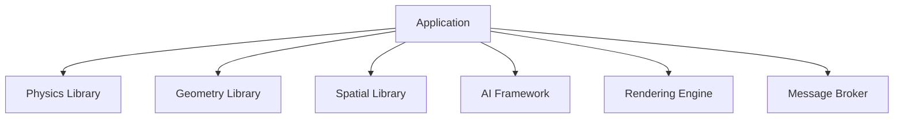

Each integration boundary introduces assumptions.

Now imagine replacing the physics engine.

Or moving neural inference from CPU to GPU.

Or replacing the spatial indexing algorithm.

Or changing the rendering backend.

Or distributing part of the computation across machines.

The application often has to know about those changes.

The implementation has leaked into the application architecture.

---

# 4. SCR: Meaning First

SCR proposes inserting a semantic layer between the application and the implementation.

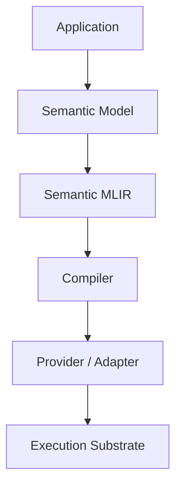

The application describes:

```text
what
```

The semantic layer describes:

```text
what it means
```

The compiler determines:

```text
what transformations are valid
```

The provider determines:

```text
how the semantics can be implemented
```

The runtime determines:

```text
where and when it should execute
```

---

# 5. A Simple Example

Imagine an application wants to propagate an agent through an environment.

At a high level, it might express:

```text
agent.propagate(
    agent,
    environment,
    timestep
)
```

That operation could semantically involve:

```text
position
velocity
environmental field
constraints
neighbour relationships
collision geometry
decision state
```

The application does not necessarily need to know whether the resulting computation becomes:

```text
CPU code
GPU kernels
a physics engine call
a generated solver
a vectorized loop
a distributed computation
```

The semantic representation provides the common ground.

---

# 6. From Meaning to Machine

A simplified SCR compilation path looks like:

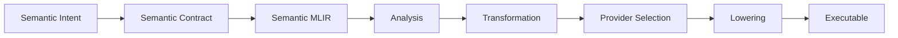

For example:

```text
physics.integrate
```

could eventually become:

```text
semantic.physics.integrate
        ↓
verified dynamical operation
        ↓
optimized numerical representation
        ↓
provider selection
        ↓
solver implementation
        ↓
CPU / GPU / accelerator
```

The semantic identity survives the transformations.

That is important.

The lower-level representation can change without changing what the operation means.

---

# 7. The Semantic Layer

SCR introduces a distinction between **meaning** and **representation**.

Consider a position.

Semantically:

```text
Position
```

might mean:

> A location in a specified spatial domain and coordinate system.

It could then be represented as:

```text
(x, y, z)
```

or:

```text
a geometric point
```

or:

```text
a SIMD vector
```

or:

```text
a GPU buffer
```

or:

```text
a distributed spatial record
```

These are different implementations of a semantic concept.

Therefore:

```text
Semantic Position
       ≠
Memory Representation
       ≠
MLIR Representation
       ≠
Hardware Representation
```

SCR attempts to preserve that distinction throughout the computational pipeline.

---

# 8. Why MLIR Is Important

SCR does not attempt to invent another compiler infrastructure.

It is built on **MLIR**.

MLIR already provides a powerful extensible foundation for representing and transforming computation.

It provides concepts such as:

* operations
* values
* types
* attributes
* regions
* dialects
* interfaces
* traits
* verification
* rewriting
* canonicalization
* transformations
* dialect conversion
* lowering

SCR adds another layer of meaning on top of those mechanisms.

Conceptually:

```text
┌─────────────────────────────┐
│      SCR Semantics          │
│                             │
│ domains                     │
│ contracts                   │
│ relationships               │
│ capabilities                │
│ invariants                  │
└──────────────┬──────────────┘
               │
               ▼
┌─────────────────────────────┐
│            MLIR             │
│                             │
│ operations                  │
│ types                       │
│ attributes                  │
│ regions                     │
│ interfaces                  │
│ transformations             │
└──────────────┬──────────────┘
               │
               ▼
        Target compilation
```

This lets SCR concentrate on the difficult question:

> **What does this computation mean?**

rather than rebuilding the machinery required to manipulate intermediate representations.

---

# 9. Computational Domains Become Composable

One of the most important consequences of this approach is that computational domains no longer need to be isolated.

Consider:

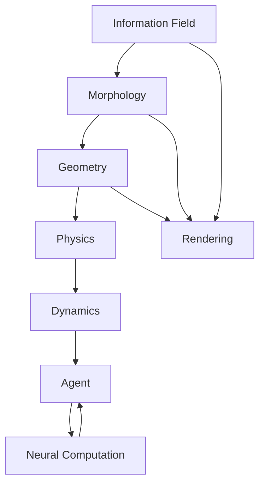

This is not merely an application-level integration diagram.

The intention is for these concepts to be understandable to the compiler as semantic relationships.

That creates opportunities for transformations that would otherwise be hidden behind library boundaries.

---

# 10. Fields: Information That Can Compute

A **field** can be thought of as information distributed across some domain.

Examples include:

```text
temperature
pressure
light
density
probability
velocity
semantic influence
distance
potential
environmental state
```

But fields do not need to be limited to physics.

A field could describe:

```text
where something is likely to occur
```

or:

```text
how strongly an entity is influenced by its environment
```

or:

```text
the intensity of a semantic property across space
```

This becomes especially interesting when fields interact with other domains.

For example:

```text
environmental field
        ↓
pattern formation
        ↓
morphology
        ↓
geometry
        ↓
rendering
```

The field becomes part of the computation rather than merely a dataset consumed by an application.

---

# 11. Morphology: When Patterns Become Form

Morphology concerns **structure and form**.

It is deliberately broader than mesh processing.

A morphology might emerge from:

```text
patterns
fields
topology
constraints
geometry
dynamics
relationships
```

For example:

```text
growth field
     ↓
pattern
     ↓
morphological structure
     ↓
geometry
     ↓
renderable form
```

But the relationship can also operate in reverse.

Geometry can influence morphology.

Morphology can influence patterns.

Patterns can emerge from dynamics.

Therefore:

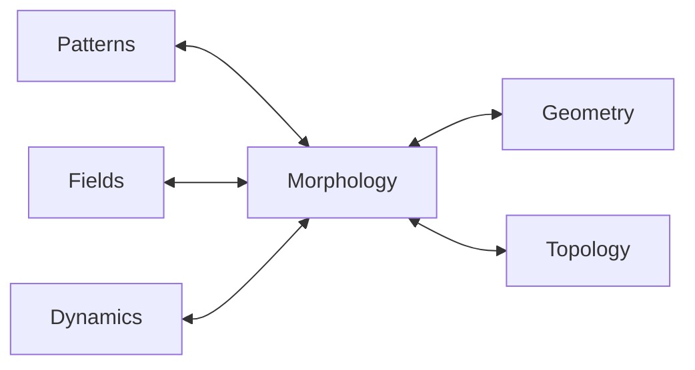

This opens the door to computational systems where **form is an active participant in computation** rather than merely the final output of computation.

---

# 12. Physics, Dynamics, and Simulation

Physics is a useful example because it demonstrates why semantic abstraction matters.

Suppose an application defines:

```text
body
+
mass
+
forces
+
constraints
+
material
+
environment
```

The semantic system can construct a dynamical model.

The model might then be integrated using:

```text
numerical solver A
```

or:

```text
numerical solver B
```

or:

```text
GPU implementation
```

or:

```text
specialized analytic solution
```

provided the implementation satisfies the required semantic contract.

This makes it possible to distinguish:

```text
physical meaning
```

from:

```text
numerical implementation
```

That distinction is enormously valuable in scientific computing.

---

# 13. AI Does Not Have to Live in a Separate World

Today, machine learning systems are frequently treated as a separate computational universe.

SCR instead treats neural computation as another semantic domain.

For example:

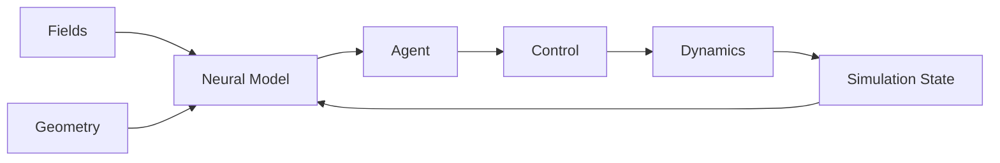

A neural model could therefore consume:

* fields
* geometry
* graphs
* simulation state
* streams

and produce:

* predictions
* decisions
* actions
* control signals
* transformations

The important point is not that SCR provides another neural-network framework.

The point is that **neural computation can become composable with other computational semantics**.

---

# 14. Geometry Does Not Have to Mean One Representation

A geometric concept can have many useful representations.

For example:

```text
semantic shape
```

might materialize as:

```text
mesh
voxel structure
point cloud
implicit surface
particle representation
finite-element structure
collision representation
render geometry
```

Different consumers may require different representations.

A physics solver may want one.

A renderer may want another.

A spatial index may want another.

A neural model may want yet another.

SCR's semantic layer creates the possibility of treating these as **representations of related computational meaning**, rather than forcing every consumer to share one physical data structure.

---

# 15. Rendering Becomes Part of Computation

Rendering is often treated as the end of a pipeline:

```text
compute
   ↓
render
   ↓
display
```

SCR allows a richer model.

Rendering can consume semantic state while also participating in streaming, observation, feedback, and interaction.

For example:

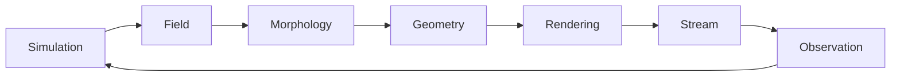

This creates the possibility of computational systems in which:

```text
simulation
→ morphology
→ rendering
→ observation
→ perception
→ decision
→ simulation
```

forms a continuous computational loop.

A rendering implementation may ultimately use:

```text
Rust
   ↓
C++ adapter
   ↓
VulkanSceneGraph
   ↓
Vulkan
   ↓
GPU
```

but none of those technologies need to define what `render` means.

---

# 16. Streams and Messaging Become Computational Primitives

Large computational systems are not just collections of functions.

They are also networks of:

```text
events
messages
streams
state
producers
consumers
```

SCR therefore treats messaging and stream processing as first-class computational concepts.

For example:

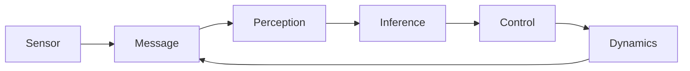

An AMQP-oriented model can provide concepts such as:

```text
exchange
queue
routing
publication
subscription
delivery
acknowledgement
ordering
backpressure
```

while the semantic model remains independent of a particular broker.

This matters because communication itself has semantics.

It should not always be treated as plumbing hidden underneath the computational model.

---

# 17. The Provider Model

SCR does not attempt to replace every excellent computational library.

Quite the opposite.

It wants to make those libraries **usable as implementation providers**.

For example:

```text
Semantic Physics
       │
       ├── Provider A
       ├── Provider B
       ├── Generated Solver
       └── GPU Solver
```

or:

```text
Semantic Spatial Index
       │
       ├── H3
       ├── R-tree
       └── Custom Index
```

or:

```text
Semantic Rendering
       │
       ├── Vulkan
       ├── VulkanSceneGraph
       ├── GPU kernels
       └── Future renderer
```

The provider implements the semantic contract.

The semantic domain does not become an API wrapper around the provider.

That distinction is crucial.

---

# 18. One Meaning, Many Implementations

Imagine the semantic operation:

```text
geometry.intersect
```

A developer should not necessarily have to decide:

```text
CGAL?
GPU kernel?
custom algorithm?
spatial accelerator?
```

Instead, the semantic operation describes what intersection means.

The compiler/runtime can then consider available providers.

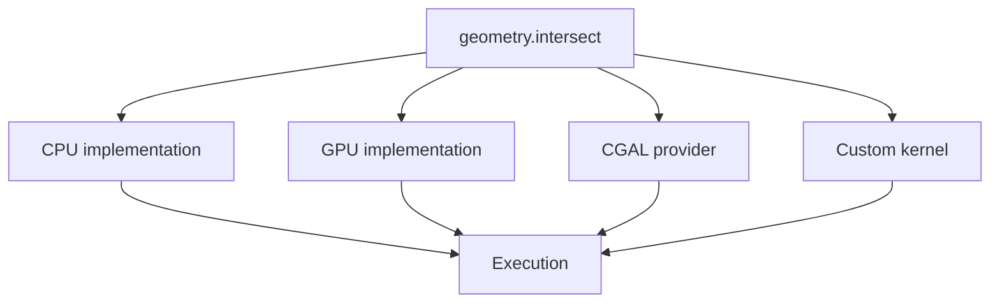

This creates a fundamentally different relationship between applications and libraries.

The application depends on **meaning**.

The runtime depends on **implementations**.

---

# 19. Hardware Without Hardware Lock-In

Hardware changes rapidly.

A semantic program should ideally not become obsolete merely because the machine on which it was designed has changed.

SCR therefore separates:

```text
hardware independence
```

from:

```text
hardware ignorance
```

Applications should not need to encode their semantics in terms of a specific GPU.

But the compiler should absolutely know that the GPU exists.

For example:

```text
Semantic Operation
       ↓
Workload analysis
       ↓
Available hardware
       ↓
Provider capabilities
       ↓
Cost / constraints
       ↓
Execution strategy
```

The compiler may consider:

* vector width
* cache topology
* NUMA topology
* memory bandwidth
* GPU occupancy
* transfer costs
* accelerator availability
* synchronization cost
* latency requirements
* throughput requirements
* power constraints

The objective is not:

> Use the GPU because a GPU exists.

It is:

> Choose an execution strategy that satisfies the semantic and application requirements efficiently.

---

# 20. The Semantic Graph

At the deepest level, SCR is not really about APIs.

It is about **relationships**.

A computation can be understood as a graph containing:

```text
entities
relationships
operations
types
constraints
capabilities
data
state
events
dependencies
spatial relationships
temporal relationships
execution requirements
```

For example:

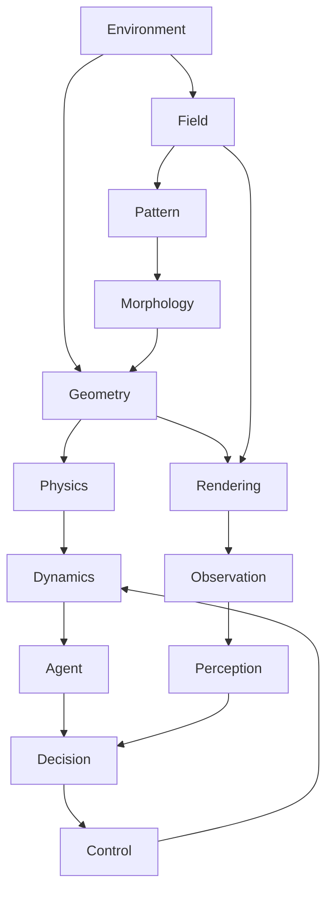

This graph is more expressive than a conventional call graph.

It describes **what the pieces mean and how they relate**.

That is what allows SCR to reason across domain boundaries.

---

# 21. A Computational Example

Consider an artificial ecosystem.

A conventional implementation might require:

```text
physics engine
geometry library
spatial index
agent framework
machine learning framework
renderer
message broker
streaming system
```

Each subsystem has its own APIs.

In SCR, the conceptual model could instead be:

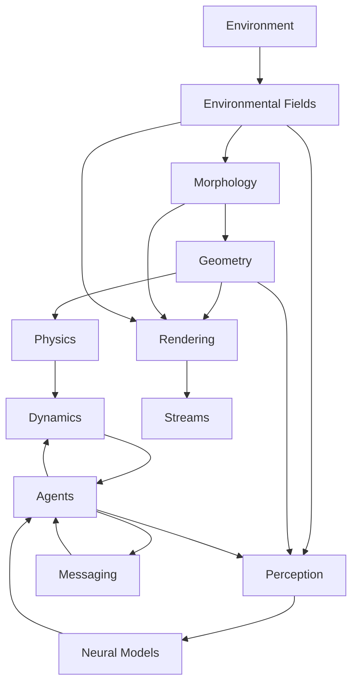

Now consider what the runtime could potentially do.

It might determine that:

```text
field calculations
        ↓
GPU
```

while:

```text
agent decision-making
        ↓
CPU
```

and:

```text
rendering
        ↓
GPU
```

while:

```text
distributed agent communication
        ↓
network messaging
```

The application did not necessarily have to be designed around those decisions.

The semantic model made the computation explicit enough for the system to reason about it.

---

# 22. What This Could Enable

The significance of SCR is not one particular optimization.

It is the possibility of changing **where software architecture begins**.

Instead of beginning with:

```text
Which framework should I use?
```

developers could begin with:

```text
What computation am I trying to express?
```

That could enable systems such as:

### Scientific Computing

Describe:

```text
equations
fields
boundary conditions
constraints
solvers
```

and allow different numerical implementations to realize them.

### Robotics

Compose:

```text
sensors
streams
perception
geometry
planning
control
dynamics
```

inside one semantic model.

### Simulation

Combine:

```text
physics
fields
agents
morphology
spatial structures
AI
rendering
```

without forcing them into separate computational worlds.

### Computational Biology

Represent:

```text
spatial structure
morphology
growth
interaction
fields
population dynamics
```

as interacting semantic domains.

### Generative Systems

Construct:

```text
patterns
fields
constraints
morphology
geometry
rendering
```

and allow structure to emerge computationally.

### Scientific Visualization

Connect:

```text
simulation
→ fields
→ geometry
→ morphology
→ rendering
→ streaming
```

without making visualization merely an afterthought.

### AI-Driven Simulation

Connect:

```text
simulation
→ perception
→ neural computation
→ decision
→ control
→ simulation
```

as one computational system.

### Distributed Computation

Represent communication and computation together:

```text
computation
↔ messages
↔ streams
↔ state
↔ computation
```

rather than treating the network as an invisible implementation detail.

---

# 23. Who Could Use SCR

SCR is intended to be useful to different communities for different reasons.

## Scientists

Work with computational concepts rather than being forced to design around infrastructure.

## Engineers

Construct high-performance systems while retaining the ability to change implementation strategies.

## Software Developers

Build against stable semantic abstractions rather than tightly coupling applications to individual libraries.

## AI Researchers

Combine neural computation with simulation, geometry, fields, graphs, perception, and control.

## Robotics Researchers

Compose sensing, perception, planning, control, dynamics, and physical environments.

## Computational Artists

Work with patterns, fields, morphology, geometry, spatial relationships, rendering, and generative processes.

## Systems Researchers

Explore new relationships between semantic compilation, heterogeneous execution, runtime adaptation, and computational graphs.

## Educators

Teach computation in terms of concepts and relationships before introducing every implementation detail.

---

# 24. What SCR Is Not

Understanding what SCR is **not** is important.

### It is not a replacement for MLIR.

MLIR provides the compiler infrastructure on which SCR is built.

### It is not another general-purpose programming language.

SCR may expose APIs to programming languages, but its central abstraction is semantic computation.

### It is not a simulation engine.

Simulation is an important reference workload, not the definition of the system.

### It is not a wrapper around existing libraries.

Providers and adapters may integrate existing libraries, but those libraries do not define SCR semantics.

### It is not a hardware abstraction that ignores hardware.

SCR aims for semantic hardware independence while making hardware information available to compilation and runtime decisions.

### It is not a promise that every implementation can automatically be substituted.

Semantic equivalence must be established under the relevant contract.

### It is not an attempt to make every domain identical.

The goal is interoperability without destroying domain-specific meaning.

---

# 25. The Long-Term Vision

The long-term vision can be summarized as:

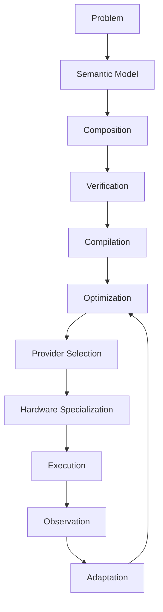

The ultimate ambition is a computational environment where the lifetime of an application is no longer tied so tightly to the technologies that happened to exist when it was written.

A semantic program could potentially survive:

```text
new algorithm
new library
new compiler
new accelerator
new GPU
new CPU
new runtime
new execution strategy
```

because its primary dependency is not the implementation.

Its primary dependency is the **meaning of the computation**.

---

# 26. Project Status

SCR is an architectural and research-stage project.

The current work is focused on establishing the foundations required for this vision:

```text
semantic domains
       ↓
semantic contracts
       ↓
MLIR representation
       ↓
relationships
       ↓
provider interfaces
       ↓
compiler transformations
       ↓
runtime execution
       ↓
real implementations
```

The project is deliberately being developed specification-first.

Semantic domains are being documented through explicit definitions, engineering status records, and a derived semantic library graph.

The initial development increments are intended to turn an architecture that could otherwise only be inferred from source code into an architecture that is **explicit, inspectable, testable, and machine-readable**.

The project is experimental.

Many of the capabilities described here are architectural goals rather than completed features.

That distinction is intentional.

---

# 27. Learn More

The project documentation provides progressively deeper levels of detail.

Start with:

```text
INTRODUCTION.md
```

for the conceptual model.

Then explore:

```text
README.md
```

for the architectural overview.

The semantic library definitions provide the detailed contracts for individual domains.

The development control plane uses:

```text
101_definition.md
102_status.yaml
103_library.graph.json
```

to distinguish:

```text
what a domain means
what currently exists
how the library relates
```

---

# The Question SCR Is Asking

The deepest idea behind SCR can be expressed as a question:

> **What if software did not have to choose its implementation before it had expressed its meaning?**

Today, a developer often starts with:

```text
Which library?
Which framework?
Which API?
Which language?
Which runtime?
Which hardware?
```

SCR explores starting somewhere else:

```text
What does this computation mean?
```

Then:

```text
How does it compose?
What constraints does it have?
What properties does it expose?
What implementations satisfy it?
What transformations preserve it?
Where should it execute?
How should it be optimized?
```

That changes the role of the runtime.

It is no longer merely responsible for executing code.

It becomes part of the machinery that connects:

```text
meaning
    ↓
representation
    ↓
implementation
    ↓
execution
```

And that is the larger idea behind the **Semantic Computational Runtime**.

> **Computation should be something we can describe semantically, compose across domains, transform without losing its meaning, and execute wherever the available computational substrate can realize it.**
