# Semantic Computational Runtime

## A Common Language Runtime for Computational Semantics

> **Express what computation means. Let the runtime determine how, where, and with which implementation it executes.**

The **Semantic Computational Runtime (SCR)** is an open, MLIR-based computational environment for representing, composing, compiling, and executing **computational semantics**.

SCR is built around a simple proposition:

> **Applications should be expressed in terms of computational meaning rather than implementation technology.**

A semantic program should be able, where its contracts permit, to benefit from different algorithms, implementations, libraries, providers, compiler transformations, hardware targets, and execution strategies **without changing the semantic program itself**.

---

## The Idea

Modern computational software is fragmented across domain-specific libraries, frameworks, APIs, languages, runtimes, hardware targets, and execution models.

A single application may combine:

* mathematics;
* numerical computation;
* fields;
* graphs;
* geometry;
* topology;
* spatial computation;
* morphology;
* physics;
* dynamics;
* simulation;
* agents;
* neural computation;
* perception;
* control;
* optimization;
* rendering;
* streams;
* messaging;
* distributed computation.

Today, each domain tends to bring its own representation, API, execution model, memory model, scheduler, error model, and implementation dependencies.

SCR introduces a semantic layer between **what a computation means** and **how it is implemented**.

Instead of:

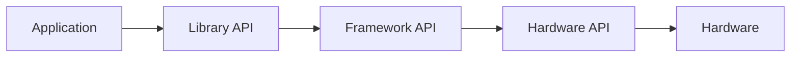

SCR aims for:


The application expresses **meaning**.

The compiler and runtime determine **realization**.

---

# Architecture

SCR is built **on top of MLIR, not beside it**.

MLIR provides the compiler and IR infrastructure.

SCR provides the semantic layer, domain contracts, relationships, capabilities, execution semantics, and provider model.

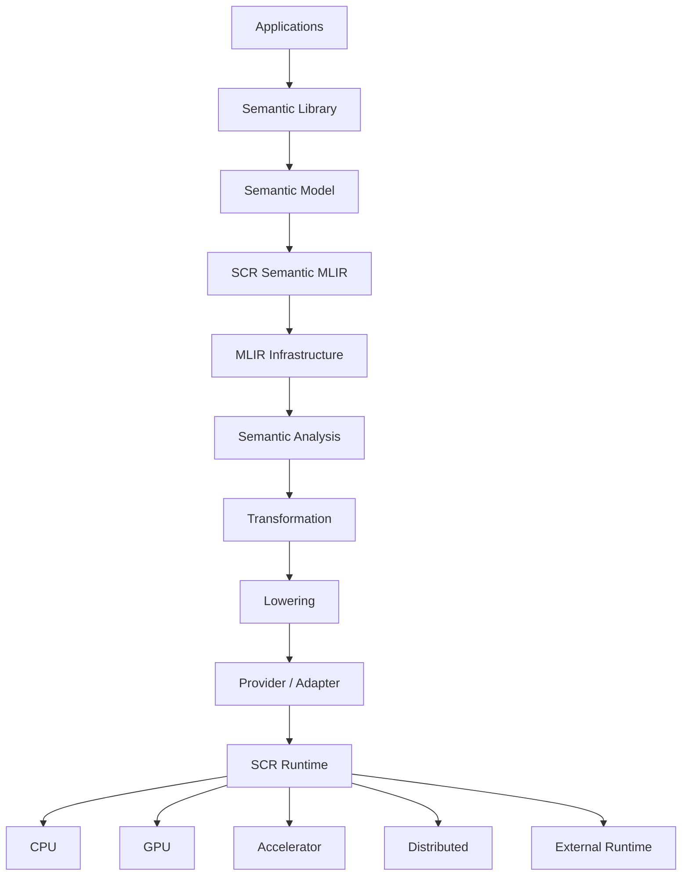

The important architectural boundaries are:

```text
Semantic Meaning
       ≠
Representation
       ≠
Transformation
       ≠
Lowering
       ≠
Provider
       ≠
Runtime
       ≠
Hardware
```

---

# Semantic Primacy

The fundamental SCR rule is:

> **The implementation does not define the semantics.**

For example:

```text
Semantic Position
       ≠
Rust Position Struct
       ≠
MLIR Type
       ≠
GPU Buffer
       ≠
Vulkan Resource
```

These may be representations or implementations of the same semantic concept at different levels.

They are not the concept itself.

This distinction allows implementation technology to change without silently changing computational meaning.

---

# Semantic Domains

SCR organizes computation into interoperable **semantic domains**.

The current library includes domains spanning:

```text
Core
Data
Mathematics
Graphs
Fields
Geometry
Topology
Morphology
Physics
Dynamics
Simulation
Agents
Neural Computation
Perception
Control
Optimization
Learning
Adaptation
Evolution
Ecology
Spatial Computing
Stream Processing
Rendering
```

These domains are not isolated libraries.

They are intended to compose.

For example:

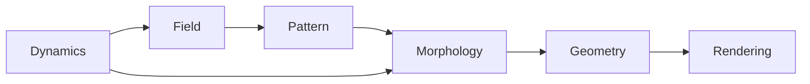

A domain may therefore:

* refine another domain;
* specialize another domain;
* compose with another domain;
* consume or produce another domain's structures;
* constrain another domain;
* transform another domain;
* interact with multiple execution substrates.

The **filesystem is hierarchical**.

The **semantic architecture is a graph**.

---

# Information Is Computational

SCR treats information structures as computational participants rather than merely passive storage.

Important semantic structures include:

```text
Fields
Graphs
Hypergraphs
Patterns
Morphology
Geometry
Topology
Streams
Semantic State
Spatial Structures
Events
Relationships
```

For example:

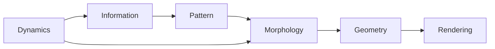

This permits computation to move across semantic domains without forcing every domain to adopt the implementation model of every other domain.

---

# Morphology Is a First-Class Computational Domain

SCR treats morphology as more than mesh generation or visual form.

Morphology concerns:

* form;
* structure;
* organization;
* differentiation;
* arrangement;
* transformation.

Importantly, morphology is bidirectional:

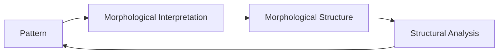

This allows patterns to give rise to morphology, while morphological structure can itself reveal patterns.

That makes morphology a bridge between:

```text
Fields
Graphs
Topology
Geometry
Dynamics
Rendering
```

---

# The Semantic Graph

SCR distinguishes two related but different graphs.

### Computational Semantic Graph

Represents computation:

```text
entities
relationships
operations
constraints
types
capabilities
state
events
dataflow
control flow
spatial relationships
temporal relationships
execution requirements
```

### Library Architecture Graph

Describes the SCR semantic library itself:

```text
domains
definitions
implementations
tests
providers
relationships
execution targets
```

The latter is maintained as derived control-plane information.

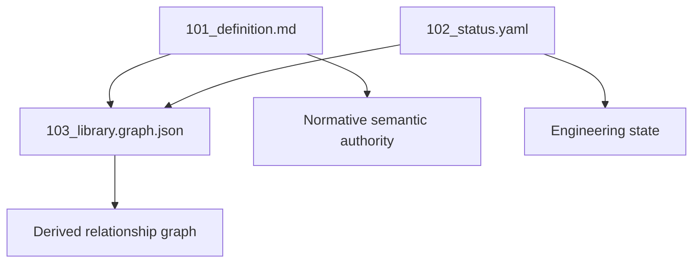

The rule is:

> **Definition is normative. Status is descriptive. Graph is derived.**

---

# Capabilities

Semantic operations may expose capabilities that generic compiler and runtime infrastructure can reason about.

Examples include:

```text
Dynamical
Spatial
Temporal
Differentiable
Parallelizable
Vectorizable
Tileable
Reducible
Integrable
Stateful
Stateless
Streamable
Renderable
Distributable
Deterministic
Stochastic
Composable
Queryable
```

These capabilities allow generic infrastructure to reason about computations without requiring every transformation to understand every semantic domain.

For example:

```text
Dynamical
   +
Parallelizable
   +
Vectorizable
```

may make a computation suitable for:

```text
CPU SIMD
GPU execution
parallel scheduling
kernel fusion
```

---

# Providers

A provider implements a semantic contract.

It does not define that contract.

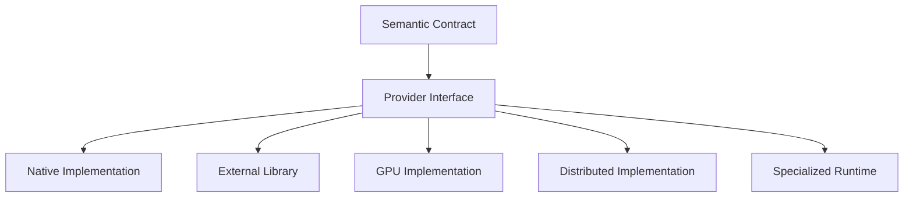

External technologies are therefore implementation resources rather than semantic authorities.

Potential providers may eventually include technologies such as:

* LLVM;
* Eigen;
* CGAL;
* H3;
* OpenVDB;
* Chrono;
* VulkanSceneGraph;
* CUDA;
* ROCm;
* other scientific, graphics, numerical, or systems runtimes.

The semantic layer should not become dependent upon any one of them.

---

# Hardware Independence Is Not Hardware Ignorance

SCR separates:

> **hardware-independent semantics**

from:

> **hardware-aware execution.**

Applications should not need to express their meaning in terms of:

```text
CPU instructions
GPU kernels
vendor APIs
specific memory spaces
specific accelerators
```

The compiler and runtime, however, should be able to reason about:

```text
CPU architecture
vector width
cache topology
NUMA
GPU architecture
memory bandwidth
occupancy
transfer cost
interconnect bandwidth
latency
throughput
memory pressure
power
thermal constraints
```

The semantic program remains portable.

The execution system remains hardware-aware.

---

# Adaptive Execution

The long-term runtime model is adaptive.

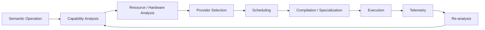

This allows the runtime to make execution decisions without requiring applications to encode those decisions directly into semantic meaning.

---

# Rendering Is Computation

Rendering is a first-class computational domain in SCR.

It is not merely a final output API.

A rendering pipeline may participate in semantic computation:

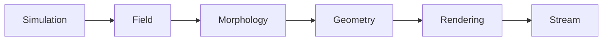

A reference implementation may eventually use:

```text
Semantic Runtime
      ↓
Render State
      ↓
Render Commands
      ↓
Rust Renderer API
      ↓
C++ Adapter
      ↓
VulkanSceneGraph
      ↓
Vulkan
      ↓
GPU
```

The rendering backend is replaceable.

The semantic rendering model is not defined by Vulkan.

---

# Streams and Messaging

Communication is also computational.

SCR treats streams and messaging as first-class semantic concerns.

A computation may contain:

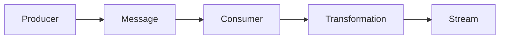

Messaging semantics may include:

```text
exchange
queue
routing
publication
subscription
delivery
acknowledgement
ordering
durability
backpressure
```

SCR uses an **AMQP-oriented messaging model where appropriate**, while keeping semantic messaging independent of a specific broker or transport implementation.

---

# Dynamics and Simulation

Simulation is an important reference workload, but it is **not the definition of SCR**.

A dynamical system may combine:

```text
state
fields
interactions
constraints
differential equations
integrators
events
```

A simulation can therefore exercise many SCR domains simultaneously.

The first executable milestone deliberately uses a much smaller workload.

## v0.0.1 Golden Path

The first end-to-end implementation target is:

```mermaid
flowchart LR
    A["Core"]
    B["Dynamics"]
    C["Simulation"]
    D["Semantic MLIR"]
    E["MLIR Transforms"]
    F["CPU Provider"]
    G["Simulation State"]
    H["Render Projection"]
    I["Render State"]
    J["Rendering Provider"]
    K["VSG / Vulkan"]
    L["Visible Result"]

    A --> B --> C --> D --> E --> F --> G --> H --> I --> J --> K --> L
```

The reference workload is a minimal deterministic particle simulation.

The objective is to prove:

```text
semantic meaning
      ↓
semantic state
      ↓
semantic operation
      ↓
Semantic MLIR
      ↓
MLIR analysis / transformation
      ↓
CPU execution
      ↓
state evolution
      ↓
render projection
      ↓
visible result
```

The particle simulation is therefore a **vertical architectural proof**, not the purpose of the runtime.

See:

[`program_increments/v0.0.1/104_golden-path.md`](program_increments/v0.0.1/104_golden-path.md)

---

# Development Model

SCR is developed specification-first.

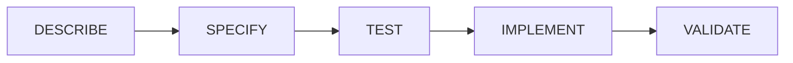

Semantic definitions come before implementation.

Tests express requirements.

Implementation satisfies contracts.

Validation demonstrates that implementation and semantics agree.

The detailed development policy is maintained in:

[`AGENTS.md`](AGENTS.md)

---

# Semantic Library Control Plane

Each semantic domain is progressively specified through explicit control-plane artifacts.

```text
101_definition.md
    ↓
Normative semantic contract

102_status.yaml
    ↓
Current engineering state

103_library.graph.json
    ↓
Derived relationship graph
```

This gives the project traceability from:

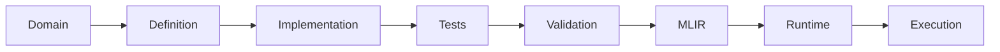

---

# Repository Structure

The repository is organized around semantic domains and cross-cutting compiler/runtime concerns.

```text
lib/
├── 000_meta
├── 101_Core
├── 201_Data
├── 202_Math
├── 203_Graph
├── 301_Field
├── 302_Geometry
├── 303_Topology
├── 401_Morphology
├── 501_Physics
├── 502_Dynamics
├── 503_Simulation
├── 601_Agent
├── 602_Neural
├── 603_Perception
├── 604_Control
├── 701_Optimization
├── 702_Learning
├── 703_Adaptation
├── 704_Evolution
├── 705_Ecology
├── 801_Spatial
├── 802_Stream
├── 901_Analysis
├── 902_Interfaces
├── 903_Lowering
├── 904_Providers
├── 905_Transforms
└── A01_Render

program_increments/
└── v0.0.1/
```

This filesystem organization is not itself the semantic architecture.

The semantic architecture is represented through definitions and relationships.

---

# What SCR Is Not

SCR is not intended to be:

* a replacement for MLIR;
* a replacement for LLVM;
* a physics engine;
* a rendering engine;
* a message broker;
* a distributed database;
* a neural-network framework;
* a single simulation framework;
* a wrapper around one external library;
* a hardware abstraction that hides hardware from the compiler.

Instead, SCR provides a semantic environment in which these capabilities can participate as **domains, transformations, providers, or execution substrates**.

---

# Relationship to Existing Technologies

SCR builds on ideas demonstrated by several existing systems.

| Technology              | Relevant contribution                                           |
| ----------------------- | --------------------------------------------------------------- |
| **MLIR**                | Extensible IR and compiler infrastructure                       |
| **IREE**                | MLIR-based compilation and runtime execution                    |
| **StableHLO / OpenXLA** | Explicit operation semantics and portability                    |
| **Apache TVM**          | Graph-level compilation and multi-level optimization            |
| **Kokkos**              | Separation of computational intent from execution/memory spaces |
| **Halide**              | Separation of computation from execution strategy               |

SCR is complementary to these systems.

Its intended scope is broader:

> **A common semantic environment in which heterogeneous computational domains can compose and share compiler/runtime infrastructure.**

---

# Current Status

SCR is in an **early architectural and implementation stage**.

The project is currently establishing:

* the semantic library;
* semantic domain boundaries;
* normative definitions;
* semantic contracts and invariants;
* the library control plane;
* MLIR dialect conventions;
* MLIR integration;
* interfaces and capabilities;
* transformation and lowering boundaries;
* provider architecture;
* runtime architecture;
* the v0.0.1 executable Golden Path.

The repository should therefore be read as a combination of:

```text
architecture
+
semantic specifications
+
implementation
+
development control plane
```

Not every domain represented in `lib/` is implemented.

Not every planned provider exists.

Not every architectural capability is executable yet.

**Claims about current implementation status should be taken from the relevant `102_status.yaml` and tests rather than inferred from the directory structure.**

---

# Long-Term Vision

The long-term objective is a computational environment in which developers can express a problem before committing to an implementation stack.

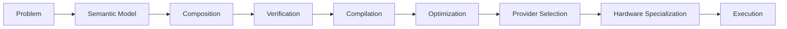

A semantic program written today should, where its contracts permit, be able to benefit from tomorrow's:

* algorithms;
* implementations;
* libraries;
* compiler transformations;
* providers;
* hardware;
* execution strategies;
* runtime capabilities.

without requiring the application to be rewritten around those technologies.

---

# The Larger Idea

MLIR gives us a powerful way to construct extensible intermediate representations and compiler infrastructure.

SCR asks a broader question:

> **What happens when that extensibility becomes the foundation for a general computational semantic environment rather than a collection of isolated domain-specific compiler IRs?**

The intended result is analogous to a:

> **Common Language Runtime for Computational Semantics.**

Not a runtime whose purpose is merely to abstract operating-system execution.

A runtime that provides a common environment for:

```text
representing
composing
verifying
transforming
compiling
executing
observing
adapting
```

computational meaning.

---

# Design Principles

SCR is governed by the following principles:

1. **Semantic Primacy** — meaning comes before implementation.
2. **MLIR Native** — build on MLIR rather than creating competing compiler infrastructure.
3. **Provider Independence** — semantic capability must not depend on one implementation library.
4. **Explicit Contracts** — types, invariants, behavior, errors, capabilities, and composition are explicit.
5. **Higher-Order Composition** — primitive semantics compose into larger computational structures.
6. **Semantic Equivalence** — implementations are substitutable only when relevant equivalence can be established.
7. **Hardware Independence** — application semantics do not require target hardware knowledge.
8. **Hardware Awareness** — compiler and runtime infrastructure exploit target capabilities.
9. **Domain Interoperability** — domains compose without surrendering their individual semantics.
10. **Information as Computation** — fields, graphs, streams, morphology, topology, and related structures participate in computation.
11. **Explicit Relationships** — semantic relationships are represented explicitly.
12. **Implementation Independence** — semantics remain independent of language, library, OS, vendor, and hardware.
13. **Traceability** — implementation must be traceable to semantic requirements.
14. **Validation Before Optimization** — correctness precedes performance.
15. **Open Ecosystem** — suitable open technologies should be reused rather than reinvented.
16. **No Silent Semantics** — implementation divergence must be explicit.

---

# Get Started

Start with:

**[Getting Started](GETTING_STARTED.md)**

Then read:

**[Agent and Development Policy](AGENTS.md)**

For the current implementation increment:

**[v0.0.1 Program Increment](program_increments/v0.0.1/)**

For the executable target:

**[v0.0.1 Golden Path](program_increments/v0.0.1/104_golden-path.md)**

For the semantic library:

**[`lib/`](lib/)**

---

# Contributing

SCR is specification-first.

For a new semantic capability:

```text
DESCRIBE
   ↓
SPECIFY
   ↓
TEST
   ↓
IMPLEMENT
   ↓
VALIDATE
```

Do not allow implementation convenience to silently redefine semantic meaning.

When changing a semantic domain:

1. understand its parent and related domains;
2. update the semantic definition where meaning changes;
3. define or update contracts and invariants;
4. identify semantic relationships;
5. design tests;
6. implement;
7. validate;
8. update engineering status;
9. update derived graph information where required.

See [`AGENTS.md`](AGENTS.md) before contributing.

---

# License

License: **TBD**

---

## One-Sentence Definition

> **Semantic Computational Runtime is an MLIR-based computational semantic environment that provides a common, composable language for heterogeneous computation and compiles semantic intent into implementations across libraries, runtimes, CPUs, GPUs, accelerators, and distributed execution environments.**
