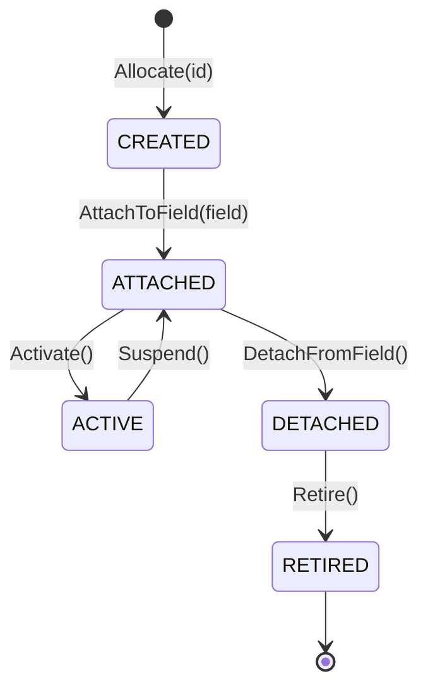

# Sprint 02: Semantic Object & State Lifecycle

**Parent Milestone:** [Milestone 001: PI-CAVE-001A Semantic Foundation](../spec.md)  
**Derived from:** `spec.md` (Sections 8, 43, 73)  
**Governing Documents:** [`docs/106_SEMANTIC_MACHINE_MODEL.md`](file:///home/kobus/Projects/Semantic-Computational-Runtime/docs/106_SEMANTIC_MACHINE_MODEL.md), [`docs/107_SEMANTIC_TRANSITION_CALCULUS.md`](file:///home/kobus/Projects/Semantic-Computational-Runtime/docs/107_SEMANTIC_TRANSITION_CALCULUS.md)  
**Status:** Planned  

---

## 1. Mission

Implement the core `SemanticObject` abstraction and the formal lifecycle state machine governing all Cave computational entities, enforcing legal state transitions and rejecting unauthorized or out-of-order mutations.

---

## 2. Technical Specifications & Data Models

### 2.1 Lifecycle State Machine

Every Cave semantic entity exhibits a deterministic lifecycle governed by the state machine:



* **`CREATED`:** The object has an allocated `SemanticId` and initial attributes, but is not yet part of an active semantic field or graph.
* **`ATTACHED`:** The object is linked into a semantic field/hypergraph, but is suspended or not currently executing or visible.
* **`ACTIVE`:** The object is participating in dynamic spatial updates, rendering transformations, or event dispatch.
* **`DETACHED`:** The object has been unlinked from the active field; references to it become inactive.
* **`RETIRED`:** Terminal immutable state; the object coordinate is archived and permanently non-reusable.

### 2.2 Semantic Object Definition
```mojo
@value
enum LifecycleState:
    case CREATED
    case ATTACHED
    case ACTIVE
    case DETACHED
    case RETIRED

struct SemanticObject:
    var id: SemanticId
    var state: LifecycleState
    var version: Int
    var provenance: ProvenanceRecord
    var attributes: Dict[String, String]

    fn transition_to(mut self, target: LifecycleState) raises:
        if not self.is_legal_transition(self.state, target):
            raise Error("IllegalLifecycleTransition: " + str(self.state) + " -> " + str(target))
        self.state = target
        self.version += 1
```

---

## 3. Error Model

Define dedicated semantic exceptions:
* `IllegalLifecycleTransitionError`: Attempting to transition along a forbidden edge (e.g. `CREATED` $\to$ `ACTIVE` directly, or `RETIRED` $\to$ `ACTIVE`).
* `ObjectRetiredError`: Attempting to mutate attributes on a retired entity.
* `UnattachedEntityError`: Attempting to execute rendering or spatial transformations on an unattached entity.

---

## 4. Verification & Testing Tasks

1. **State Machine Completeness:** Test all $5 \times 5 = 25$ possible state transition pairs; verify that only the 6 legal transitions succeed and all 19 invalid pairs raise `IllegalLifecycleTransitionError`.
2. **Version Monotonicity:** Verify that `version` strictly increments by 1 on every legal transition.
3. **Immutability of Retired State:** Verify that all attribute mutations fail once an entity reaches `RETIRED`.
