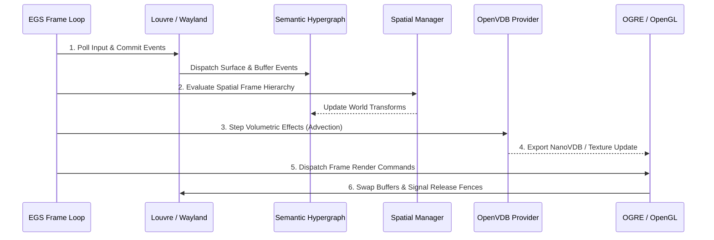

# Sprint 02: EGS Operational Orchestration

**Parent Milestone:** [Milestone 010: PI-CAVE-001J EGS & Reference Executor](../spec.md)  
**Derived from:** `spec.md` (Sections 35, 61, 63)  
**Governing Documents:** [`docs/106_SEMANTIC_MACHINE_MODEL.md`](file:///home/kobus/Projects/Semantic-Computational-Runtime/docs/106_SEMANTIC_MACHINE_MODEL.md), [`docs/108_EXECUTION_MANIFESTATION_AND_CONFORMANCE.md`](file:///home/kobus/Projects/Semantic-Computational-Runtime/docs/108_EXECUTION_MANIFESTATION_AND_CONFORMANCE.md)  
**Status:** Planned  

---

## 1. Mission

Implement the Execution Graph Substrate (EGS) frame loop coordinator in Mojo, executing the cyclic temporal frame sequence across input, spatial updating, volumetric advection, and multi-provider manifestation rendering.

---

## 2. Technical Specifications & Frame Lifecycle (§61)



### 2.1 EGS Frame Driver Implementation
```mojo
struct EGSFrameCoordinator:
    var clock: SemanticClock
    var hypergraph: SemanticHypergraph
    var spatial_mgr: SpatialTreeManager
    var providers: ResolvedProviders

    fn execute_frame_tick(mut self) raises:
        var dt = self.clock.advance()
        
        # Phase 1: Input ingestion
        self.providers.wayland.poll_events(self.hypergraph)
        
        # Phase 2: Spatial hierarchy propagation
        self.spatial_mgr.evaluate_all_dirty()
        
        # Phase 3: Volumetric field step
        self.providers.volumetric.step_simulation(dt)
        
        # Phase 4: Render dispatch
        self.providers.renderer.render_scene(self.hypergraph, self.spatial_mgr)
```

---

## 3. Verification & Testing Tasks

1. **Deterministic Step Test:** Execute 100 frame ticks with mock time $\Delta t = 0.0166\text{s}$; verify strict chronological progression.
2. **Phase Boundary Ordering:** Verify that spatial transforms are fully resolved before render dispatch is invoked.
3. **Jitter Benchmark:** Assert frame tick execution variance is $\le 1.0\text{ms}$ under normal desktop loads.
