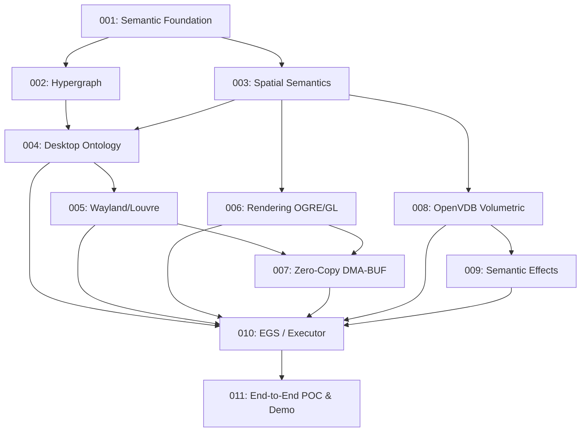

# PI-CAVE-001: Semantic Spatial Desktop — Master Milestone Roadmap

**Parent Program Increment:** [PI-CAVE-001](../spec.md)  
**Parent System:** Semantic Computational Runtime (SCR)  
**Target Directory:** `applications/cave/program_increments/v0.0.1_PI-CAVE-001/milestones/`  
**Governing Documents:** Complies with normative specifications under [`docs/*.md`](file:///home/kobus/Projects/Semantic-Computational-Runtime/docs/)  
**Status:** Normative Implementation Roadmap  

---

## 1. Executive Summary & Strategic Objective

PI-CAVE-001 proves the foundational thesis of the Cave project:

> **A desktop environment can be represented as a semantic computational field whose objects, relationships, spatial state, physical manifestations, effects, and provider resources are distinct, composable representations of one underlying semantic state.**

Cave is **not** fundamentally a window manager or Wayland compositor; it is a **semantic spatial computer whose first physical manifestation is a Wayland desktop**.

---

## 2. Compliance Mapping with `docs/*.md`

Every milestone and sprint in this roadmap strictly adheres to the authoritative SCR architecture specifications:

| Authoritative Specification | Core Normative Mandate | Cave Application & Enforcement |
|---|---|---|
| [`docs/102_ARCHITECTURE.md`](file:///home/kobus/Projects/Semantic-Computational-Runtime/docs/102_ARCHITECTURE.md) | "Meaning precedes representation. Representation precedes physical realization." Providers implement capabilities; they do not own or define semantics. | Milestones 01, 05, 06, 08, 10: SCR owns all entity identity and state; Louvre, OGRE, and OpenVDB are subordinate providers. |
| [`docs/103_SEMANTIC_MODEL.md`](file:///home/kobus/Projects/Semantic-Computational-Runtime/docs/103_SEMANTIC_MODEL.md) | Formal field model $\mathcal{F} = (E, R, T, C, S, K, M)$. Distinct $S$ (semantic state) and $M$ (physical manifestation). | Milestones 01, 04: Desktop, Workspace, Surface, and Buffer are modeled as entities in $\mathcal{F}$; handles in $M$ are decoupled. |
| [`docs/104_SEMANTIC_INVARIANTS.md`](file:///home/kobus/Projects/Semantic-Computational-Runtime/docs/104_SEMANTIC_INVARIANTS.md) | Invariants governing identity uniqueness, reference validity, state transitions, determinism. | Milestones 01, 04, 11: Enforces CAVE-CONF-001..015 and CAVE-INV-001..020 across all operational states. |
| [`docs/106_SEMANTIC_MACHINE_MODEL.md`](file:///home/kobus/Projects/Semantic-Computational-Runtime/docs/106_SEMANTIC_MACHINE_MODEL.md) | Abstract Semantic Machine defining execution context, state, outcomes, and equivalence. | Milestones 01, 10: Cave execution driven by the abstract Semantic Machine via the Reference Executor. |
| [`docs/107_SEMANTIC_TRANSITION_CALCULUS.md`](file:///home/kobus/Projects/Semantic-Computational-Runtime/docs/107_SEMANTIC_TRANSITION_CALCULUS.md) | State transitions as typed transformations $\tau: S \to S'$ under constraints $K$ and context $C$. | Milestones 02, 09: Spatial movements and volumetric smoke advection modeled as formal STC transitions. |
| [`docs/108_EXECUTION_MANIFESTATION_AND_CONFORMANCE.md`](file:///home/kobus/Projects/Semantic-Computational-Runtime/docs/108_EXECUTION_MANIFESTATION_AND_CONFORMANCE.md) | Physical manifestation separation, realization transparency, conformance by observation. | Milestones 05, 06, 07: Replacing an OpenGL renderer or Wayland compositor does not alter semantic desktop state. |
| [`docs/112_STC_GRAPH_RELATIONAL_REFINEMENT.md`](file:///home/kobus/Projects/Semantic-Computational-Runtime/docs/112_STC_GRAPH_RELATIONAL_REFINEMENT.md) | Hypergraph carrier, directed typed hyperedges with roles, nullary environmental relations. | Milestone 02: Frame hypergraph, surface relationships, and global gravity/lighting as nullary relations. |
| [`docs/114_SPATIAL_SEMANTICS.md`](file:///home/kobus/Projects/Semantic-Computational-Runtime/docs/114_SPATIAL_SEMANTICS.md) | Coordinate spaces, reference frames, transforms, positions, orientations, inverse pointer mapping. | Milestone 03: Affine/dual quaternion transforms, reference frame hierarchy, and screen-to-surface inverse hit testing. |
| [`docs/115_EXECUTABLE_SEMANTIC_HYPERGRAPH.md`](file:///home/kobus/Projects/Semantic-Computational-Runtime/docs/115_EXECUTABLE_SEMANTIC_HYPERGRAPH.md) | Executable semantic hypergraphs linking operational dependencies and dataflow. | Milestones 02, 10: Dynamic frame execution driven by executable hyperedges. |
| [`docs/116_SCR_MLIR_DIALECT_SPECIFICATION.md`](file:///home/kobus/Projects/Semantic-Computational-Runtime/docs/116_SCR_MLIR_DIALECT_SPECIFICATION.md) | MLIR sole canonical intermediate representation; standard dialects; differential verification. | Milestone 10: Spatial transformations and grid operations lowered through standard MLIR. |
| [`docs/117_FIELD_PARTITIONING_AND_DISTRIBUTED_EXECUTION.md`](file:///home/kobus/Projects/Semantic-Computational-Runtime/docs/117_FIELD_PARTITIONING_AND_DISTRIBUTED_EXECUTION.md) | Continuous and discrete spatial fields, scalar/vector fields, volume grids, level sets. | Milestone 08: OpenVDB sparse volumetric tree representation for density, velocity, and distance fields. |
| [`docs/118_LIBRARY_DOMAIN_AND_SUBDOMAIN_MODEL.md`](file:///home/kobus/Projects/Semantic-Computational-Runtime/docs/118_LIBRARY_DOMAIN_AND_SUBDOMAIN_MODEL.md) | Semantic library domain structure, `101_spec.md` requirements, provider contracts. | Milestones 04, 05, 06, 08: Subsystem adapters conform to domain and provider specifications. |
| [`docs/119_SEMANTIC_REPRESENTATION_AND_INTERCHANGE_MODEL.md`](file:///home/kobus/Projects/Semantic-Computational-Runtime/docs/119_SEMANTIC_REPRESENTATION_AND_INTERCHANGE_MODEL.md) | Zero-copy buffer handoff, DMA-BUF file descriptor passing, OpenVDB/NanoVDB memory interchange. | Milestones 07, 08: DMA-BUF zero-copy pipeline across Wayland client, compositor, and GPU renderer. |
| [`docs/120_SCR_Core_MLIR_Mojo_Relationship.md`](file:///home/kobus/Projects/Semantic-Computational-Runtime/docs/120_SCR_Core_MLIR_Mojo_Relationship.md) | Mojo Reference Executor as semantic oracle; differential verification against native execution. | Milestone 10: Mojo reference executor acts as ground truth for all spatial transformations. |

---

## 3. End-to-End Architecture Dataflow

```text
                     SEMANTIC WORLD (Authoritative SCR Core)
                                       │
                               Semantic Hypergraph
                                       │
                    ┌──────────────────┴──────────────────┐
                    ▼                                     ▼
             Spatial State                           Field State
         (Frames, Transforms,                   (Density, Velocity,
           Inverse Mapping)                          Level Sets)
                    │                                     │
                    │                                  OpenVDB
                    │                                (NanoVDB)
                    │                                     │
                    └──────────────────┬──────────────────┘
                                       ▼
                            EGS / Reference Executor
                                       │
                    ┌──────────────────┼──────────────────┐
                    ▼                  ▼                  ▼
             Wayland / Louvre    OGRE / OpenGL    Hardware Providers
                    │                  │
                 DMA-BUF              GPU
             (Zero-Copy Path)          │
                    │                  │
                    └──────────────────┴──────────────────┘
                                       │
                                       ▼
                            Physical Display Output
```

---

## 4. Milestone Decomposition (PI-CAVE-001A through 001K)

The 102 sections of `spec.md` are refactored into 11 executable milestones:

```text
v0.0.1_PI-CAVE-001/milestones/
├── README.md                                             # Master roadmap (this document)
├── 001_PI-CAVE-001A_semantic_foundation/                 # Milestone 01: Core Semantics & Invariants
│   ├── spec.md
│   └── sprints/
│       ├── sprint_01_identity_and_reference.md           # Identity, SID coordinates, references, provenance
│       ├── sprint_02_object_and_lifecycle.md             # Semantic objects, state vectors, lifecycle transitions
│       └── sprint_03_conformance_and_invariants.md       # CAVE-CONF-001..015, baseline test suite
├── 002_PI-CAVE-001B_hypergraph/                          # Milestone 02: Semantic Hypergraph Carrier
│   ├── spec.md
│   └── sprints/
│       ├── sprint_01_hypergraph_structure_and_roles.md   # Hyperedges, incidence, endpoints, relational roles
│       ├── sprint_02_nullary_relations.md                # Environmental context as nullary relations
│       ├── sprint_03_mutation_and_traversal.md           # Atomic hypergraph mutation, traversal engine
│       └── sprint_04_hypergraph_conformance.md           # Conformance test suite & structural invariants
├── 003_PI-CAVE-001C_spatial/                             # Milestone 03: Spatial Semantics & Inverse Mapping
│   ├── spec.md
│   └── sprints/
│       ├── sprint_01_spatial_primitives_and_frames.md    # Coordinate spaces, reference frames, transforms
│       ├── sprint_02_spatial_hierarchy.md                # Parent-child frame tree, local-to-world composition
│       └── sprint_03_inverse_spatial_mapping.md          # Viewport ray to surface (u,v) inverse hit testing
├── 004_PI-CAVE-001D_desktop_ontology/                    # Milestone 04: Desktop Semantic Domain
│   ├── spec.md
│   └── sprints/
│       ├── sprint_01_desktop_and_workspace.md            # Desktop and Workspace semantic entities
│       ├── sprint_02_surface_and_application.md          # Surface and Application entities & relations
│       ├── sprint_03_buffer_entity_and_ownership.md      # Buffer semantic abstraction & state ownership
│       └── sprint_04_desktop_invariants_and_api.md       # CAVE-INV-001..020 & Desktop Application API
├── 005_PI-CAVE-001E_wayland_louvre/                      # Milestone 05: Wayland / Louvre Provider
│   ├── spec.md
│   └── sprints/
│       ├── sprint_01_louvre_bootstrap.md                 # Louvre C++ compositor initialization
│       ├── sprint_02_wayland_protocol_mapping.md         # wl_surface, xdg_shell to semantic surface lifecycle
│       └── sprint_03_adapter_boundary_and_faults.md      # Provider adapter contract & crash resilience
├── 006_PI-CAVE-001F_rendering/                           # Milestone 06: OGRE / OpenGL Rendering Provider
│   ├── spec.md
│   └── sprints/
│       ├── sprint_01_ogre_opengl_bootstrap.md            # OGRE 3D scene manager & OpenGL context setup
│       ├── sprint_02_surface_scene_node_binding.md       # Spatial state to OGRE scene nodes & surface quads
│       └── sprint_03_rendering_manifestation.md          # Depth ordering, frame composition, multi-surface render
├── 007_PI-CAVE-001G_dma_buf/                             # Milestone 07: Zero-Copy DMA-BUF GPU Path
│   ├── spec.md
│   └── sprints/
│       ├── sprint_01_dmabuf_import_and_eglimage.md       # Linux DMA-BUF fd import via EGLImageKHR
│       ├── sprint_02_zero_copy_verification.md           # Verifying zero CPU pixel copies into GPU texture
│       └── sprint_03_gpu_synchronization.md              # dma_fence & EGLSyncKHR synchronization
├── 008_PI-CAVE-001H_openvdb/                             # Milestone 08: OpenVDB Volumetric Spatial Provider
│   ├── spec.md
│   └── sprints/
│       ├── sprint_01_openvdb_runtime_and_adapter.md      # OpenVDB C++ runtime & Float/Vec3S grid adapter
│       ├── sprint_02_spatial_field_mapping.md            # Density, velocity, level set field mapping
│       └── sprint_03_nanovdb_gpu_evaluation.md           # NanoVDB GPU read-only leaf acceleration
├── 009_PI-CAVE-001I_effect/                              # Milestone 09: Semantic Field Effects
│   ├── spec.md
│   └── sprints/
│       ├── sprint_01_semantic_effect_pipeline.md         # Formal effect state transition definition
│       ├── sprint_02_smoke_and_advection_effect.md       # Surface velocity injection & sparse density advection
│       ├── sprint_03_levelset_and_physics_boundary.md    # Distance field level sets & Chrono boundary
│       └── sprint_04_volumetric_effect_rendering.md      # Volumetric raymarching in OGRE/OpenGL
├── 010_PI-CAVE-001J_egs_executor/                        # Milestone 10: EGS & Reference Executor
│   ├── spec.md
│   └── sprints/
│       ├── sprint_01_provider_capability_resolution.md   # Capability matrix querying & dynamic binding
│       ├── sprint_02_egs_operational_orchestration.md    # Execution Graph Substrate frame tick coordination
│       └── sprint_03_reference_executor_oracle.md        # Mojo reference execution & differential verification
└── 011_PI-CAVE-001K_end_to_end/                          # Milestone 11: End-to-End Proof of Concept
    ├── spec.md
    └── sprints/
        ├── sprint_01_end_to_end_assembly.md              # Full Wayland -> SCR -> OGRE/OpenVDB pipeline
        ├── sprint_02_mandatory_demo_scenario.md          # 7-step interactive demonstration scenario
        ├── sprint_03_performance_and_acceptance.md       # Latency (60 FPS), zero-copy, stress test
        └── sprint_04_pi_completion_and_audit.md          # Deliverables consolidation & completion audit
```

---

## 5. Milestone Dependency & Execution Graph



---

## 6. Strict Non-Negotiable Invariants

1. **Semantic Primacy:** Meaning precedes representation. Providers manifest state; they do not dictate semantic identity or domain structure.
2. **Provider Subordination:** Replacing Louvre with wlroots, OGRE with Vulkan, or OpenVDB with another volume provider MUST NOT modify the semantic desktop representation.
3. **Zero-Copy Mandate:** DMA-BUF handles must flow directly from client to GPU textures without CPU memcpy in the steady state.
4. **Differential Verification:** All semantic transitions executed in lowered MLIR or C++ providers must conform to the Mojo Reference Executor oracle.
