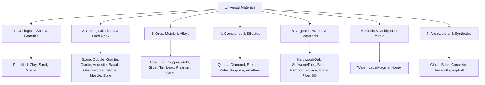

# SCR Architecture: Universal Materials Ontology & Semantics

**Document:** `docs/architecture/106_unified_materials_ontology.md`  
**Version:** 1.0.0  
**Status:** Normative Architecture  
**Parent:** [`docs/architecture/`](file:///home/kobus/Projects/Semantic-Computational-Runtime/docs/architecture)  
**Associated Catalog:** [`lib/A01_Render/Material/105_unified_materials_catalog.md`](file:///home/kobus/Projects/Semantic-Computational-Runtime/lib/A01_Render/Material/105_unified_materials_catalog.md)  
**Associated Data:** [`lib/A01_Render/Material/materials_catalog.json`](file:///home/kobus/Projects/Semantic-Computational-Runtime/lib/A01_Render/Material/materials_catalog.json)  

---

## 1. Executive Summary & Semantic Primacy

Per **Rule 1** (*"Semantics are authoritative"*), **Rule 2** (*"Implementation does not define meaning"*), and **Rule 18** (*"External technologies remain subordinate to SCR contracts"*), materials in the Semantic Computational Runtime (SCR) are neither texture bitmaps, raw shader snippets, nor proprietary game block IDs.

Instead, SCR defines a material through an invariant **Dual-Contract**:
$$\mathcal{M} = \langle \mathcal{C}_{\text{phys}}, \mathcal{C}_{\text{opt}}, \mathcal{C}_{\text{kin}} \rangle$$
where:
* $\mathcal{C}_{\text{phys}}$ is the **Physical Constitutive Contract** (`lib/501_Physics/Material`), governing mass, elasticity, stress-strain response, thermal transfer, and fracture thresholds.
* $\mathcal{C}_{\text{opt}}$ is the **Optical Appearance Contract** (`lib/A01_Render/Material`), governing Bidirectional Scattering Distribution Functions (BSDF), Emission Distribution Functions (EDF), Volume Distribution Functions (VDF), refractive indices ($n, k$), and first-class shading closures.
* $\mathcal{C}_{\text{kin}}$ is the **Kinematic & Morphological Contract**, governing angle of repose, granular collapse, fluid viscosity, and boundary contact dynamics.

By distilling the material systems of Minecraft and Terraria down to their **universal physical and optical archetypes**—while discarding single-game fantasy lore—SCR establishes a cross-domain ontology suitable for procedural world generation, voxel simulation, CAD interchange, and physically based rendering.

---

## 2. Core Material Taxa

The universal catalog decomposes into 7 fundamental material taxa:

---

## 3. Mathematical & Physical Formulations

### 3.1 Constitutive Stress-Strain Tensor
For solid continuum media, mechanical stress $\boldsymbol{\sigma}$ is coupled to strain $\boldsymbol{\varepsilon}$ via generalized Hooke's law:
$$\sigma_{ij} = \lambda \delta_{ij} \varepsilon_{kk} + 2\mu \varepsilon_{ij}$$
where Lamé constants $\lambda, \mu$ are derived directly from Young's Modulus $E$ and Poisson's Ratio $\nu$:
$$\lambda = \frac{E \nu}{(1 + \nu)(1 - 2\nu)}, \quad \mu = \frac{E}{2(1 + \nu)}$$

### 3.2 Granular Collapse & Angle of Repose
Unconsolidated materials (Sand, Gravel) obey the Mohr-Coulomb failure criterion:
$$\tau = c + \sigma_n \tan(\phi)$$
where $c$ is cohesive shear strength and $\phi$ is the internal friction angle. When $\phi$ exceeds the critical threshold and supportive voxels are removed, kinematic gravity triggers non-local voxel transposition.

### 3.3 Radiative Scattering & Shading Closures
The surface optical response is declared as a symbolic shading closure $C_{\text{BSDF}}$ evaluated across the hemisphere $\mathcal{H}^2$:
$$L_o(p, \omega_o) = \int_{\mathcal{H}^2} f_r(p, \omega_i, \omega_o) L_i(p, \omega_i) (\omega_i \cdot n) d\omega_i$$

For conductor metals (Gold, Iron, Copper, Silver, Platinum), the Fresnel reflection coefficient is evaluated using complex refractive indices $(n, k)$:
$$F(\theta) = \frac{(n - \cos\theta)^2 + k^2}{(n + \cos\theta)^2 + k^2}$$

---

## 4. Hypergraph Projection ($\mathcal{H} = (E, R, I, \rho)$)

In accordance with SCR architecture, every material entry is mapped deterministically to the canonical Hypergraph:

1. **Material Vertex ($e_{\text{mat}} \in E$)**: Semantic identity conforming to `lib/101_Core/Identity`.
2. **Constitutive Vertex ($e_{\text{phys}} \in E$)**: Encapsulates density, Young's modulus, Poisson ratio, friction, blast resistance.
3. **Optical Closure Vertex ($e_{\text{opt}} \in E$)**: Encapsulates BSDF, roughness, albedo, metallic, IOR, and layering rules.
4. **Thermodynamic Vertex ($e_{\text{therm}} \in E$)**: Specific heat capacity $c_p$ and thermal conductivity $k$.
5. **Coupling Hyperedges ($r \in R$)**:
   - $r_{\text{phase}}$: Thermomechanical phase transformation edges (e.g. `sand + heat \to glass`, `stone + heat \to lava`, `water + freeze \to ice`).
   - $r_{\text{fracture}}$: Blast resistance and yield stress dissipation relations.
   - $r_{\text{energy}}$: Optical emission ($L_e$) and thermal dissipation conservation.

---

## 5. Summary Table of Universal Materials

Refer to [`lib/A01_Render/Material/105_unified_materials_catalog.md`](file:///home/kobus/Projects/Semantic-Computational-Runtime/lib/A01_Render/Material/105_unified_materials_catalog.md) and [`lib/A01_Render/Material/materials_catalog.json`](file:///home/kobus/Projects/Semantic-Computational-Runtime/lib/A01_Render/Material/materials_catalog.json) for the complete parameter sets across all 45 universal materials.
