# SCR External References and Implementation Ecosystem

**Document:** `references.md`
**Document Type:** Meta / Reference Catalogue
**Scope:** `lib/000_meta`
**Status:** Draft
**Version:** 0.1.0
**Authority:** SCR
**Domain:** Semantic Library Metadata

---

## 1. Purpose

This document defines the catalogue of external open-source projects, libraries, frameworks, standards implementations, algorithms, execution substrates, and architectural precedents that may be referenced during development of the SCR Semantic Library.

The catalogue exists to help developers and coding agents answer questions such as:

* Does an existing implementation already provide this capability?
* Is there a mature algorithm that SCR can use as a provider?
* Is there an established representation or interoperability standard?
* Is there an existing architecture that provides a useful precedent?
* Can an external implementation be adapted behind an SCR semantic interface?
* Which projects should be evaluated before implementing a capability from scratch?
* Which projects provide useful testing, validation, benchmarking, or verification infrastructure?

This document does **not** define SCR semantics.

External projects listed here are resources that SCR may reference, evaluate, adapt, wrap, lower into, interoperate with, or use as implementation providers.

---

# 2. Fundamental Principle

> **External implementations may realize SCR semantics, but they do not define SCR semantics.**

The semantic authority hierarchy is therefore:

```text
SCR Semantic Definition
        │
        ▼
SCR Semantic Contract
        │
        ▼
SCR Interface / Capability
        │
        ▼
Provider / Adapter / Transformation
        │
        ▼
External Implementation
        │
        ▼
Hardware / Runtime / Infrastructure
```

An external project MUST NOT become authoritative over SCR semantics merely because:

* it is mature;
* it is widely used;
* it is faster;
* it is already integrated;
* it is implemented in Rust;
* it is used by MLIR;
* it is a de facto standard;
* it is easier to use;
* it is already present as a dependency.

SCR semantics remain authoritative.

---

# 3. Reference Does Not Mean Dependency

The presence of a project in this catalogue does not imply that SCR depends upon it.

The following states are distinct:

```text
REFERENCED
    ↓
EVALUATED
    ↓
CANDIDATE
    ↓
SELECTED
    ↓
ADOPTED
    ↓
INTEGRATED
```

A project may remain a reference without ever becoming a dependency.

For example:

```text
GEOS
  │
  ├── referenced as geometry implementation
  ├── evaluated for predicates
  ├── rejected for semantic or architectural reasons
  └── remains useful as an algorithmic reference
```

Therefore:

> **Reference status MUST NOT be interpreted as dependency status.**

---

# 4. Reference Categories

Every external reference SHOULD be classified into one or more of the following categories.

## 4.1 Normative Standard

An externally maintained open standard that SCR uses for interoperability or compatibility.

Examples:

* URI / IRI
* JSON
* JSON-LD
* CBOR
* RDF
* RDF-star
* SHACL
* ISO GQL
* AMQP
* ISO 8601
* RFC 3339
* UCUM
* OGC standards
* EPSG definitions

A standard may be normative for an interoperability boundary without becoming the normative definition of an SCR semantic domain.

---

## 4.2 Semantic Precedent

A project or specification whose conceptual model provides useful architectural or semantic precedent.

Examples:

* RDF systems
* knowledge graphs
* dataflow systems
* event-sourcing systems
* graph computation systems
* compiler IR systems

Semantic precedent is informative rather than authoritative.

---

## 4.3 Algorithmic Reference

A project providing algorithms that may be reproduced, adapted, benchmarked, or exposed through an SCR provider.

Examples:

* graph algorithms
* computational geometry
* numerical solvers
* topology algorithms
* optimization algorithms
* spatial indexing algorithms

---

## 4.4 Implementation Provider

A concrete implementation capable of realizing an SCR capability.

Examples:

```text
SCR Geometry
    ↓
GEOS / CGAL / OpenCascade / GeoRust
```

or:

```text
SCR Physics
    ↓
Rapier / Bullet / PhysX / Project Chrono
```

---

## 4.5 Representation Provider

A project implementing a representation or interchange format.

Examples:

* Apache Arrow
* Parquet
* glTF
* GeoJSON
* WKB/WKT
* ONNX
* Protocol Buffers
* FlatBuffers
* Cap'n Proto

---

## 4.6 Execution Substrate

A runtime, compiler, accelerator API, virtual machine, or hardware-facing environment.

Examples:

* LLVM
* Vulkan
* CUDA
* ROCm
* SPIR-V
* WebAssembly
* Wasmtime
* Wasmer

---

## 4.7 Interoperability Implementation

A project that implements an established standard or protocol.

Examples:

* RabbitMQ
* Oxigraph
* Apache Jena
* GDAL
* PROJ
* ONNX Runtime

---

## 4.8 Testing / Verification Reference

Projects useful for establishing semantic correctness, invariants, equivalence, determinism, or reproducibility.

Examples:

* proptest
* QuickCheck
* Z3
* cvc5
* Kani
* Verus
* Lean
* Coq

---

## 4.9 Architectural Precedent

A project whose architecture provides useful design evidence without being directly incorporated into SCR.

Examples:

* DataFusion
* Timely Dataflow
* Differential Dataflow
* Apache Flink
* Kubernetes
* Git
* IPFS

Architectural precedent MUST NOT be treated as evidence that SCR should reproduce the same architecture.

---

# 5. Compiler and Intermediate Representation Ecosystem

## 5.1 LLVM

**Category:**

* compiler infrastructure
* execution substrate
* architectural reference

LLVM provides the low-level compiler infrastructure underlying many SCR execution paths.

Potential SCR relevance:

* machine-level lowering
* code generation
* CPU targets
* optimization
* target-specific compilation
* runtime integration

SCR MUST remain semantically above LLVM.

```text
SCR Semantic Meaning
        ↓
SCR Semantic MLIR
        ↓
MLIR
        ↓
LLVM-compatible representation
        ↓
LLVM
        ↓
Machine Code
```

---

## 5.2 MLIR

**Category:**

* compiler infrastructure
* IR framework
* transformation infrastructure
* execution lowering substrate

MLIR is the principal compiler infrastructure upon which SCR is built.

MLIR provides extensible dialects, operations, attributes, types, interfaces, analyses, transformations, and lowering infrastructure. Its interfaces allow transformations and analyses to operate against generic capabilities rather than encoding knowledge of every concrete operation.

SCR therefore SHOULD exploit MLIR mechanisms where appropriate rather than independently recreating equivalent compiler infrastructure.

Relevant MLIR mechanisms include:

* dialects
* types
* attributes
* operations
* interfaces
* traits
* rewrite patterns
* analyses
* passes
* Transform dialect
* Dialect Conversion
* lowering infrastructure

---

## 5.3 MLIR Interfaces

MLIR interfaces are particularly relevant to SCR's capability model.

MLIR explicitly provides interfaces so transformations and analyses can operate against generic properties without coupling themselves to individual operations or dialects.

This provides an important architectural precedent for SCR interfaces such as:

```text
Dynamical
Spatial
Differentiable
Parallelizable
Renderable
Streamable
Observable
Controllable
Learnable
Optimizable
Morphological
```

SCR SHOULD distinguish:

```text
SCR Semantic Interface
        ↓
MLIR Interface
        ↓
Concrete Operation / Dialect
```

rather than treating MLIR interfaces as automatically equivalent to SCR semantic contracts.

---

## 5.4 MLIR Transform Dialect

**Category:**

* transformation infrastructure
* optimization
* scheduling
* specialization

The MLIR Transform dialect provides an explicit IR for controlling transformations applied to payload IR. It supports fine-grained transformation control and extensibility through transformation interfaces.

SCR's `905_Transforms` SHOULD evaluate MLIR Transform Dialect capabilities before introducing independent transformation mechanisms.

---

## 5.5 MLIR Dialect Conversion

**Category:**

* lowering
* representation conversion
* dialect transformation

MLIR Dialect Conversion provides infrastructure for converting operations between dialects through conversion targets, rewrite patterns, and optional type converters.

SCR SHOULD use this infrastructure for suitable MLIR-level lowering rather than constructing an independent conversion framework.

---

# 6. Rust / MLIR Integration

Potential references include:

* Melior
* `mlir-sys`
* other Rust MLIR bindings as they mature

These projects may provide:

* MLIR C API bindings
* Rust wrappers
* dialect registration
* operation construction
* type manipulation
* module management
* pass integration

They MUST be treated as implementation infrastructure rather than semantic authorities.

---

# 7. Graph Ecosystem

## 7.1 petgraph

**Category:**

* graph implementation
* graph algorithms
* Rust reference implementation

Useful for:

* directed graphs
* undirected graphs
* traversal
* connectivity
* shortest paths
* graph algorithms
* conventional graph data structures

SCR SHOULD NOT assume that its native semantic graph is equivalent to a `petgraph` graph.

In particular:

```text
petgraph Graph
    ≠
SCR Semantic Hypergraph
```

petgraph may be used as a provider for suitable graph computations.

---

## 7.2 igraph

**Category:**

* graph algorithms
* graph analysis
* performance reference

Potential uses include:

* graph algorithms
* centrality
* community detection
* connectivity
* graph statistics
* large graph analysis

---

# 8. RDF and Knowledge Graph Ecosystem

## 8.1 Oxigraph

**Category:**

* RDF implementation
* semantic graph implementation
* SPARQL
* Rust interoperability provider

Potential uses:

* RDF interoperability
* RDF datasets
* SPARQL
* JSON-LD ecosystems
* semantic graph exchange
* interoperability testing

Oxigraph MUST NOT define the SCR native hypergraph model.

---

## 8.2 Apache Jena

**Category:**

* RDF
* semantic web
* SPARQL
* knowledge graph reference

Useful as a reference implementation for:

* RDF
* RDFS
* OWL
* SPARQL
* graph-based semantic systems

---

## 8.3 RDFLib

**Category:**

* RDF
* Python interoperability
* semantic graph experimentation

Useful for:

* prototyping
* RDF interoperability
* semantic graph testing
* reference implementations

---

# 9. Hypergraph Ecosystem

Potential references include:

* HyperNetX
* HyperGraphDB
* academic hypergraph implementations
* specialized higher-order network libraries

The purpose of these references is to inform:

* hyperedge semantics
* higher-order relationships
* hypergraph algorithms
* hypergraph traversal
* hypergraph analytics
* representation strategies

SCR MUST preserve genuine hyperedge semantics where pairwise decomposition would lose information.

---

# 10. Query and Dataflow Engines

## 10.1 Apache DataFusion

**Category:**

* query engine
* logical planning
* physical planning
* vectorized execution
* streaming execution
* Rust implementation
* architectural precedent

DataFusion is particularly relevant to SCR because its architecture demonstrates a separation between logical computation and physical execution.

Potential SCR reference areas:

```text
Semantic Query
      ↓
Logical Plan
      ↓
Optimization
      ↓
Physical Plan
      ↓
Execution Provider
```

This is highly compatible with SCR's broader semantic-to-execution architecture.

DataFusion SHOULD be treated as an architectural reference and possible provider rather than as the definition of SCR's query semantics.

---

## 10.2 DuckDB

**Category:**

* analytical query engine
* vectorized execution
* columnar processing

Useful for:

* analytical execution
* relational operators
* query optimization
* vectorized execution
* data interoperability

---

## 10.3 Polars

**Category:**

* dataframe engine
* query execution
* columnar computation
* Rust implementation

Useful for:

* data transformations
* expression systems
* lazy execution
* columnar computation

---

# 11. Data Representation

## 11.1 Apache Arrow

**Category:**

* columnar representation
* data interchange
* memory representation

Potential uses:

* zero-copy data interchange
* columnar computation
* analytical data
* provider interoperability

Arrow SHOULD be treated as a representation rather than as SCR's semantic data model.

```text
SCR Data
   ↓
Arrow Representation
   ↓
Execution Provider
```

---

## 11.2 Apache Parquet

**Category:**

* persistent columnar representation
* analytical interchange

Potential uses:

* datasets
* analytical workloads
* external data exchange
* materialized state

Parquet MUST NOT define SCR Data semantics.

---

# 12. Mathematics and Numerical Computing

Potential references:

### Rust

* nalgebra
* ndarray
* faer
* num
* `approx`

### Established numerical ecosystems

* BLAS
* LAPACK
* OpenBLAS
* BLIS
* Intel oneMKL
* SuiteSparse

Potential capabilities:

* linear algebra
* sparse computation
* numerical kernels
* tensor computation
* numerical approximation
* decomposition
* factorization

SCR Mathematics defines mathematical meaning.

These libraries provide possible implementations.

---

# 13. Symbolic Mathematics

Potential references:

* SymPy
* SymEngine
* GiNaC
* Mathics

Potential capabilities:

* symbolic expressions
* differentiation
* integration
* simplification
* equation manipulation
* symbolic transformation
* algebraic reasoning

---

# 14. Automatic Differentiation

Potential references:

* Enzyme
* autodiff
* finitediff
* Zygote
* AD frameworks in existing ML ecosystems

Potential capabilities:

* automatic differentiation
* derivative propagation
* higher-order differentiation
* differentiable transformations

SCR SHOULD distinguish:

```text
Differentiability
        ≠
Automatic Differentiation
        ≠
Gradient Descent
```

The former is semantic; the latter are implementation mechanisms.

---

# 15. Geometry

Potential references:

* GEOS
* CGAL
* OpenCascade
* JTS
* GeoRust
* OpenGeometry
* Manifold

Potential capabilities:

* geometric predicates
* intersections
* unions
* differences
* distance
* tessellation
* triangulation
* Boolean operations
* curves
* surfaces
* solids
* spatial transformations

SCR Geometry defines geometric semantics independently of these implementations.

---

# 16. Topology

Potential references:

* GUDHI
* CGAL
* JTS
* computational topology libraries
* persistent homology implementations

Potential capabilities:

* simplicial complexes
* cell complexes
* homology
* homotopy
* persistent homology
* connectivity
* topological invariants
* manifold analysis

SCR Topology MUST remain distinct from:

```text
Geometry
Graph
Mesh
Spatial Index
```

even where an implementation combines them.

---

# 17. Spatial Computing

Potential references:

* H3
* S2
* R-tree implementations
* KD-tree implementations
* BVH implementations
* Octree implementations
* `rstar`
* `kdtree`

Potential capabilities:

* spatial indexing
* partitioning
* locality
* nearest-neighbour search
* spatial navigation
* hierarchical spatial decomposition

These are particularly relevant to:

```text
801_Spatial
```

H3, for example, may provide a spatial indexing/provider implementation without becoming the semantic definition of SCR spatial topology.

---

# 18. Physics

Potential references:

* Rapier
* Bullet
* PhysX
* Project Chrono
* SOFA

Potential capabilities:

* rigid-body dynamics
* collision
* constraints
* articulated systems
* physical simulation
* numerical integration

SCR Physics defines physical semantics.

A physics engine provides one possible realization.

---

# 19. Dynamics and Simulation

Potential references:

* OpenModelica
* SimPy
* SOFA
* Project Chrono
* Differential equation libraries
* discrete-event simulation systems

Potential capabilities:

* continuous dynamics
* discrete-event systems
* hybrid systems
* numerical integration
* event scheduling
* model execution
* co-simulation

SCR MUST distinguish:

```text
Physics
    ↓
physical laws

Dynamics
    ↓
state evolution

Simulation
    ↓
computational realization
```

---

# 20. Optimization

Potential references:

* HiGHS
* IPOPT
* NLopt
* OR-Tools
* Optuna

Potential capabilities:

* linear programming
* mixed-integer programming
* nonlinear optimization
* constrained optimization
* combinatorial optimization
* search
* parameter optimization

SCR Optimization defines objectives, constraints, feasible spaces, and optimization semantics independently of these solvers.

---

# 21. Constraint and Formal Solving

Potential references:

* Z3
* cvc5
* OR-Tools
* SMT solvers
* SAT solvers
* theorem provers

Potential capabilities:

* satisfiability
* constraint solving
* symbolic reasoning
* equivalence checking
* invariant verification
* feasibility analysis

---

# 22. Neural and Tensor Computing

Potential references:

* PyTorch
* ONNX Runtime
* Candle
* Burn
* `tch-rs`
* TensorFlow
* XLA

Potential capabilities:

* neural networks
* tensors
* inference
* training
* automatic differentiation
* model execution
* accelerator execution

SCR Neural semantics MUST remain independent of any particular neural framework.

---

# 23. Model Interchange

## ONNX

**Category:**

* model representation
* interoperability
* neural execution

Potential uses:

```text
SCR Neural Model
       ↓
ONNX Representation
       ↓
ONNX Runtime / Provider
```

ONNX is a representation/interoperability mechanism, not SCR's semantic neural model.

---

# 24. Learning and Reinforcement Learning

Potential references:

* Gymnasium
* RLlib
* Stable-Baselines3
* CleanRL
* PettingZoo

Potential capabilities:

* reinforcement learning
* environments
* policies
* multi-agent learning
* training loops
* evaluation

SCR SHOULD preserve the distinction:

```text
Learning
Optimization
Control
Agents
Dynamics
```

even where external projects combine them.

---

# 25. Streaming and Dataflow

This category is particularly important to SCR.

Potential references:

* Timely Dataflow
* Differential Dataflow
* Apache Flink
* Arroyo
* RisingWave
* Kafka Streams
* Apache Beam

Potential capabilities:

* streaming computation
* incremental computation
* stateful operators
* windows
* joins
* aggregation
* event-time processing
* incremental updates
* distributed dataflow

These systems are important architectural references for SCR's:

```text
State
  ↓
Delta
  ↓
Stream
  ↓
Incremental Computation
```

model.

---

# 26. Messaging

Potential references:

* RabbitMQ
* Apache Qpid Proton
* NATS
* Apache Kafka
* ZeroMQ

SCR MUST distinguish messaging semantics from transport implementation.

---

# 27. AMQP

AMQP is particularly relevant to SCR because SCR intends to standardize its messaging model around an AMQP-oriented abstraction.

Potential implementations:

* RabbitMQ
* Qpid Proton
* `lapin`
* other AMQP clients/brokers

Conceptual architecture:

```text
SCR Message Semantics
        ↓
SCR Messaging Interface
        ↓
AMQP Mapping
        ↓
AMQP Implementation
        ↓
Broker / Transport
```

AMQP implementation details MUST NOT redefine SCR message semantics.

---

# 28. Distributed Computing

Potential references:

* Ray
* Dask
* Apache Arrow Ballista
* MPI
* Tokio
* Rayon

Potential capabilities:

* distributed execution
* task scheduling
* actor execution
* parallel computation
* resource management
* cluster execution

SCR should use these as possible execution providers rather than treating distributed execution as synonymous with any particular framework.

---

# 29. Workflow and Orchestration

Potential references:

* Temporal
* Apache Airflow
* Prefect
* Dagster
* Argo Workflows

Potential capabilities:

* workflow graphs
* scheduling
* retries
* execution state
* long-running processes
* orchestration

These may provide implementation or architectural references for higher-level execution coordination.

---

# 30. Event Sourcing and State Evolution

Potential references:

* EventStoreDB
* Kafka
* Git
* event-sourcing frameworks

Potential relevance:

```text
Initial State
      ↓
Operation
      ↓
Operation
      ↓
Operation
      ↓
Materialized State
```

This provides useful precedent for SCR's distinction between:

```text
State
Operation
Delta
Event
Stream
Materialization
```

SCR SHOULD NOT assume that event sourcing is the only or canonical realization of this model.

---

# 31. Content Addressing and Immutable Data

Potential references:

* IPFS
* CID / multiformats
* Git
* Git LFS
* content-addressable storage systems

Potential concepts:

* content identity
* immutable representations
* provenance
* object addressing
* versioning
* deduplication

SCR's conceptual identity model remains distinct:

```text
Semantic Identity
Content Identity
Operation Identity
Region Identity
```

Content addressing MUST NOT replace semantic identity.

---

# 32. Serialization

Potential references:

* Serde
* CBOR
* MessagePack
* Protocol Buffers
* FlatBuffers
* Cap'n Proto

These are representation mechanisms.

They MUST NOT be treated as the native SCR semantic model.

---

# 33. Schema and Validation

Potential references:

* JSON Schema
* SHACL
* Protocol Buffers
* Cap'n Proto
* OpenAPI
* TypeSpec

Potential capabilities:

* structural validation
* schema declaration
* contract validation
* interoperability
* generated bindings

SCR SHOULD distinguish:

```text
Semantic Constraint
        ≠
Schema Constraint
        ≠
Serialization Constraint
```

---

# 34. Units and Quantities

Potential references:

* UCUM
* `uom`
* Pint
* unit-aware numerical libraries

Potential capabilities:

* units
* dimensions
* quantities
* conversion
* dimensional analysis

UCUM SHOULD be preferred where it can express the required interoperability semantics.

---

# 35. Geospatial Standards and Implementations

Potential references:

* GDAL
* PROJ
* GeoRust
* OGC implementations
* EPSG datasets

Potential capabilities:

* coordinate reference systems
* projections
* coordinate transformations
* geospatial formats
* raster/vector interoperability

SCR Geometry and Spatial semantics remain authoritative.

---

# 36. Rendering

Potential references:

* Vulkan
* VulkanSceneGraph
* wgpu
* Bevy
* Filament
* OpenSceneGraph
* bgfx

Potential capabilities:

* rendering
* GPU execution
* scene representation
* rasterization
* ray tracing
* compute
* materials
* lighting

SCR Rendering remains a semantic computational domain rather than a wrapper around a renderer.

A possible provider path is:

```text
SCR Render Semantics
        ↓
Render IR
        ↓
Rust Renderer API
        ↓
C++ Adapter
        ↓
VulkanSceneGraph
        ↓
Vulkan
        ↓
GPU
```

---

# 37. GPU and Accelerator Computing

Potential references:

* CUDA
* ROCm
* Vulkan Compute
* SPIR-V
* OpenCL
* SYCL
* wgpu

These are execution substrates and provider mechanisms.

SCR SHOULD expose hardware capabilities semantically while keeping hardware-specific implementation details below the semantic layer.

---

# 38. WebAssembly

Potential references:

* Wasmtime
* Wasmer
* WasmEdge
* wasm-bindgen

Potential uses:

* portable execution
* sandboxing
* plugin execution
* provider isolation
* cross-platform execution

WebAssembly MAY become an execution/provider boundary for SCR components without becoming the SCR semantic representation.

---

# 39. Actor and Agent Systems

Potential references:

* Actix
* Tokio actor frameworks
* Orleans
* Akka
* other actor-model implementations

Potential uses:

* agent execution
* distributed state
* message-driven computation
* lifecycle management

SCR Agents MUST NOT be defined as actor systems.

An actor implementation may be one realization of agent semantics.

---

# 40. Visualization and Graph Analysis

Potential references:

* Graphviz
* Gephi
* Cytoscape
* D3
* VTK

Potential uses:

* graph visualization
* semantic graph inspection
* topology visualization
* simulation visualization
* debugging
* analysis

Visualization is an observation/manifestation mechanism and does not become semantic authority.

---

# 41. Observability

Potential references:

* OpenTelemetry
* Prometheus
* Jaeger
* Grafana

Potential capabilities:

* telemetry
* traces
* metrics
* runtime observation
* performance analysis
* provenance support

Observability SHOULD remain distinct from semantic state.

---

# 42. Testing

Potential references:

* Rust built-in test framework
* proptest
* QuickCheck
* Criterion
* iai-callgrind
* cargo-fuzz
* AFL++
* libFuzzer

Potential uses:

* invariant testing
* property testing
* fuzzing
* performance validation
* regression testing

Semantic invariants SHOULD be tested independently of implementation details wherever possible.

---

# 43. Formal Verification

Potential references:

* Z3
* cvc5
* Kani
* Verus
* Prusti
* Lean
* Coq
* Isabelle

Potential uses:

* invariant verification
* equivalence checking
* proof
* symbolic reasoning
* memory safety
* state-space verification

Formal verification MAY be applied to semantic contracts, transformations, providers, and lowering passes.

---

# 44. Reproducibility

Potential references:

* Nix
* NixOS
* Guix
* OCI
* container tooling
* ReproZip

Potential uses:

* reproducible builds
* environment capture
* dependency pinning
* experiment reproduction
* execution provenance

Reproducibility is particularly important for Simulation, Learning, Optimization, Evolution, and Analysis.

---

# 45. Build and Development Infrastructure

Potential references:

* Cargo
* CMake
* Ninja
* LLVM tooling
* Clang
* LLD
* Python
* Rustup
* Nix

These projects provide implementation infrastructure rather than semantic functionality.

---

# 46. Reference Selection Rules

Before implementing a significant capability from scratch, developers SHOULD ask:

1. Does an established open-source implementation already exist?
2. Does it provide the required semantics or merely a representation?
3. Can its behavior be expressed through an SCR semantic contract?
4. Can it operate behind an SCR provider interface?
5. Does using it introduce unwanted semantic assumptions?
6. Does it impose a representation that conflicts with SCR abstraction?
7. Is it sufficiently mature?
8. Is its license compatible with the intended SCR use?
9. Is its maintenance status acceptable?
10. Can its implementation be replaced later?
11. Can its behavior be tested against SCR semantic invariants?
12. Does it preserve provenance and reproducibility requirements?
13. Does it expose the capabilities required by SCR?
14. Does it introduce hardware or runtime assumptions that belong below the semantic layer?

---

# 47. Provider Selection

A provider SHOULD be selected according to semantic capability rather than popularity.

Conceptually:

```text
Semantic Requirement
        ↓
Capability Analysis
        ↓
Provider Candidates
        ↓
Contract Compatibility
        ↓
Semantic Equivalence
        ↓
Resource / Hardware Analysis
        ↓
Provider Selection
        ↓
Execution
```

A provider is valid only if it can satisfy the relevant semantic contract.

---

# 48. Provider Substitution

Two providers SHOULD be considered substitutable only when their behavior is sufficiently equivalent under the relevant SCR contract.

For example:

```text
SCR.Geometry.Intersection
        │
        ├── GEOS
        ├── CGAL
        └── Custom Kernel
```

does not imply:

```text
GEOS == CGAL == Custom Kernel
```

Instead:

```text
Provider A
    │
    ▼
Semantic Contract
    ▲
    │
Provider B
```

Substitution requires demonstrated semantic compatibility.

---

# 49. Representation Independence

External representation formats MUST NOT automatically become semantic types.

For example:

```text
Arrow
Parquet
JSON
CBOR
RDF
GeoJSON
glTF
ONNX
WASM
```

are representations or execution/interoperability mechanisms.

They are not automatically:

```text
SCR.Data
SCR.Geometry
SCR.Neural
SCR.SemanticGraph
```

Instead:

```text
SCR Semantic Object
        │
        ├── Representation A
        ├── Representation B
        └── Representation C
```

---

# 50. Standards First

When an applicable open standard exists, SCR SHOULD prefer the established standard for interoperability rather than creating a proprietary replacement.

However:

> **Interoperability standardization MUST NOT force SCR's semantic model into a weaker representation.**

The preferred relationship is:

```text
SCR Semantic Model
        │
        ├── Native SCR representation
        │
        ├── Standard projection A
        │
        ├── Standard projection B
        │
        └── External provider representation
```

---

# 51. External Dependency Discipline

External dependencies SHOULD be introduced only when they provide meaningful value.

A dependency should normally satisfy at least one of:

* substantial implementation complexity reduction;
* significant performance benefit;
* established interoperability;
* mature algorithmic implementation;
* hardware-specific capability;
* standards compliance;
* meaningful verification capability;
* ecosystem compatibility.

Dependencies SHOULD NOT be introduced merely because:

* an implementation already exists;
* an API looks convenient;
* a library is popular;
* it avoids writing a small amount of code;
* an agent is familiar with it.

---

# 52. Semantic Boundary Rule

Every external dependency MUST have an explicit architectural boundary.

For example:

```text
SCR Geometry
     │
     ▼
GeometryProvider
     │
     ▼
GEOS
```

or:

```text
SCR Messaging
     │
     ▼
AMQP Provider
     │
     ▼
RabbitMQ
```

or:

```text
SCR Neural
     │
     ▼
ONNX Provider
     │
     ▼
ONNX Runtime
```

The external project MUST NOT leak its internal semantic model upward unless explicitly adopted as part of an SCR contract.

---

# 53. Reference Metadata

Future individual reference entries SHOULD use metadata similar to:

```yaml
id: SCR-REF-DATAFUSION
name: Apache DataFusion

category:
  - implementation_provider
  - architectural_precedent

domains:
  - data
  - query
  - stream

language:
  - rust

license: Apache-2.0

relationship_to_scr:
  - reference_implementation
  - provider_candidate
  - architectural_precedent

semantic_authority: false
normative: false

adoption_status: referenced

possible_capabilities:
  - query_planning
  - logical_planning
  - physical_planning
  - streaming_execution
  - vectorized_execution

replacement_allowed: true

notes: >
  Candidate reference for query planning and execution architecture.
  Does not define SCR Data or Query semantics.
```

The exact metadata schema MAY evolve.

---

# 54. Adoption States

External references SHOULD use one of the following states:

```text
referenced
    ↓
under_review
    ↓
evaluated
    ↓
candidate
    ↓
selected
    ↓
integrated
```

Projects may also be:

```text
rejected
deprecated
superseded
archived
```

A rejected project MAY remain in the catalogue when its rejection provides useful architectural or historical information.

---

# 55. Version Tracking

When an external implementation materially affects SCR behavior, the reference SHOULD record:

* project version;
* commit or revision where appropriate;
* supported SCR version;
* supported platform;
* relevant feature set;
* compatibility constraints;
* license;
* provenance;
* evaluation date;
* evaluation status.

Provider behavior MUST NOT be assumed to remain identical across versions.

---

# 56. Licensing

Every adopted external dependency MUST have its licensing implications evaluated before integration.

The reference catalogue SHOULD record:

* license;
* copyright requirements;
* redistribution requirements;
* linking implications;
* source-availability requirements;
* patent considerations where relevant;
* compatibility with the SCR distribution model.

License compatibility is an engineering constraint, not a semantic property.

---

# 57. Security

External references MUST also be evaluated for:

* supply-chain risk;
* unsafe native dependencies;
* network behavior;
* code execution;
* sandboxing requirements;
* untrusted input handling;
* memory safety;
* cryptographic dependencies;
* update practices;
* vulnerability history.

Security requirements MUST NOT be weakened merely to accommodate an external implementation.

---

# 58. Performance

External implementations MAY be selected because of:

* latency;
* throughput;
* memory efficiency;
* vectorization;
* GPU utilization;
* distributed execution;
* hardware specialization;
* cache behavior;
* parallelism.

Performance MUST NOT redefine semantic meaning.

The correct model is:

```text
Same Semantics
     │
     ├── Provider A
     ├── Provider B
     └── Provider C
          │
          ▼
    Different Performance
```

rather than:

```text
Fast implementation
      ↓
new semantic definition
```

---

# 59. Hardware Awareness

External hardware ecosystems may include:

* x86
* ARM
* RISC-V
* CUDA
* ROCm
* Vulkan
* SPIR-V
* GPU accelerators
* NPUs
* FPGAs
* specialized accelerators

SCR SHOULD expose hardware capabilities to compilation and provider selection.

However:

> **Hardware capability is an execution constraint or optimization opportunity, not a definition of semantic meaning.**

---

# 60. Relationship to the Semantic Library

External references participate in the library through explicit relationships.

Examples:

```text
SCR Geometry
    ──IMPLEMENTED_BY──> GEOS

SCR Topology
    ──IMPLEMENTED_BY──> GUDHI

SCR Graph
    ──IMPLEMENTED_BY──> petgraph

SCR Query
    ──REFERENCES──> DataFusion

SCR Messaging
    ──MAPS_TO──> AMQP

AMQP
    ──IMPLEMENTED_BY──> RabbitMQ

SCR Rendering
    ──LOWERS_TO──> Vulkan

SCR Neural
    ──REPRESENTED_AS──> ONNX

ONNX
    ──EXECUTES_ON──> ONNX Runtime
```

These relationships should eventually be represented in the library graph.

---

# 61. Reference Graph

The conceptual reference graph is:

```mermaid
graph TD
    SCR[SCR Semantic Library]

    SCR --> Standards[Open Standards]
    SCR --> Providers[Implementation Providers]
    SCR --> Algorithms[Algorithmic References]
    SCR --> Execution[Execution Substrates]
    SCR --> Representation[Representations]
    SCR --> Verification[Verification]
    SCR --> Architecture[Architectural Precedents]

    Standards --> RDF[RDF / JSON-LD]
    Standards --> GQL[ISO GQL]
    Standards --> AMQP[AMQP]
    Standards --> Units[UCUM]
    Standards --> Spatial[OGC / EPSG]

    Providers --> Geometry[Geometry]
    Providers --> Physics[Physics]
    Providers --> Neural[Neural]
    Providers --> Graph[Graph]
    Providers --> Data[Data]

    Execution --> MLIR[MLIR]
    Execution --> LLVM[LLVM]
    Execution --> GPU[GPU APIs]
    Execution --> WASM[WebAssembly]

    Representation --> Arrow[Arrow]
    Representation --> Parquet[Parquet]
    Representation --> ONNX[ONNX]
    Representation --> glTF[glTF]

    Verification --> Z3[Z3]
    Verification --> Kani[Kani]
    Verification --> Proptest[Proptest]

    Architecture --> DataFusion[DataFusion]
    Architecture --> Timely[Timely Dataflow]
    Architecture --> Differential[Differential Dataflow]
    Architecture --> Git[Git]
    Architecture --> IPFS[IPFS]
```



This graph is descriptive metadata.

It MUST NOT become the semantic authority of the library.

---

# 62. Recommended Initial Reference Set

The following projects deserve early evaluation because they align particularly well with SCR's architecture.

### Compiler

* MLIR
* LLVM
* Melior
* `mlir-sys`

### Graph

* petgraph
* igraph
* Oxigraph

### Query / Data

* Apache DataFusion
* Apache Arrow
* Parquet
* DuckDB
* Polars

### Streams / Dataflow

* Timely Dataflow
* Differential Dataflow
* Apache Flink
* RisingWave

### Messaging

* RabbitMQ
* Qpid Proton
* Lapin
* NATS

### Geometry / Spatial

* GeoRust
* GEOS
* CGAL
* OpenCascade
* H3
* R-tree implementations
* KD-tree implementations

### Topology

* GUDHI
* CGAL
* computational topology implementations

### Physics / Simulation

* Rapier
* Project Chrono
* Bullet
* SOFA
* OpenModelica

### Mathematics

* nalgebra
* ndarray
* faer
* SymPy
* SymEngine

### Optimization / Constraints

* HiGHS
* IPOPT
* NLopt
* OR-Tools
* Z3
* cvc5

### Neural / Learning

* Candle
* Burn
* ONNX Runtime
* PyTorch
* Gymnasium
* PettingZoo

### Rendering

* Vulkan
* VulkanSceneGraph
* wgpu
* Bevy
* VTK

### Execution

* CUDA
* ROCm
* SPIR-V
* WebAssembly
* Wasmtime

### Verification

* proptest
* Criterion
* cargo-fuzz
* Kani
* Verus
* Z3

### Reproducibility

* Nix
* Guix
* OCI

---

# 63. What SCR Should Not Do

SCR SHOULD NOT:

* copy an external project's semantic model merely because it is convenient;
* make a provider mandatory when a capability can have multiple implementations;
* expose provider-specific concepts as universal semantic concepts without justification;
* treat a serialization format as the semantic model;
* treat a database schema as the semantic graph;
* treat a renderer as the definition of geometry;
* treat a physics engine as the definition of physics;
* treat a neural framework as the definition of neural computation;
* treat a message broker as the definition of messaging;
* treat hardware APIs as the definition of computation;
* make implementation details normative;
* create proprietary standards where an applicable open standard already exists without a clear semantic reason;
* assume semantic equivalence merely because two providers expose similar APIs.

---

# 64. Agent Guidance

Coding agents SHOULD consult this catalogue before implementing substantial functionality.

An agent SHOULD:

1. Identify the semantic requirement.
2. Identify the required capability.
3. Search this catalogue for existing references.
4. Evaluate relevant open-source implementations.
5. Determine whether the project is:

   * a standard;
   * provider;
   * representation;
   * algorithmic reference;
   * execution substrate;
   * architectural precedent.
6. Determine whether integration is actually necessary.
7. Preserve the SCR semantic boundary.
8. Add or update reference metadata when a significant external project is adopted or evaluated.
9. Record the reasoning behind important provider selections.
10. Never silently elevate an external implementation into semantic authority.

---

# 65. Relationship to `101_definition.md`

`101_definition.md` answers:

> **What does this semantic domain mean?**

`references.md` answers:

> **What existing external resources may help implement, represent, validate, or execute it?**

These are fundamentally different documents.

```text
101_definition.md
    │
    └── normative semantic authority

references.md
    │
    └── implementation ecosystem
```

An external reference MUST NOT be used to silently modify a normative definition.

If an external implementation reveals that the definition is incomplete or incorrect, the semantic definition MUST be explicitly reviewed and revised.

---

# 66. Relationship to `102_status.yaml`

`102_status.yaml` records the engineering state of the domain.

For example:

```yaml
references:
  - id: SCR-REF-DATAFUSION
    status: evaluated
  - id: SCR-REF-PETGRAPH
    status: candidate
  - id: SCR-REF-OXIGRAPH
    status: referenced
```

This keeps:

```text
101_definition.md
    = what it means

102_status.yaml
    = what has happened

references.md
    = what exists in the external ecosystem
```

---

# 67. Relationship to `103_library.graph.json`

The reference catalogue SHOULD eventually contribute nodes and relationships to the global library graph.

For example:

```text
SCR-LIB-GEOMETRY
        │
        ├──IMPLEMENTED_BY──> SCR-REF-GEOS
        ├──IMPLEMENTED_BY──> SCR-REF-CGAL
        └──IMPLEMENTED_BY──> SCR-REF-OPENCASCADE
```

The aggregate graph remains derived.

It MUST NOT replace the normative definitions.

---

# 68. Reference Provenance

Every significant external reference SHOULD have provenance including:

* project name;
* project URL;
* source repository;
* version;
* commit where necessary;
* license;
* evaluation date;
* SCR evaluation status;
* relevant SCR domains;
* reason for inclusion;
* relevant capabilities;
* known limitations.

This allows future agents to determine why a project appears in the catalogue.

---

# 69. Reference Lifecycle

External references evolve.

A project may move through:

```text
referenced
    ↓
evaluated
    ↓
candidate
    ↓
selected
    ↓
integrated
    ↓
deprecated
    ↓
replaced
```

SCR SHOULD preserve this history where it materially affects architectural decisions.

---

# 70. Core Metadata Invariants

### REF-INV-001 — Semantic Authority

External references MUST NOT override SCR semantic definitions.

### REF-INV-002 — Reference Independence

A reference entry does not imply dependency.

### REF-INV-003 — Explicit Classification

Significant references SHOULD have an explicit reference category.

### REF-INV-004 — Provider Isolation

External implementations SHOULD be accessed through explicit semantic/provider boundaries.

### REF-INV-005 — Representation Independence

External representations MUST NOT silently become semantic definitions.

### REF-INV-006 — Substitution Discipline

Provider substitution requires semantic compatibility.

### REF-INV-007 — Provenance

Significant external references SHOULD have provenance.

### REF-INV-008 — Version Awareness

Adopted implementations SHOULD record relevant versions.

### REF-INV-009 — Licensing Awareness

Adopted dependencies MUST have licensing implications evaluated.

### REF-INV-010 — Security Awareness

External dependencies MUST be evaluated for relevant security risks.

### REF-INV-011 — Standards Preference

Applicable open standards SHOULD be preferred for interoperability.

### REF-INV-012 — Implementation Independence

SCR semantics MUST remain independent of any particular external implementation.

### REF-INV-013 — Replaceability

External implementations SHOULD remain replaceable where practical.

### REF-INV-014 — No Accidental Authority

An implementation MUST NOT acquire semantic authority merely through widespread use.

### REF-INV-015 — Traceability

Important provider decisions SHOULD be traceable to the semantic requirement they satisfy.

---

# 71. Recommended Future Structure

The reference catalogue may eventually be decomposed into:

```text
000_meta/
└── references/
    ├── README.md
    ├── standards.md
    ├── compilers.md
    ├── graphs.md
    ├── hypergraphs.md
    ├── data.md
    ├── mathematics.md
    ├── fields.md
    ├── geometry.md
    ├── topology.md
    ├── morphology.md
    ├── physics.md
    ├── dynamics.md
    ├── simulation.md
    ├── agents.md
    ├── neural.md
    ├── learning.md
    ├── optimization.md
    ├── spatial.md
    ├── streams.md
    ├── messaging.md
    ├── rendering.md
    ├── distributed.md
    ├── verification.md
    ├── reproducibility.md
    └── tooling.md
```

This decomposition SHOULD only occur when the catalogue becomes sufficiently large to justify it.

---

# 72. Final Principle

The SCR ecosystem is deliberately larger than the SCR codebase.

SCR should be able to reason about, interoperate with, and exploit a large body of existing computational infrastructure without surrendering semantic authority to that infrastructure.

The governing model is therefore:

```text
                  SCR SEMANTICS
                       │
                       ▼
                SEMANTIC CONTRACT
                       │
             ┌─────────┴─────────┐
             │                   │
        CAPABILITIES          CONSTRAINTS
             │                   │
             └─────────┬─────────┘
                       ▼
                  PROVIDER MODEL
                       │
          ┌────────────┼────────────┐
          ▼            ▼            ▼
      Algorithms   Representations  Runtimes
          │            │            │
          └────────────┼────────────┘
                       ▼
                External Ecosystem
                       │
        ┌──────────────┼──────────────┐
        ▼              ▼              ▼
      CPU            GPU          Distributed
```

The purpose of this catalogue is therefore not to answer:

> **"Which libraries does SCR use?"**

It is to answer the much more important question:

> **"What existing computational ecosystem can SCR potentially reason about, interoperate with, adapt, lower into, or use to realize its semantic contracts?"**

SCR defines the meaning.

The ecosystem provides ways to realize it.
