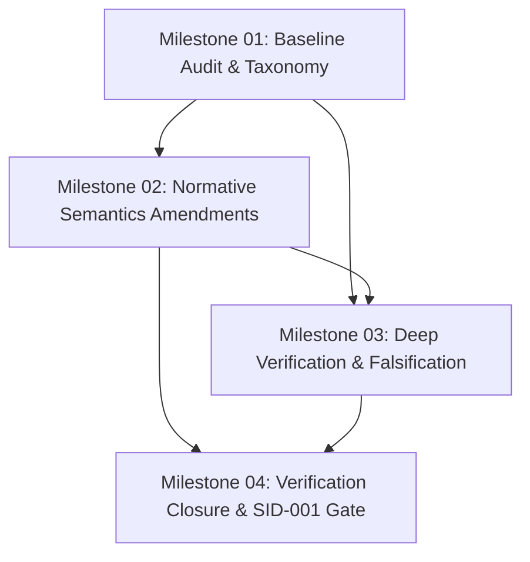

# SCR IAM-001 Verification Closure & SID-001 Roadmap

**Target Area:** `lib/101_Core/Identity/01_implementation/sprints/003_SID-001/milestones/`  
**Parent Specification:** [spec.md](../spec.md)  
**Predecessor:** IAM-RM-001 — Identity Address Space Reference Machine (`sprints/002_IAM-RM-001/`)  
**Target Outcome:** Establish whether IAM-001 is sufficiently stable to become the normative semantic foundation for SID-001 (`READY FOR SID-001`).

---

## 1. Governing Architectural Principle

Preserve this foundational distinction throughout all milestones and sprints:

```text
SID is a coordinate, not an identity system.
```

The canonical identity system decomposition:
```text
Genesis
    ↓
Root Authority
    ↓
Identity Address Space
    ↓
Allocation Domain
    ↓
Authority
    ↓
Allocation
    ↓
SID Coordinate
    ↓
Semantic Identity
    ↓
Manifestation
```

Correctness decomposition across SCR layers:
```text
Topology        → uniqueness
Allocation      → local injectivity
History         → non-reuse
Authority       → allocation permission
Cryptography    → authority/provenance authenticity
Context         → resolution
Semantic Graph  → meaning
EGS             → manifestation
```

---

## 2. Milestone Structure Overview

```text
003_SID-001/milestones/
├── README.md                                          # Master roadmap & dependency graph
├── 001_baseline_and_taxonomy/                         # Milestone 1: Baseline Audit & Verification Taxonomy
│   ├── spec.md
│   └── sprints/
│       ├── sprint_01_baseline_assessment.md           # Inspect IAM-RM-001, record baseline results
│       └── sprint_02_verification_classification.md   # 4-tier verification taxonomy & evidence discipline
├── 002_normative_amendments/                          # Milestone 2: Normative Semantics (IAM-001 v0.2)
│   ├── spec.md
│   └── sprints/
│       ├── sprint_01_historical_consistency.md       # Historical consistency rule & IAM-I017
│       ├── sprint_02_transaction_identity.md          # TransactionId -> at most one SID & idempotence
│       ├── sprint_03_multi_root_and_derived_allocation.md # Multi-root & derived allocation decisions
│       └── sprint_04_specification_amendments_consolidation.md # IAM-001 v0.1 -> v0.2 amendment
├── 003_deep_verification/                             # Milestone 3: Deep Verification & Adversarial Falsification
│   ├── spec.md
│   └── sprints/
│       ├── sprint_01_deep_temporal_traces.md          # 18-stage temporal trace exploration
│       ├── sprint_02_targeted_recovery_verification.md# 8-property recovery resilience suite
│       ├── sprint_03_authority_generation_and_non_reuse.md # Generation fencing g -> g+1 & non-reuse
│       └── sprint_04_concurrency_and_binding_separation.md # Interleaving, domain races & manifestation
└── 004_verification_closure_and_gate/                 # Milestone 4: Verification Closure & SID-001 Gate
    ├── spec.md
    └── sprints/
        ├── sprint_01_formal_proof_assessment.md       # Lean 4 mechanization evaluation
        ├── sprint_02_invariant_matrix_and_counterexamples.md # 12-column invariant matrix & trace logs
        └── sprint_03_closure_deliverables_and_readiness_gate.md # Final reports, evidence JSON & gate
```

---

## 3. Milestone Dependency & Execution Graph



---

## 4. Summary of Milestones

| Milestone | Key Objective | Primary Deliverables | Exit Gate |
|---|---|---|---|
| **[001_baseline_and_taxonomy](001_baseline_and_taxonomy/spec.md)** | Inspect IAM-RM-001 baseline, establish verification categories & evidence rules | `reports/step_1_baseline_assessment.md`<br>`reports/report_R_verification_classification.md` | Baseline locked without code edits; 4-tier verification taxonomy defined. |
| **[002_normative_amendments](002_normative_amendments/spec.md)** | Formalize discovered failure classes into normative IAM-001 v0.2 rules & invariants | `reports/report_J_historical_consistency.md`<br>`reports/report_K_transaction_semantics.md`<br>`reports/report_N_multi_root_decision.md`<br>`reports/report_O_derived_allocation.md`<br>`reports/report_I_iam001_amendments.md` | IAM-I017 formulated; transaction rebind banned; multi-root & derivation resolved. |
| **[003_deep_verification](003_deep_verification/spec.md)** | Stress-test reference machine across temporal traces, recovery, fencing, concurrency | `reports/report_L_deep_targeted_exploration.md`<br>`reports/report_M_recovery_verification.md`<br>`reports/report_P_generation_fencing.md`<br>`reports/report_Q_concurrency_verification.md` | Zero unhandled defects across 18-stage traces; all recovery & concurrency invariants hold. |
| **[004_verification_closure_and_gate](004_verification_closure_and_gate/spec.md)** | Compile 12-column verification matrix, Lean 4 proof assessment, SID-001 readiness decision | `reports/report_S_iam001_verification_closure.md`<br>`reports/verification_closure_evidence.json` | Explicit determination: `READY FOR SID-001` or `NOT READY FOR SID-001`. |

---

## 5. Non-Negotiable Invariants

1. **Do not modify SID representation prematurely:** Do not choose bit widths (e.g. 128-bit), textual encodings, or embed timestamps/signatures. SID remains an abstract coordinate until SID-001.
2. **Preserve Counterexample Discipline:** If an invariant fails, preserve the minimal trace, classify the defect (spec, model, test, code), and record permanently.
3. **No Fake Formal Proofs:** Never label Python assertions or bounded search as "formally proven". Strict adherence to the 4-tier verification taxonomy is mandatory.
