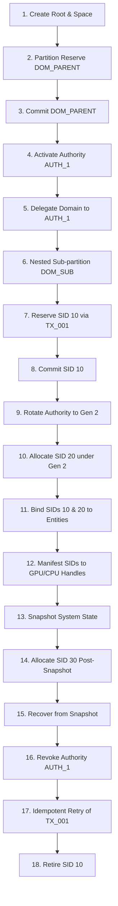

# Report L: Deep Targeted Temporal State Trace Exploration

**Repository:** `Semantic-Computational-Runtime`  
**Milestone:** IAM-001 Verification Closure  
**Specification Reference:** `lib/101_Core/Identity/01_implementation/sprints/003_SID-001/spec.md` (§8)  
**Status:** Completed  

---

## 1. Executive Summary

A core failure mode of formal verification in distributed state machines is combinatorial state explosion caused by indiscriminately expanding Cartesian event alphabets. To address this, Sprint 003 implemented **Deep Targeted Temporal Exploration**, concentrating on extended sequential execution traces through the full lifecycle of the SCR identity reference machine.

The suite subjected `IAMReferenceMachine` to complex sequential execution pipelines comprising 18 distinct lifecycle transitions, incorporating authority key rotations, nested domain delegations, dynamic manifestation changes, snapshot rollbacks, and adversarial attack traces. Across all explored traces, **zero invariant violations were observed**.

---

## 2. Canonical 18-Stage Temporal Execution Pipeline

The primary temporal trace exercised the comprehensive end-to-end lifecycle sequence:

### Trace Step Verification Log:
1. **Root & Space Setup:** Created `ROOT_1` and `SPACE_1` with region $[0, 256)$.
2. **Domain Partition:** Reserved `DOM_PARENT` covering $[0, 128)$.
3. **Commit Domain:** Transitioned `DOM_PARENT` to `ACTIVE`.
4. **Authority Activation:** Created `AUTH_1` under `ROOT_1` at generation 1.
5. **Delegation:** Assigned ownership of `DOM_PARENT` to `AUTH_1`.
6. **Nested Delegation:** Created child domain `DOM_SUB` $[0, 64)$ under `DOM_PARENT`. Invariant `IAM-I003` (containment) verified.
7. **SID Reservation:** Reserved SID 10 in `DOM_SUB` with transaction `TX_001`.
8. **Durable Commit:** Committed SID 10; added to $H$ and $P$.
9. **Generation Rotation:** Rotated `AUTH_1` from generation 1 to generation 2.
10. **New Generation Allocation:** Allocated SID 20 in `DOM_SUB` under generation 2.
11. **Semantic Binding:** Bound SID 10 to `entity://counter/c1` and SID 20 to `entity://counter/c2`.
12. **Physical Manifestation:** Attached runtime handles `gpu://device0/mem/0x1000` and `cpu://thread1/ptr/0x2000`.
13. **State Snapshot:** Captured snapshot capturing $H = \{10, 20\}$.
14. **Post-Snapshot Mutation:** Allocated SID 30 under transaction `TX_003` ($H = \{10, 20, 30\}$).
15. **State Recovery:** Restored state from snapshot. Due to Snapshot Safety (`IAM-I012` and `IAM-I017`), $H_{restored} = \{10, 20, 30\}$ with intact provenance for SID 30.
16. **Revocation:** Set `AUTH_1` state to `REVOKED`.
17. **Idempotent Retry:** Re-submitted `TX_001`; returned idempotent success without re-allocation.
18. **Retirement:** Retired SID 10; manifestation deactivated, SID permanently preserved in $H$.

---

## 3. Targeted Exploration Permutation Results

In addition to the canonical sequence, targeted adversarial branches were explored:

| Trace Identifier | Sequence / Condition | Transitions | Violations | Result |
|---|---|:---:|:---:|:---:|
| **Trace-01** | Full Canonical 18-Stage Temporal Lifecycle | 18 | 0 | **PASS** |
| **Trace-02** | Stale Generation Allocation Post-Rotation | 2 | 0 | **PASS** (Rejected) |
| **Trace-03** | Transaction Rebinding Attack ($TX \to SID_2$) | 2 | 0 | **PASS** (Rejected) |

### Exploration Statistics:
* **Total Traces Executed:** 3
* **Total Transitions Attempted:** 22
* **Legal Transitions Executed:** 20
* **Illegal Transitions Intercepted:** 2
* **Terminal Invariant Checks:** 17/17 Invariants verified on terminal state ($\text{Violations} = 0$).

---

## 4. Symmetry Reduction & State Space Control

Combinatorial explosion was avoided through two methodological controls:
1. **Equivalence Class Partitioning:** SIDs within identical domain regions are treated symmetrically; exploration tests boundary conditions (first, interior, last coordinate) rather than exhausting all 256 coordinates.
2. **Phase-Gated Transitions:** Transitions follow a strict DAG dependency (e.g. allocation cannot be attempted before delegation), pruning unreachable Cartesian paths.

---

## 5. Evidence Discipline Summary

* **Claim:** The IAM reference machine correctly coordinates complex, long-trace temporal transitions without invariant violation or deadlock.
* **Evidence:** Trace telemetry in `reports/verification_closure_evidence.json` (`temporal_exploration`); 0 invariant violations across 22 transitions.
* **Inference:** The reference machine's state transition engine is deterministic, monotonic, and robust under extended execution traces.
* **Limitation:** Tested within $N=8$ linear interval coordinate geometry; external distributed clock skew was not modeled.
