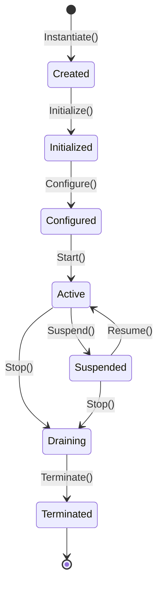

# Lifecycle (`SCR-APP-LIFECYCLE`)

**Path:** `lib/804_Application/Lifecycle/101_definition.md`  
**Parent Domain:** [`lib/804_Application/101_definition.md`](../101_definition.md)  
**Version:** `0.1.0`  
**Status:** Normative Draft (corrected v0.0.3)  
**Authority:** SCR Architectural Group

---

## 1. Definition

The **Lifecycle** domain formalizes the operational progression of an Application and its constituent Modules and Services across discrete, deterministic lifecycle states.

### v0.0.3 Correction: Scope

**This lifecycle applies to Applications, Modules, and Services.** It is NOT a universal entity lifecycle. SCR does not impose a single lifecycle on all semantic entities.

Different entity types may have different lifecycles:

| Entity Type | Applicable Lifecycle |
|-------------|---------------------|
| Application | This lifecycle (SCR-APP-LIFECYCLE) |
| Module | This lifecycle (SCR-APP-LIFECYCLE) |
| Service | This lifecycle (SCR-APP-LIFECYCLE) |
| Component | Provider-defined (e.g., O3DE Component lifecycle) |
| Semantic entity | Domain-defined (no universal lifecycle) |
| Resource | Provider-defined (e.g., GPU buffer lifecycle) |

Do not elevate a provider-specific lifecycle (e.g., O3DE's Construct→Initialize→Activate→Deactivate→Destroy) to a universal SCR entity law.

---

## 2. State Machine

---

## 3. Invariants

- **`APP-LFC-001` (Lifecycle DAG)**: State transitions must follow the valid lifecycle directed acyclic graph.
- **`APP-LFC-002` (Terminal Immutability)**: Once in `Terminated` state, an application instance cannot transition back to any active state.
- **`APP-LFC-003` (Version Monotonicity)**: Every successful lifecycle state transition increments the application version counter.

---

## 4. Lifecycle as Profile

The O3DE-style lifecycle (Construct→Initialize→Activate→Deactivate→Destroy) is a **provider-specific profile** of this lifecycle:

| SCR State | O3DE State |
|-----------|-----------|
| Created | Construct |
| Initialized | Initialize |
| Active | Activate |
| Draining | Deactivate |
| Terminated | Destroy |

O3DE does not have Configured or Suspended states. These are SCR extensions.

---

## Evidence Status

Documented: true
Formally Specified: true
Formally Verified: false
Implemented: true (SCR application framework)
Tested: false
Validated: false
