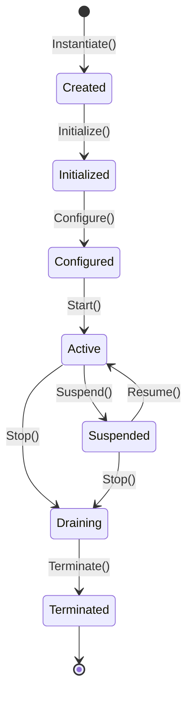

# Lifecycle (`SCR-APP-LIFECYCLE`)

**Path:** `lib/804_Application/Lifecycle/101_definition.md`  
**Parent Domain:** [`lib/804_Application/101_definition.md`](../101_definition.md)  
**Version:** `0.1.0`  
**Status:** Normative Draft  
**Authority:** SCR Architectural Group  

---

## 1. Definition

The **Lifecycle** domain formalizes the operational progression of an Application and its constituent Modules and Services across discrete, deterministic lifecycle states.

## 2. Invariants

- **`APP-LFC-001` (Lifecycle DAG)**: State transitions must follow the valid lifecycle directed acyclic graph.
- **`APP-LFC-002` (Terminal Immutability)**: Once in `Terminated` state, an application instance cannot transition back to any active state.
- **`APP-LFC-003` (Version Monotonicity)**: Every successful lifecycle state transition increments the application version counter.
