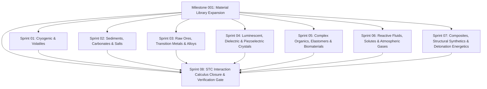

# Milestone 001: Universal Material Library & Semantic Interaction Expansion

**Document:** `program_increments/v0.0.2/milestones/001_MaterialLibraryExpansion/README.md`  
**Milestone ID:** `SCR-PI-002-M001`  
**Version:** 1.0.0  
**Status:** ACCEPTED (Operational)  
**Parent:** [Program Increment v0.0.2](file:///home/kobus/Projects/Semantic-Computational-Runtime/program_increments/v0.0.2)  
**Exit Gate Report:** [`milestone_001_exit_gate_report.md`](file:///home/kobus/Projects/Semantic-Computational-Runtime/program_increments/v0.0.2/milestones/001_MaterialLibraryExpansion/sprints/sprint_08_stc_interaction_calculus_closure/reports/milestone_001_exit_gate_report.md)  
**Normative Catalog Baseline:** [`lib/A01_Render/Material/105_unified_materials_catalog.md`](file:///home/kobus/Projects/Semantic-Computational-Runtime/lib/A01_Render/Material/105_unified_materials_catalog.md)  
**Dynamic Transitions Baseline:** [`lib/A01_Render/Material/106_material_transformations_and_reactions.md`](file:///home/kobus/Projects/Semantic-Computational-Runtime/lib/A01_Render/Material/106_material_transformations_and_reactions.md)  
**Governing Architecture:** [`docs/architecture/106_unified_materials_ontology.md`](file:///home/kobus/Projects/Semantic-Computational-Runtime/docs/architecture/106_unified_materials_ontology.md)  

---

## 1. Executive Summary & Architectural Mandate

Milestone `001_MaterialLibraryExpansion` broadens the universal inventory of physical-optical materials and formal dynamic interactions within the Semantic Computational Runtime (SCR).

SCR materials are neither simple visual texture maps, arbitrary game block IDs, nor opaque graphics shader kernels. In accordance with **Rule 1** (*"Semantics are authoritative"*), **Rule 2** (*"Implementation does not define meaning"*), and **Rule 18** (*"External technologies remain subordinate to SCR contracts"*), every material in this expansion adheres to the invariant **Dual-Contract**:

$$\mathcal{M} = \langle \mathcal{C}_{\text{phys}}, \mathcal{C}_{\text{opt}}, \mathcal{C}_{\text{kin}} \rangle$$

1. **Physical Constitutive Contract ($\mathcal{C}_{\text{phys}}$)** (`lib/501_Physics/Material`):
   Defines mass density ($\rho$), Mohs scratch hardness, Young's elastic modulus ($E$), Poisson's ratio ($\nu$), Coulomb friction ($\mu$), coefficient of restitution ($e$), blast fracture threshold ($J$), thermal conductivity ($k$), and specific heat capacity ($c_p$).
2. **Optical Appearance Contract ($\mathcal{C}_{\text{opt}}$)** (`lib/A01_Render/Material`):
   Defines Bidirectional Scattering Distribution Functions (BSDF), Emission Distribution Functions (EDF), Volume Distribution Functions (VDF), linear sRGB albedo, microfacet roughness ($\alpha$), metallic parameter ($m$), refractive index ($n$), spectral transmittance ($\tau$), and radiative emission ($L_e$).
3. **Kinematic & Morphological Contract ($\mathcal{C}_{\text{kin}}$)**:
   Defines angle of repose ($\phi$), granular Mohr-Coulomb collapse, fluid dynamic viscosity ($\eta$), surface tension ($\gamma$), and falling block state transitions across topological neighborhoods (`lib/303_Topology/Adjacency`).

Furthermore, materials are dynamic participants in the **Semantic Transition Calculus (STC)**:
$$\tau_{\text{react}}: \mathcal{S}_{\text{mat}} \times \mathcal{C}_{\text{adj}} \xrightarrow{K} \mathcal{S}'_{\text{mat}}$$
governing how materials transform under thermal excitation, chemical oxidation, hydraulic setting, shear fracture, and explosive detonation.

---

## 2. Expanded Material Taxa & Sprint Architecture

This milestone is organized into eight execution sprints:



---

## 3. Sprint Directory Structure

```text
program_increments/v0.0.2/milestones/001_MaterialLibraryExpansion/
├── README.md                                          # Master roadmap & sprint index (this document)
├── spec.md                                            # Milestone formal specification & invariant rules
└── sprints/
    ├── sprint_01_cryogenic_and_volatile_phases/
    │   ├── spec.md                                    # Ice, Packed Ice, Blue Ice, Snow, Permafrost
    │   └── reports/                                   # Record keeping and verification logs
    ├── sprint_02_sediments_minerals_carbonates/
    │   ├── spec.md                                    # Limestone, Calcite, Tuff, Pumice, Halite, Sulfur
    │   └── reports/
    ├── sprint_03_raw_ores_transition_metals_alloys/
    │   ├── spec.md                                    # Raw Ores, Bronze, Brass, Aluminum, Titanium, Zinc
    │   └── reports/
    ├── sprint_04_crystals_dielectrics_luminescent/
    │   ├── spec.md                                    # Lapis Lazuli, Topaz, Jade, Amber, Phosphors
    │   └── reports/
    ├── sprint_05_complex_organics_and_elastomers/
    │   ├── spec.md                                    # Leather, Chitin, Natural Rubber, Wax, Charcoal, Fungi
    │   └── reports/
    ├── sprint_06_fluids_solutes_atmospheric_gases/
    │   ├── spec.md                                    # Petroleum, Acid, Steam, Air, Smoke, Methane
    │   └── reports/
    ├── sprint_07_composites_synthetics_energetics/
    │   ├── spec.md                                    # Mortar, Powder Precursor, Aerogel, Plastics, Explosives
    │   └── reports/
    └── sprint_08_stc_interaction_calculus_closure/
        ├── spec.md                                    # Reaction Matrix, Invariant Verification & Exit Gate
        └── reports/
```

---

## 4. Sprint Breakdown & Scope

| Sprint | Domain & Scope | Target Archetypes | Key Semantic Interactions |
|---|---|---|---|
| **[Sprint 01](file:///home/kobus/Projects/Semantic-Computational-Runtime/program_increments/v0.0.2/milestones/001_MaterialLibraryExpansion/sprints/sprint_01_cryogenic_and_volatile_phases/spec.md)** | Cryogenic & Volatile Phases | `cryo.ice`, `cryo.packed_ice`, `cryo.blue_ice`, `cryo.snow`, `cryo.powder_snow`, `cryo.permafrost` | Water freezing, ice melting, snow overburden compaction, freezing-point depression via salt. |
| **[Sprint 02](file:///home/kobus/Projects/Semantic-Computational-Runtime/program_increments/v0.0.2/milestones/001_MaterialLibraryExpansion/sprints/sprint_02_sediments_minerals_carbonates/spec.md)** | Earth Sediments, Carbonates & Soluble Salts | `rock.limestone`, `rock.calcite`, `rock.tuff`, `rock.pumice`, `soil.peat`, `soil.podzol`, `mineral.salt`, `mineral.sulfur`, `mineral.gypsum`, `mineral.ash` | Acid dissolution of carbonates ($CO_2$ release), aqueous dissolution of salts, pozzolanic cementation. |
| **[Sprint 03](file:///home/kobus/Projects/Semantic-Computational-Runtime/program_increments/v0.0.2/milestones/001_MaterialLibraryExpansion/sprints/sprint_03_raw_ores_transition_metals_alloys/spec.md)** | Raw Ores, Transition Metals & Advanced Alloys | `ore.iron_ore`, `ore.copper_ore`, `ore.bauxite`, `ore.gold_ore`, `metal.bronze`, `metal.brass`, `metal.aluminum`, `metal.titanium`, `metal.zinc`, `metal.tungsten` | Carbothermic reduction, bronze/brass metallurgical alloying, surface patination, ferrous oxidative rusting. |
| **[Sprint 04](file:///home/kobus/Projects/Semantic-Computational-Runtime/program_increments/v0.0.2/milestones/001_MaterialLibraryExpansion/sprints/sprint_04_crystals_dielectrics_luminescent/spec.md)** | Luminescent, Dielectric & Piezoelectric Crystals | `gem.lapis_lazuli`, `gem.topaz`, `gem.jade`, `gem.amber`, `mineral.phosphor`, `gem.luminescent_crystal` | Piezoelectric stress coupling, delayed phosphorescent emission, high-index spectral dispersion. |
| **[Sprint 05](file:///home/kobus/Projects/Semantic-Computational-Runtime/program_increments/v0.0.2/milestones/001_MaterialLibraryExpansion/sprints/sprint_05_complex_organics_and_elastomers/spec.md)** | Complex Organics, Elastomers & Biomaterials | `organic.leather`, `organic.chitin`, `organic.rubber`, `organic.wax`, `wood.charcoal`, `botanical.moss`, `botanical.mycelium`, `botanical.cactus` | Hyperelastic deformation, biomass anoxic pyrolysis, mycelial humus decomposition, thermal wax liquefaction. |
| **[Sprint 06](file:///home/kobus/Projects/Semantic-Computational-Runtime/program_increments/v0.0.2/milestones/001_MaterialLibraryExpansion/sprints/sprint_06_fluids_solutes_atmospheric_gases/spec.md)** | Reactive Fluids, Solutes & Atmospheric Gases | `fluid.oil`, `fluid.acid`, `gas.steam`, `gas.air`, `gas.smoke`, `gas.methane` | Gravitational multiphase stratification (immiscibility), volatile hydrocarbon combustion, steam condensation. |
| **[Sprint 07](file:///home/kobus/Projects/Semantic-Computational-Runtime/program_increments/v0.0.2/milestones/001_MaterialLibraryExpansion/sprints/sprint_07_composites_synthetics_energetics/spec.md)** | Composites, Structural Synthetics & Energetics | `granular.concrete_powder`, `synthetic.mortar`, `synthetic.aerogel`, `synthetic.plastic`, `synthetic.silicon`, `synthetic.explosive` | Hydraulic setting of binders, Chapman-Jouguet detonation shockwave propagation, thermal insulation barriers. |
| **[Sprint 08](file:///home/kobus/Projects/Semantic-Computational-Runtime/program_increments/v0.0.2/milestones/001_MaterialLibraryExpansion/sprints/sprint_08_stc_interaction_calculus_closure/spec.md)** | Semantic Transition Calculus Closure & Gate | Universal Interaction Graph & Transition Engine | Full state machine verification, invariant conservation proofs, JSONSchema validation, Gate Acceptance. |

---

## 5. Non-Negotiable Invariants

1. **Dual-Contract Completeness**: No material may be declared without both a valid Physical Constitutive Tensor and an Optical Appearance Closure.
2. **Universal Physical Archetypes Only**: Material names must reflect universal physical, chemical, or geological archetypes. Single-game proprietary fantasy lore (e.g. "redstone", "hellstone", "mythril", "adamantite") is prohibited.
3. **Dimensional & Conservation Integrity**: All reactions must respect conservation of mass ($\sum m_{\text{react}} = \sum m_{\text{prod}}$), elemental species conservation, and thermodynamic enthalpy balances.
4. **Technology Independence**: Material definitions must remain independent of specific rendering backends (Vulkan, DirectX, OptiX, Metal) and simulation solvers (PhysX, Bullet, FleX).

---

## 6. Exit Gate Determination & Status

```text
================================================================================
SCR MILESTONE 001 ACCEPTANCE GATE
================================================================================
Target Milestone: SCR-PI-002-M001 (Material Library Expansion)
Normative Catalog Scope: 96 Universal Physical-Optical Materials
Semantic Transitions Scope: 27 Universal STC Dynamic Reactions
Dual-Contract Completeness: 100% (Physical Constitutive + Optical Closures)
Schema & Invariant Verification: PASSED (0 Failures)
Evidence File: verification_evidence.json
Gate Determination: ACCEPTED (Operational)
================================================================================
```

See the full [Milestone 001 Exit Gate Report](file:///home/kobus/Projects/Semantic-Computational-Runtime/program_increments/v0.0.2/milestones/001_MaterialLibraryExpansion/sprints/sprint_08_stc_interaction_calculus_closure/reports/milestone_001_exit_gate_report.md) for detailed verification evidence.
