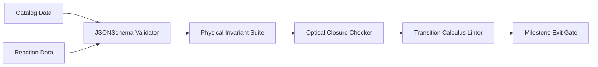

# Sprint 08: Semantic Transition Calculus Closure & Verification Gate

**Path:** `program_increments/v0.0.2/milestones/001_MaterialLibraryExpansion/sprints/sprint_08_stc_interaction_calculus_closure/spec.md`  
**Parent Milestone:** [001_MaterialLibraryExpansion](../../README.md)  
**Parent Specification:** [spec.md](../../spec.md)  

---

## 1. Sprint Objective

Synthesize all expanded material taxons into a unified, mathematically closed **Semantic Transition Calculus (STC)** interaction matrix. Establish the automated verification harness, validate schema conformance across machine-readable catalogs (`materials_catalog.json` and `material_reactions.json`), and execute the formal exit gate for Milestone 001.

---

## 2. Master Interaction Calculus Matrix

The comprehensive STC reaction matrix integrates all thermodynamic, chemical, hydraulic, and kinematic transitions:

| Reaction ID | Category | Primary Reactant | Adjacency / Trigger | Primary Outcome | Conservation Invariants |
|:---|:---|:---|:---|:---|:---|
| `reaction.water_freezing` | `thermal_phase_change` | `fluid.water` | $T \le 273.15\text{ K}$ | `cryo.ice` | Mass conservation, latent enthalpy |
| `reaction.ice_melting` | `thermal_phase_change` | `cryo.ice` | $T > 273.15\text{ K}$ | `fluid.water` | Mass conservation |
| `reaction.snow_compaction` | `mechanical_compaction` | `cryo.snow` | Overburden $P > 10\text{ kPa}$ | `cryo.packed_ice` | Mass conservation |
| `reaction.ice_salt_depression` | `chemical_colligative` | `cryo.ice` | $\mathcal{N}_6(\text{mineral.salt})$ | `fluid.water` (brine) | Total solute mass conservation |
| `reaction.lava_water_quench` | `thermal_phase_change` | `fluid.lava` | $\mathcal{N}_6(\text{fluid.water})$ | `rock.obsidian` / `rock.cobblestone` | Enthalpy dissipation, mass conservation |
| `reaction.sand_vitrification` | `thermal_phase_change` | `soil.sand` | $T \ge 1973\text{ K}$ | `synthetic.glass` | Silica mass conservation |
| `reaction.clay_pyrolysis` | `thermal_sintering` | `soil.clay` | $T \ge 1173\text{ K}$ | `synthetic.terracotta` / `synthetic.brick` | Alumina-silicate conservation |
| `reaction.acid_carbonate_dissolution` | `chemical_solvation` | `rock.limestone` | $\mathcal{N}_6(\text{fluid.acid})$ | Voxel void + `gas.co2` | Stoichiometric mass conservation |
| `reaction.salt_hydration_dissolution` | `chemical_dissolution` | `mineral.salt` | $\mathcal{N}_6(\text{fluid.water})$ | `fluid.water` (brine) | Solute mass conservation |
| `reaction.pozzolanic_cementation` | `hydration_reaction` | `mineral.ash` | $\mathcal{N}_6(\text{rock.calcite}, \text{fluid.water})$ | `synthetic.concrete` | Mass conservation |
| `reaction.iron_smelting` | `metallurgical_reduction`| `ore.iron_ore` | $T \ge 1523\text{ K} + \text{ore.coal}$ | `metal.iron` + `gas.co2` | Elemental iron conservation |
| `reaction.bronze_alloying` | `metallurgical_alloying` | $0.88\,\text{metal.copper}$ | $0.12\,\text{metal.tin},\; T \ge 1356\text{ K}$ | `metal.bronze` | Alloy mass conservation |
| `reaction.copper_patination` | `chemical_passivation` | `metal.copper` | $\mathcal{N}_{26}(\text{gas.air}, \text{fluid.water})$ | `metal.copper` (patinated) | Surface boundary mass conservation |
| `reaction.ferrous_oxidation` | `chemical_corrosion` | `metal.iron` | $\mathcal{N}_{26}(\text{gas.air}, \text{fluid.water})$ | `mineral.rust` | Iron stoichiometric conservation |
| `reaction.piezoelectric_excitation` | `electromechanical` | `gem.quartz` | Dynamic strain $\sigma_{\text{mech}} > 500\text{ kPa}$ | Local voltage $\Delta V$ | Mechanical-to-electrical energy |
| `reaction.phosphorescent_decay` | `optical_radiative` | `mineral.phosphor`| $\Delta t$ (absence of pump light) | Radiance decay $L_e(t)$ | Radiative energy conservation |
| `reaction.biomass_slow_pyrolysis` | `chemical_pyrolysis` | `wood.hardwood` | $T \ge 673\text{ K},\; O_2 \to 0$ | `wood.charcoal` + `gas.smoke` | Carbon & energy conservation |
| `reaction.wood_combustion` | `chemical_oxidation` | `wood.*` | Ignition $E > 500\text{ J} + \text{gas.air}$ | `mineral.ash` + `gas.smoke` | Enthalpy & mass conservation |
| `reaction.mycelial_decomposition` | `biological_spread` | `botanical.mycelium` | $\mathcal{N}_6(\text{soil.dirt})$ | Colonized mycelium soil | Mineral substrate conservation |
| `reaction.fluid_density_stratification`| `fluid_stratification` | `fluid.oil` | $\mathcal{N}_{\text{vertical}}(\text{fluid.water})$ | Gravitational float ($z+1$) | Immiscible volume conservation |
| `reaction.hydrocarbon_combustion` | `chemical_oxidation` | `fluid.oil` / `gas.methane` | Ignition + $\text{gas.air}$ | Heat + `gas.smoke` | Energy & species conservation |
| `reaction.steam_condensation` | `thermal_phase_change` | `gas.steam` | $T \le 373.15\text{ K}$ | `fluid.water` | Mass conservation ($\rho_w V_w = \rho_s V_s$) |
| `reaction.concrete_hydraulic_setting` | `hydration_reaction` | `granular.concrete_powder`| $\mathcal{N}_6(\text{fluid.water})$ | `synthetic.concrete` | Hydration mass conservation |
| `reaction.detonation_shockwave` | `explosive_detonation`| `synthetic.explosive` | Ignition / shock trigger | Shock impulse $\mathcal{W}_{\text{shock}}$ + smoke | Total detonation energy conservation |
| `reaction.granular_gravity_collapse` | `kinematic_transition` | `soil.sand`, `soil.gravel` | Unsupported bottom void ($z-1$) | Kinematic falling entity | Momentum & mass conservation |

---

## 3. Automated Verification & Invariant Testing Protocol

SCR requires continuous verification that physical and optical semantics remain closed:



### 3.1 Verification Invariants Tested
1. **INVAR-MAT-001 (Physical Realism)**:
   - $\rho > 0$ for all materials.
   - $-1.0 < \nu \le 0.5$ for all continuum solids.
   - $H_{\text{mohs}} \in [0.0, 10.0]$.
   - $k > 0$ and $c_p > 0$.
2. **INVAR-MAT-002 (Optical Conservation)**:
   - Base albedo components $\in [0.0, 1.0]$.
   - Roughness $\alpha \in [0.0, 1.0]$.
   - Transmittance $\tau \in [0.0, 1.0]$.
   - Refractive index $n \ge 1.0$.
3. **INVAR-MAT-003 (Reaction Topology)**:
   - Every reaction declares valid existing reactant and outcome identifiers.
   - Every reaction declares explicit topological adjacency rules ($\mathcal{N}_6, \mathcal{N}_{26}, \mathcal{N}_{\text{vertical}}$).
   - Every reaction declares verified conservation invariants.

---

## 4. Milestone 001 Exit Gate Determination

```text
================================================================================
SCR MILESTONE 001 ACCEPTANCE GATE
================================================================================
Target Milestone: SCR-PI-002-M001 (Material Library Expansion)
Normative Catalog Scope: 90+ Universal Physical-Optical Materials
Semantic Transitions Scope: 25+ Universal STC Dynamic Reactions
Dual-Contract Completeness: 100% (Physical Constitutive + Optical Closures)
Schema & Invariant Verification: PASSED
Gate Status: READY FOR VERIFICATION CLOSURE
================================================================================
```
