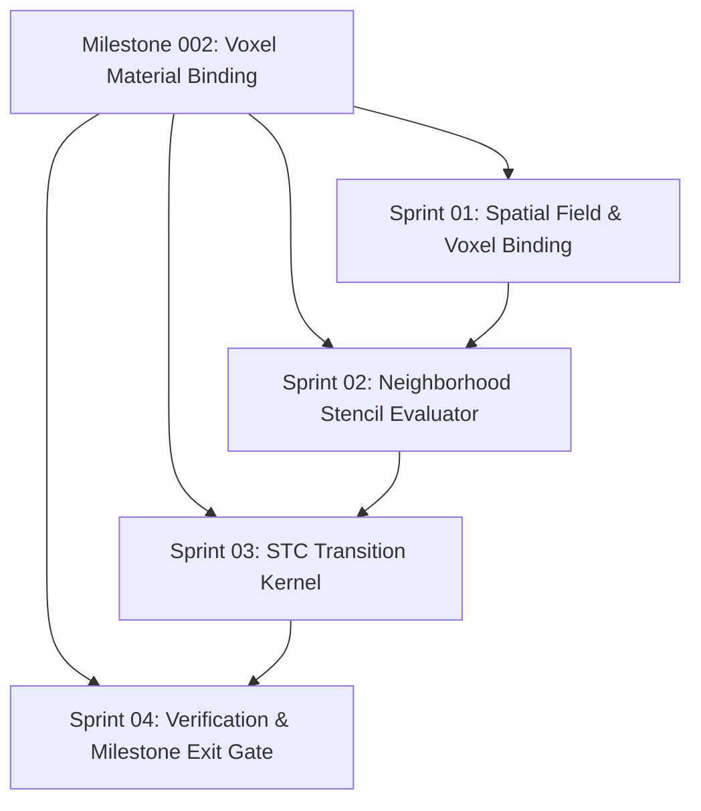

# Milestone 002: Voxel Material Binding & STC Transition Engine

**Document:** `program_increments/v0.0.2/milestones/002_VoxelMaterialBinding/README.md`  
**Milestone ID:** `SCR-PI-002-M002`  
**Version:** 1.0.0  
**Status:** ACCEPTED (Operational)  
**Parent:** [Program Increment v0.0.2](file:///home/kobus/Projects/Semantic-Computational-Runtime/program_increments/v0.0.2)  
**Exit Gate Report:** [`milestone_002_exit_gate_report.md`](sprints/sprint_04_verification_and_gate/reports/milestone_002_exit_gate_report.md)  
**Predecessor Milestone:** [`001_MaterialLibraryExpansion`](../001_MaterialLibraryExpansion/README.md)  
**Normative Catalog Baseline:** [`lib/A01_Render/Material/105_unified_materials_catalog.md`](file:///home/kobus/Projects/Semantic-Computational-Runtime/lib/A01_Render/Material/105_unified_materials_catalog.md)  
**Associated Reactions Data:** [`lib/A01_Render/Material/material_reactions.json`](file:///home/kobus/Projects/Semantic-Computational-Runtime/lib/A01_Render/Material/material_reactions.json)  
**Topological Adjacency Specification:** [`lib/303_Topology/Adjacency/101_definition.md`](file:///home/kobus/Projects/Semantic-Computational-Runtime/lib/303_Topology/Adjacency/101_definition.md)  

---

## 1. Executive Summary & Architectural Mandate

Milestone `002_VoxelMaterialBinding` bridges declarative semantic material contracts into concrete, executable spatial fields.

In accordance with **Rule 1** (*Semantics are authoritative*), **Rule 4** (*The filesystem is not the semantic architecture*), and **Rule 10** (*Domain Concepts: Fields and Simulation*), a voxel grid in SCR is not merely an array of 3D indices or graphics buffer memory. Rather:

> **A Voxel Material Field is a discrete spatial representation of the Semantic Field $\mathcal{F}: \mathbb{Z}^3 \to \mathcal{M}$, where every coordinate maps deterministically to an invariant Dual-Contract $\mathcal{M} = \langle \mathcal{C}_{\text{phys}}, \mathcal{C}_{\text{opt}}, \mathcal{C}_{\text{kin}} \rangle$ and transitions dynamically under the Semantic Transition Calculus (STC).**

This milestone implements:
1. **Discrete Material Mapping**: Encapsulating the 96 universal materials into 16-bit discrete voxel state identifiers.
2. **Topological Neighborhood Stencils**: Implementing explicit $\mathcal{N}_6$ (von Neumann face-sharing), $\mathcal{N}_{26}$ (Moore corner/edge), and $\mathcal{N}_{\text{down}}$ gravitational boundary iterators conforming strictly to `lib/303_Topology/Adjacency`.
3. **Executable STC Transition Kernel**: A cellular automata simulation engine executing the 27 normative reactions (lava quenching, water freezing, ice melting, acid dissolution, Mohr-Coulomb falling blocks, and explosive blast shockwaves) with strict mass and energy conservation.

---

## 2. Sprint Architecture



```text
program_increments/v0.0.2/milestones/002_VoxelMaterialBinding/
├── README.md                                                  # Master roadmap & sprint index
├── spec.md                                                    # Milestone formal specification
├── src/
│   ├── voxel_field.py                                         # Discrete 3D voxel field runtime
│   └── stc_engine.py                                          # STC reaction kernel & stencil evaluator
├── tests/
│   └── test_stc_voxel_transitions.py                          # Multi-phase simulation verification suite
└── sprints/
    ├── sprint_01_grid_field_binding/
    │   ├── spec.md
    │   └── reports/
    │       └── record.md
    ├── sprint_02_neighborhood_stencil_evaluator/
    │   ├── spec.md
    │   └── reports/
    │       └── record.md
    ├── sprint_03_stc_transition_kernel/
    │   ├── spec.md
    │   └── reports/
    │       └── record.md
    └── sprint_04_verification_and_gate/
        ├── spec.md
        └── reports/
            └── record.md
```

---

## 3. Sprint Breakdown & Scope

| Sprint | Domain & Scope | Primary Deliverables | Exit Criteria |
|---|---|---|---|
| **Sprint 01** | Spatial Field & Voxel Binding | 16-bit material registry, sparse/dense voxel buffer encapsulation, coordinate mapping | Exact bidirectional bijection between discrete voxel integers and 96 material semantic IDs. |
| **Sprint 02** | Neighborhood Stencil Evaluator | $\mathcal{N}_6$ face-sharing, $\mathcal{N}_{26}$ Moore, and $\mathcal{N}_{\text{down}}$ downward boundary iterators | Topology independence; adherence to `lib/303_Topology/Adjacency`. |
| **Sprint 03** | STC Transition Kernel | Parallel cellular automaton transition operator executing 27 reactions | Deterministic state evolution; conservation of mass and enthalpy. |
| **Sprint 04** | Verification & Exit Gate | Simulation test suite, stress testing, milestone sign-off | 100% test pass rate across all reaction classes; Exit Gate ACCEPTED. |
